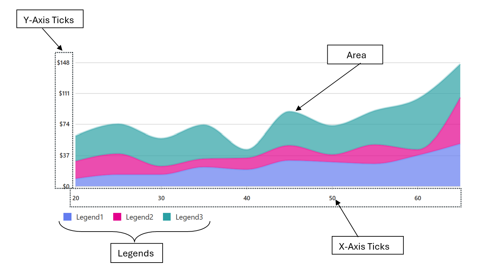
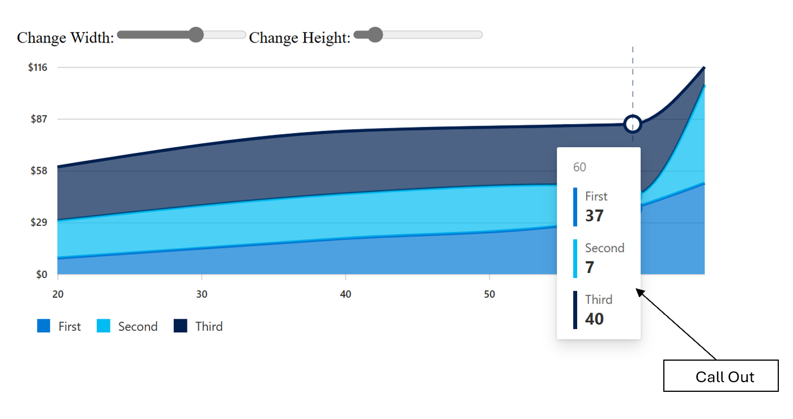
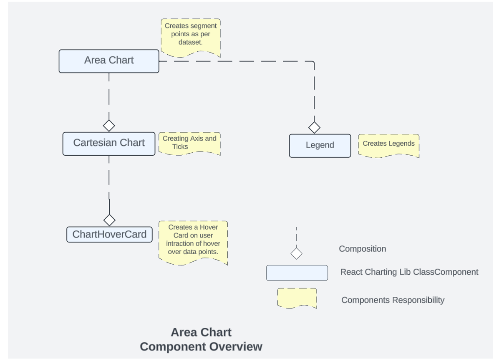
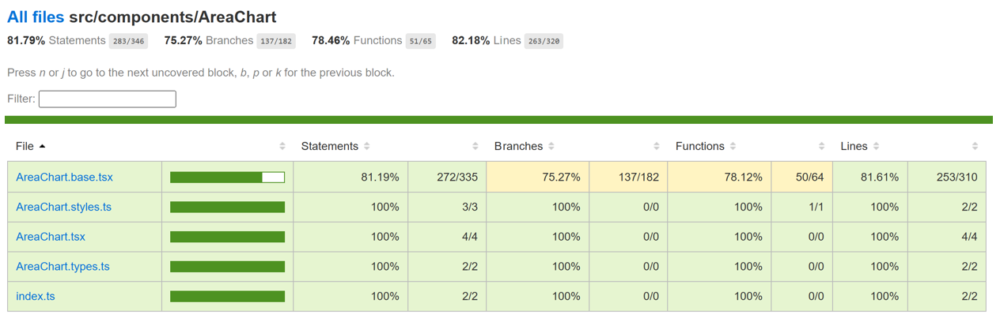

# Contributor guide: Area Chart

Area charts are graphical representations of data that display quantitative data points connected by lines and filled with colors to create a visual representation of trends and patterns. The area between the line and the x-axis is filled, which helps in emphasizing the cumulative total or the overall magnitude of the data.

## Use cases: 
Area charts are used for various use cases which involve Trend Analysis, Cumulative Data, Comparing Multiple Series , Part-to-Whole Relationships , Distribution Comparison Forecasting etc.

### Fluent Area chart also provide support for the scenarios where we need 
- ### Stacked Area Chart
  In stacked area chart, two or more data series are stacked vertically. It helps in easy comparison across different dimensions.
- ### Custom Accessibility 
  Area chart provides a bunch of props to enable custom accessibility messages.UsexAxisCalloutAccessibilityData and callOutAccessibilityData to configure x axis and y axis accessibility messages respectively
- ### Hover Options: 
  Area chart also provide different interactive options like ChartHoverCard on hovering over some data in chart. You can customize the content of the Hover card on the basis of the requirement.

## Dev Design Details

### 1.Area Chart 
 This is the main component which is responsible for invoking/using other components. This is the component which is responsible for creating area  and managing user interactions with itself , Legends and Cartesian Chart.
### 2.Cartesian chart
This is component which is responsible for creating the X and Y Axis and the ticks for Axis. All the calculation for domain/range is done in cartesian chart. This component can be accessed through area chart. This is also manages the ChartHoverCard component .

### 3.ChartHover Card:
 ChartHoverCard is a utility in the Fluent UI web library that provides a tooltip-like experience for charts. It is a React component that can be used to display additional information about data points on a chart when the user hovers over them.

### 4.Legends:
 In the Fluent UI React charting library, a legend contains a list of the variables appearing in the chart and an example of their appearance. This information allows the data from each variable to be identified in the chart. This component is populated in Area chart component.

## Mathematical/Geometrical concepts
Area Chart are created using [d3-shape](https://github.com/d3/d3-shape#readme). The main API used from this library to create line between 2 points is [d3-line](https://github.com/d3/d3-shape#lines) and [d3-area](https://github.com/d3/d3-shape#areas).
### D3-Line
Line Generator are generated using a [spline](https://en.wikipedia.org/wiki/Spline_(mathematics)) or [polyline](https://en.wikipedia.org/wiki/Polygonal_chain) , as in a area chart. While lines  are defined as a sequence of two-dimensional [x, y] points, and [areas](https://github.com/d3/d3-shape#areas) similarly defined by a topline and a baseline, there remains the task of transforming this discrete representation into a continuous shape: i.e., how to interpolate between the points. A variety of curves are provided for this purpose. The curve used to draw these lines are [curveLinear](https://github.com/d3/d3-shape#curveLinear) .
### D3-Area
The area generator produces an area, as in an area chart. An area is defined by two bounding lines, either splines or polylines. Typically, the two lines share the same x-values (x0 = x1), differing only in y-value (y0 and y1); most commonly, y0 is defined as a constant representing zero. The first line (the topline) is defined by x1 and y1 and is rendered first; the second line (the baseline) is defined by x0 and y0 and is rendered second, with the points in reverse order. With a curveLinear curve, this produces a clockwise polygon.
## Performance
The performance aspect of a area chart refers to how efficiently and effectively it conveys information to the viewer. Here are some key considerations regarding the performance of a area chart: 
- Data Visualization Efficiency 
- Clarity and Simplicity 
- Responsiveness
- Handling Large Datasets
- Interactive Features

We use Lighthouse tool for measuring the performance of our charts. We have multiple scenarios against which we measure the performance score for area chart:
- 1 chart with 30k Points 
- 6 charts,1 series with 100 data points each 
- 18 charts,1 series 5 data points each 
Last two scenarios have 90+ LH score. We are currently working on improving the performance of the area with heavy data set (30 k Data points).
## Accessibility
 Following subcomponents are accessible using a screen reader:
- Chart `<svg>`The role is set as presentation, and the aria-label attribute is set as a string to describe its contents. This is readable by screen reader if user has given chartTitle prop
- Points accessibility is managed by `<path>` tags with role=”img” whose accessibility is managed by aria-label property .
- Area chart provides a bunch of props to enable custom accessibility messages.Use xAxisCalloutAccessibilityData and callOutAccessibilityData to configure x axis and y axis accessibility messages respectively.
## Testing
## Variants
Different variants of area charts are available starting from the basic area chart to stacked area charts, styled area chart, area chart with custom accessibility, Area chart with large data set, area chart with data change functionality. For more details visit DemoSite [Fluent UI React Charting Examples - Area Chart (windows.net)](https://fluentuipr.z22.web.core.windows.net/heads/master/react-charting/demo/index.html#/examples/areachart)
- ### Stacked area chart:
  In stacked area chart, two or more data series are stacked vertically. It helps in easy comparison across different dimensions. The callout on hover for stacked chart displays multiple values from the stack. The callout can be customized to show single values or stacked values. Refer to the propsonRenderCalloutPerDataPoint and onRenderCalloutPerStack using which custom content for the callout can be defined.
- ### Custom accessibility:
  Area chart provides a bunch of props to enable custom accessibility messages.UsexAxisCalloutAccessibilityDataand callOutAccessibilityData to configure x axis and y axis accessibility messages respectively.
- ### Area chart with large dataset:
  We provide support  for smoth  rendering of large data area chart.  

## Theming
The getStyles function defined in the styles file returns styles for different areas (or subcomponents) of the chart based on the props passed to it. The base component is wrapped with the styled HOC, which passes the theme (set by the user) and the concatenated styles (derived from the styling function and any additional styles provided by the user) as props to the base component. Within the base component, the styles are named as the class name. The conversion is done by passing theme and other style props as arguments to the function returned by the classNamesFunction utility. Learn more about component styling here.
The color prop for a segment is optional. If the color prop is not defined, a color is selected from the qualitative palette using the getNextColor utility. On the other hand, if the color prop is defined, the getColorFromToken utility is used to determine the appropriate CSS color. If the value of the color prop is a theme-specific color token from the DataVizPalette, the utility will return the corresponding CSS color. Otherwise, if the color prop is already a valid CSS color, it will be returned as is.
## Debugging
Our Test Suites are exhaustive to test each and every features provided with Area Charts, for debugging any particular feature these can be used respectively .Few of these tests also verify the technical aspect of rendering like there is a test suite “Render calling with respective to props” available in area chart test which verifies that the render is called 2 times.
Furthermore, the fundamental debugging techniques can also be applied to Area charts. These techniques encompass:
- Employing logging mechanisms
- Utilizing the browser debugger
- Leveraging browser extensions
## Error scenarios
### The stacked area chart cannot be loaded if the x-values are not consistent across all the charts within the stack.
The chart cannot be loaded because of one or more reasons:
- Empty data passed such that chart does not have visual to show.
- One of the datapoint passed to the chart is corrupted. The corrupted datapoint can be for a continuous chart like line or area, or a discrete chart like bar chart, donut chart.
- The type of data passed to the chart is not supported.
- The user has not provided the required property.
### The chart is in a loading state because of one or more reasons below.
- The chart data is too heavy.
- Chart is waiting for data from a webservice.
### Errors in other components:
- Empty/invalid data passed to hover callout.
- There is a large variation in data in one datapoint compared to others causing the graphs to become extremely skewed and non-interactable.
- Title for legends is not defined or is corrupted.
- There is more than point on y axis for the same point in x axis.
## Localization aspects
### Date Axis localization: The axes support 2 ways of localization.
1. Javascript provided inbuilt localization for numeric and date axis. Specify the culture and dateLocalizeOptions for date axis to define target localization. Refer theJavascript localization guidefor usage.

2. Custom locale definition: The consumer of the library can specify a custom locale definition as supported by d3 like this:
The date axis will use the date range and the multiformat specified in the definition to determine the correct labels to show in the ticks. For example - If the date range is in days then the axis will show hourly ticks. If the date range spans across months then the a xis will show months in tick labels and so on. Specify the custom locale definition in the timeFormatLocale prop. Refer to the Custom Locale Date Axis example in line chart for sample usage.
## Some notable PRs and their brief description
[Add color palette for data visualization by krkshitij · Pull Request #26869 · microsoft/fluentui (github.com)](https://github.com/microsoft/fluentui/pull/26869)  -Color is optional for the data series in AreaChart and LineChart. If the color is absent, it will be picked automatically from the default color palette. New DataVizPalette provides users with theme-specific color tokens

[[2 of N] Changes for Making first render cycle faster and fixing test cases by ankityadav4 · Pull Request #27721 · microsoft/fluentui (github.com)](https://github.com/microsoft/fluentui/pull/27721)  -Improving first render cycle of cartesian chart

[Make area chart keyboard accessible by krkshitij · Pull Request #27234 · microsoft/fluentui (github.com)](https://github.com/microsoft/fluentui/pull/27234)  -Data points in AreaChart are accessible using keyboard

[[3 of N] Changes for lazy load for hover card and legends by ankityadav4 · Pull Request #27857 · microsoft/fluentui (github.com)](https://github.com/microsoft/fluentui/pull/27857) – Lazy loading for hover cards in cartesian charts.

## Future improvements
We are working on Performance Improvements for area chart for large dataset scenario(30k data points).
## Rendering details
Area Chart is a react class Component, which uses different states for managing user interaction. The various other components that are used and their relationship are shown here.The rendering order is reverse of the diagram that means the order of rendering of the components is.
### Chart Hover Card -> Cartesian Chart -> Legend -> Area chart.
Every state change of user interaction causes different components to re-render. Example if a user hover onto the Legends then the components that will be re-rendered are Legends and then Area chart. However, if the user hovers onto a data point then the components that are re-rendered are Chart Hover Card then Cartesian Chart and then the Area Chart.
## Interactions
There are various interactions that a user experiences in Area Chart which are
**1. Hover on Legends
2. Hover on Data Points**
Hovering on the legend highlights only that legend and area related to that legend.
Hovering on Data Points renders a card which highlights the nearest points and displays the value of x and all the y on it.
## Extension
While working on area chart if you are exploring or adding any new things , so if you are planning to contribute or fix something related to creation of line, interaction with the chart and data related things you should start exploring [fluentui/packages/react-charting/src/components/AreaChart at master · microsoft/fluentui (github.com)](https://github.com/microsoft/fluentui/tree/master/packages/react-charting/src/components/AreaChart)
If anything is related axis creation, domain range issues then one should start exploring cartesian chart code:
[fluentui/packages/react-charting/src/components/CommonComponents at master · microsoft/fluentui · GitHub](https://github.com/microsoft/fluentui/tree/master/packages/react-charting/src/components/CommonComponents)

 

