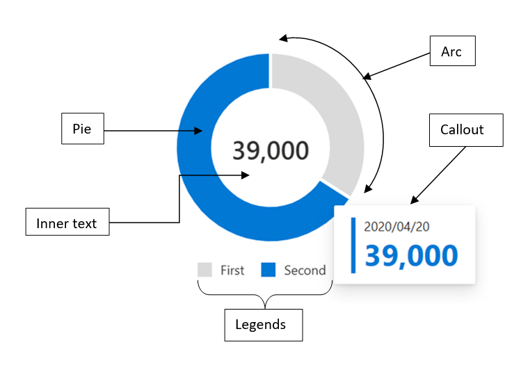
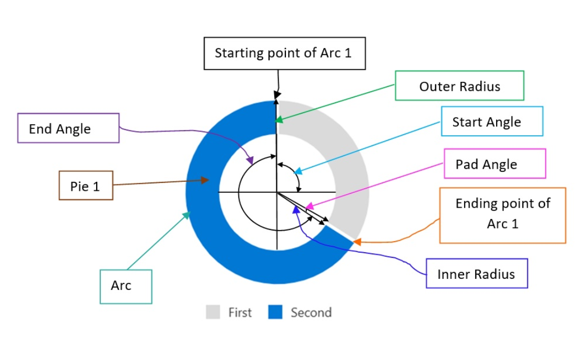
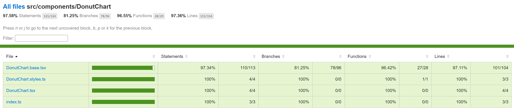

# Contributor guide: Donut Chart



A Donut chart is a type of chart used to visualize data as a circular shape with the central area hollow. It is similar to a Pie chart, but with the area in the center cut out instead of a solid circle.
Donut charts are useful for displaying data as parts of a whole, where each segment represents a percentage or proportion of the total. The segments are typically colored differently to make them easier to distinguish.

## Use cases
Donut charts are commonly used in business and finance to display financial data, such as revenue or expenses. They are also used in marketing to display customer demographics or market share. Here are some real-world use cases for Donut charts:
- Sales data: Donut charts can be used to display sales data, where each segment represents a product or service category. This can help businesses identify which products or services are performing well and which ones need improvement.
- Budget data: Donut charts can be used to display budget data, where each segment represents a budget category. This can help businesses identify areas where they are overspending or underspending.
- Demographic data: Donut charts can be used to display demographic data, where each segment represents a different demographic group. This can help businesses identify their target audience and tailor their marketing efforts accordingly.
- Market share data: Donut charts can be used to display market share data, where each segment represents a different company or brand. This can help businesses identify their competitors and their position in the market.
- Survey data: Donut charts can be used to display survey data, where each segment represents a different response option. This can help businesses identify the most popular responses and areas where improvements can be made.

Overall, Donut charts are useful for displaying data as parts of a whole, where each segment represents a percentage or proportion of the total. They are a popular choice for visualizing financial, marketing, and survey data.

## Mathematical/Geometrical concepts



The d3-shape library provides various functions for creating and manipulating shapes such as arcs, lines, and areas. Following are the main mathematical/geometrical concepts that are used while drawing a donut chart.

1. **d3.arc():** Creates an arc generator function that can be used to create an SVG arc path. The arc generator function takes in an object that specifies the start and end angles of the arc, as well as the inner and outer radii of the arc. The following are some of the main props that the arc generator accepts:
```
- startAngle: The starting angle of the arc, in radians. The default value is 0.
- endAngle: The ending angle of the arc, in radians. The default value is 2π (i.e., a full circle).
- innerRadius: The inner radius of the arc, in pixels. The default value is 0.
- outerRadius: The outer radius of the arc, in pixels. This prop is required.
- padAngle: The amount of padding to add between adjacent arcs, in radians. The default value is 0.
```

2. **d3.pie():** creates a pie generator function that can be used to create a pie chart. The pie generator function takes in an array of data and returns an array of objects that represent each data point in the pie chart.

- Pie formation: The function uses the data values to calculate the angles for each data point. It then uses the angles to create a series of arcs that represent each data point in the pie chart. The arcs are created using the d3.arc() function, which creates an SVG arc path based on the start and end angles of the arc.
- Supported props: The function also provides various options for customizing the pie chart, such as the pie start angle, the pie end angle, and the sort order of the data points. These options can be used to create different types of pie charts, such as donut charts or exploded pie charts.
Here are the main props that can be passed to the pie generator function:
```
- data: the input datum; the corresponding element in the input data array.
- value: the numeric value of the arc.
- index: the zero-based sorted index of the arc.
- startAngle: The starting angle of the pie chart, in radians. The default value is 0.
- endAngle: The ending angle of the pie chart, in radians. The default value is 2π (i.e., a full circle).
- padAngle: The amount of padding to add between adjacent data points, in radians. The default zalue is 0.
```

## Dev Design details
This section contains the technical design of various sub components of a donut chart and how they interact with each other. This section can also contain any key interface or class structure of the donut chart.
The Donut chart consists of the following sub-components:

1. **Arc:**

- **Arc creation:** This component is used to render an arc in a pie chart, and it receives various props such as the arc data, color, and focus state. The component uses the d3-shape library to create the arc shape, and it also uses the @fluentui/react library to apply styles to the component.
- **Arc event handlers:** The Arc component has several methods that handle events such as _onFocus, _hoverOn, _hoverOff, _onBlur and onClick. These methods are used to update the component's state and to trigger callbacks that are passed in as props. The component also has a method called _renderArcLabel that is used to render the label for the arc.
- **Arc update:** The Arc component uses the getDerivedStateFromProps method to update the chart whenever new props are received. This method calls the _updateChart function, which updates the inner and outer radius of the arc based on the new props.
Overall, the Arc component is a reusable component that can be used to render an arc in a pie chart. It is highly customizable and can be used in a variety of contexts.

2. **Pie:**

- **Pie creation:** This component is used to render a pie chart, and it receives various props such as the chart data, inner and outer radius, and callbacks for hover and focus events. The component uses the d3-shape library to create the pie chart shape, and it also uses the @fluentui/react library to apply styles to the component.
- **Constraint:** The inner radius has to be greater than 0.
- **Pie handlers:** The Pie component has several methods that handle events such as _focusCallback and _hoverCallback. These methods are used to update the component's state and to trigger callbacks that are passed in as props. The component also has a method called _computeTotalValue that is used to calculate the total value of the chart data.
- **Pie update:** The Pie component uses the getDerivedStateFromProps method to update the chart whenever new props are received. This method calls the _updateChart function, which updates the inner and outer radius of the chart based on the new props.
Overall, the Pie component is a reusable component that can be used to render a pie chart. It is highly customizable and can be used in a variety of contexts.

3. **Callout:**

- **Callout creation:** The DonutChart component has a method called _renderCallouts that is used to render callouts for the data points. This method creates a Callout component from the @fluentui/react library and passes in various props such as the target element, the callout ID, and the callout content. The method also sets up various actions for the callout, such as hover and dismiss actions.
- **Callout behaviour:** The Callout component is used to display additional information about a data point when it is hovered over. It is positioned relative to the hovered data point and displays information such as the data point's legend, value, and color. The Callout component is highly customizable and can be used in a variety of contexts.

4. **Legends:**

- **Legend creation:** The DonutChart component has a private method called _createLegends that is used to create the legends for the chart. This method takes in the chart data and color palette as arguments and returns a JSX element that contains the legends. The method maps over the chart data and creates a legend for each data point. It also sets up various actions for each legend, such as hover and click actions.

5. **Inner Text:**

- **Inner text description:** The inner text in a Donut chart is the text displayed in the centre of the donut chart, inside the hollow region. This text can be used to display additional information about the data being displayed, such as the total value or the name of the data set.

6. **Rendering details**
The donut chart uses d3 SVG based rendering, which follows the following render cycles:

```
Invocation cycle: Donut Chart -> Pie -> Arc
Rendering cycle:  Donut chart <- d3.pie() <- d3.arc()
```

7. **Error scenarios**

Currently, donut chart cannot handle long inner texts which overflows and results in error state. Fix for this issue is already in PR.

8. **Localization aspects**
Currently, donut chart provides localization only for the inner text.

9. **Testing**
The manual, component and unit testing of donut charts have been completed. Following is the improvement in code coverage:



1. Component Tests:
o Work item: https://uifabric.visualstudio.com/iss/_workitems/edit/6798/
o Test plan: https://github.com/microsoft/fluentui/blob/master/packages/react-charting/docs/TestPlans/DonutChart/ComponentTests.md 
2. Unit Tests:
o Work item: https://uifabric.visualstudio.com/iss/_workitems/edit/7403

- **Accessibility**
FAST pass checks resulted in no error for Donut chart. Link to the FAST pass tool: https://accessibilityinsights.io/docs/web/getstarted/fastpass/ 
Our charts have elaborate accessibility support. The charts are WCAG 2.1 MAS C compliant for accessibility.
Consumers can define their own aria labels for each point by setting the xAxisCalloutAccessibilityData and callOutAccessibilityData properties.

- **Theming**
The palette for donut chart is set from the "theme" prop as passed to the component during rendering. Both light and dark themes are supported and users can create there own theme too. Ref[3]  and Ref[4]  explains theming in detail.

- **Debugging**
The detailed steps on debugging has been given in [Debugging](https://github.com/microsoft/fluentui-charting-contrib/blob/main/docs/Debugging.md).

- **Variants**
Following are the variants of donut chart: [Ref2](https://developer.microsoft.com/en-us/fluentui#/controls/web/donutchart)
  1. Basic Donut Chart: Only basic props are provided.
  2. Dynamic Donut Chart: The data and pie colors can change.
  3. Custom Callout: Can show customized callout data.
  4. Custom Accessibility: Providing custom aria labels.

- **Interaction**
Following are the interactions that are allowed for donut chart:

  1. Mouse Events:
a. On mouse over on the donut chart, should render callout.
b. On mouse move on Pie 1 (step 1) -> mouse leave (step 2) -> mouse move on Pie 2 (step 3), should render the callout of the Pie 2.
c. On mouse over, callout should be defined, on mouse leave, callout should disappear.
d. On mouse over on legends, should highlight the corresponding pie.
e. On mouse over on legends, should change the value inside donut with the legend value.
f. On click on Pie, should highlight the corresponding pie with aria-selected set to “true” and tabIndex set to 0.
g. On mouse out after mouse over on first legend, should have opacity 0.1 for second Pie initially (during mouseOver on first legend) and opacity set to 1 for both the Pies on mouse out.
  2. Keyboard Events:
a. On focus on a Pie, should render the corresponding callout.
b. On blur on a Pie, should remove focus from the corresponding Pie.

- **Some notable PRs and their brief description**

  1. [Adding the Donut Chart main component](https://github.com/microsoft/fluentui/commit/b60d3dfb35367467568d91c2933bb7053e9b716b)
  2. [Adding Tests for Donut Chart using React Testing Library](https://github.com/microsoft/fluentui/commit/5349c8cbc522ff7b9eac2e5858cbad092d22eb82)
  3. [Allow focus navigation with tab key in donut chart (Accessibility)](https://github.com/microsoft/fluentui/commit/50ee71862affde61ace35edcb5c3d6f67928f343)

- **Learnings**

1. While implementing the tests using react testing library, it was found that certain browser functions like getComputedTextLength() cannot be unit tested and needs to be tested End-to-End only.

2. Order of imports are important.
For example: for Vertical bar charts tests, improper sequencing of the imports (data first and then render) results in incorrect and incopmlete rendering of charts:
```
import { chartPoints } from '../VerticalBarChart/VerticalBarChart.test';
import { render, screen, queryAllByAttribute, fireEvent, act } from '@testing- 
library/react';
However, the following results in correct rendering:

import { render, screen, queryAllByAttribute } from '@testing-library/react';
import { chartPoints } from './VerticalBarChart.test';
```
3. Certain props need async await structure (waitFor in react testing library) for different props or nested SVGs to render.

- **Known issues**

The value inside Donut chart overflows. Should be ideally wrapping inside the donut chart. Work item 5321 captures this bug. This item has already been fixed in this [PR](https://github.com/microsoft/fluentui/pull/26192).

- **Future improvements**

Following are the list of future improvements for the donut chart:

1. The donut chart component can be extended to support Nested Donut Charts which can also be used to display multiple sets of data, where each ring represents a different data set.

- **Design figma**
Donut Chart Figma: [Link](https://www.figma.com/file/WOoCs0CmNYZhYl9xXeCGpi/Data-viz-(Archive)?type=design&node-id=3361-77520&mode=design&t=lvW5txXwtfI7wvOI-0)

- **Performance**

The performance aspect of a donut chart refers to how efficiently and effectively it conveys information to the viewer. Here are some key considerations regarding the performance of a line chart:

- Data Visualization Efficiency
- Clarity and Simplicity
- Responsiveness
- Handling Large Datasets
- Interactive Features
We use Lighthouse tool for measuring the performance of our charts. Following are few of the scenarios for which we measure the performance score for donut chart:
  1. chart with 100 data points
  2. charts with localized data
All of the above scenarios have 95+ Lighthouse score. We are efficient in terms of the performance of the donut chart.