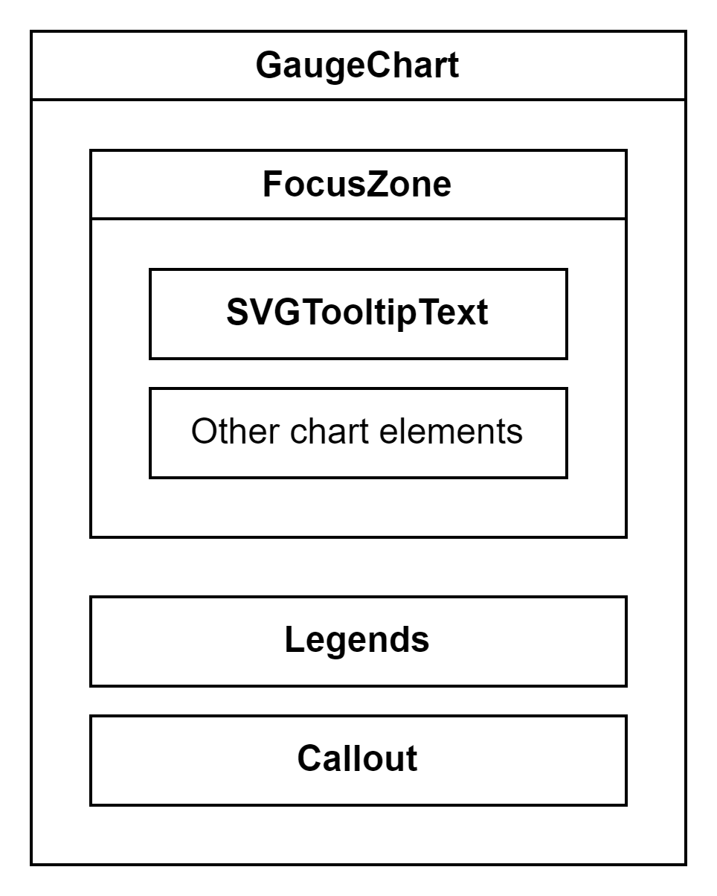
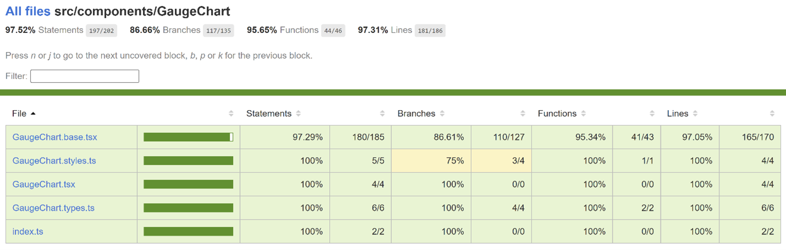

# Contributor guide: Gauge Chart

Gauge chart measures the progress of a metric against its target and its primary components are a speedometer and a needle. The speedometer usually consists of color-coded segments progressing value from left to right.

## Use cases

Gauge chart offers a quick and intuitive way to evaluate a single value within a specific range and its relation to targets or thresholds. Here are some common use cases for gauge chart:

- Performance Monitoring: Track metrics like sales or customer satisfaction against predefined benchmarks.
- KPI Tracking: Monitor progress towards goals by displaying key performance indicators.
- Health and Fitness: Display health parameters such as heart rate or steps taken.
- Survey Feedback: Visualize satisfaction scores or survey feedback.
- Resource Allocation: Show resource distribution across different categories.
- Risk Assessment: Assess risk levels or safety ratings.
- Project Progress: Represent project or task completion percentage.
- Quality Control: Monitor defect or error rates.

## Dev Design details

The Gauge chart comprises the following components and subcomponents:

**GaugeChart**: This is the main component responsible for rendering and managing subcomponents such as chart title, limits (min and max values), segments, needle, chart value, sublabel, and other components. It handles user interactions and provides the overall functionality of the chart.

**FocusZone**: This component facilitates focus navigation within the Gauge chart. It allows users to navigate between focusable subcomponents, such as segments and the needle, using the arrow and tab keys.

**SVGTooltipText**: This component is used to render the chart value and sublabel as SVG text elements with an optional tooltip. The tooltip is triggered when the content overflows and appears when users hover over or focus on the element.

**Legends**: Legends are a list of strings that identify each segment in the Gauge chart. The Legends component renders a button for each legend, enabling users to highlight the corresponding segment by hovering over or selecting the legend.

**Callout**: This component functions as an anchored tip, offering additional information about the segment, needle, or chart value that is currently hovered over or focused without blocking the user.

**Segments**: These are the color-coded intervals that indicate different levels or categories.

**Needle**: It indicates the current value of the chart within a range.

## Mathematical/Geometrical concepts

- Segments in the chart are generated using the [arc](https://github.com/d3/d3-shape#arcs) utility from the [d3-shape](https://github.com/d3/d3-shape) library. This utility returns an arc generator that produces path data based on specified angle and radius values. The arcs are always centred at coordinates \{0, 0}, so a transform is applied to move the arc to a different position.
- Here, an angle of 0 radians corresponds to the positive y-axis. The arc is created in a clockwise direction if the signed difference between the start and end angles is positive. The angular span of each segment is determined by the ratio of its individual size to the total size of all segments.
- The [pad angle](https://github.com/d3/d3-shape#arc_padAngle) is converted to a fixed linear distance separating adjacent arcs, defined as padRadius * padAngle. As per the design doc, the desired distance between adjacent arcs is 2px, referred to as ARC_PADDING. To maintain this distance between the outer boundaries of the arcs, padRadius is kept the same as outerRadius, and padAngle is calculated as ARC_PADDING / padRadius. Note that if the inner radius or angular span is small relative to the pad angle, it may not be possible to maintain parallel edges between adjacent arcs.

## Performance

## Accessibility

The following subcomponents are accessible using a screen reader:

1. **Chart \<svg>**: The following attributes provide an accessible name describing the contents of the chart.
   - `role` = "presentation"
   - `aria-label` = "This is a gauge chart with \{numSegments} section represented."

1. **Min value \<text>**: It is already accessible to screen readers, but the content doesn’t convey complete information. The following attributes specify a different accessible name for the min value.
   - `role` = "img"
   - `aria-label` = "Min value: \{minValue}"

1. **Max value \<text>**: It is already accessible to screen readers, but the content doesn’t convey complete information. The following attributes specify a different accessible name for the max value.
   - `role` = "img"
   - `aria-label` = "Max value: \{adjustedMaxValue}"

1. **Segments \<path>**: The following attributes provide an accessible name describing the segment.
   - `role` = "img"
   - `aria-label` =
     "\{segmentLegend}, \{segmentStart} - \{segmentEnd}" when variant is GaugeChartVariant.MultipleSegments, or
     "\{segmentLegend}, \{segmentSize} out of \{totalSizeOfSegments} or \{segmentSizeInPercent}%" when variant is GaugeChartVariant.SingleSegment.

   Users can provide a custom accessible name or description for a segment using its accessibilityData prop.

1. **Chart value \<text>**: It is already accessible to screen readers, but the content doesn’t convey complete information. The following attributes specify a different accessible name for the chart value.
   - `role` = "img"
   - `aria-label` = "Current value: \{formattedChartValue}"

1. **Sublabel \<text>**: It is already accessible to screen readers. The following attributes provide an accessible name for the sublabel.
   - `role` = "img"
   - `aria-label` = the sublabel itself

## Testing

[GaugeChart test plan](../Test%20Plans/GaugeChart/ComponentTests.md)

## Variants

Here are the props available for customizing the gauge chart:

- **width** and **height**: These props determine the diameter of the gauge. If not provided, a default diameter of 140px is used.

- **chartTitle**: Use this prop to render a title above the gauge.

- **chartValue**: This required prop controls the rotation of the needle. If the chart value is less than the minimum, the needle points to the min value. Similarly, if it exceeds the maximum, the needle points to the max value.

- **segments**: Use this required prop to divide the gauge into colored sections. The segments can have fixed sizes or vary with the chart value to create a sweeping effect. Negative segment sizes are treated as 0.

- **minValue**: Use this prop if the minimum value of the gauge is different from 0.

- **maxValue**: Use this prop to render a placeholder segment when the difference between the max and min values is larger than the total size of the segments. If the difference is smaller, the max value will be adjusted so that the total size of the segments matches the difference.

- **sublabel**: Use this prop to render additional text below the chart value.

- **hideMinMax**: Set this prop to true to hide the min and max values of the gauge.

- **chartValueFormat**: This prop controls how the chart value is displayed. Set it to one of the following options:
  - A custom formatter function that returns a string representing the chart value.
  - *GaugeValueFormat.Fraction*: Renders the chart value as a fraction.
  - *GaugeValueFormat.Percentage*: Renders the chart value as a percentage. This is the default format.

  Note: If the min value is non-zero and no formatter function is provided, the chart value will be rendered as a number.

- **variant**: This prop determines the presentation style of the gauge chart. Set it to one of the following options:
  - *GaugeChartVariant.SingleSegment*: Displays and announces the segment sizes as percentages.
  - *GaugeChartVariant.MultipleSegments*: Displays and announces the segment sizes as ranges. This is the default variant.

For more details, see [Fluent UI React Charting Examples - Gauge Chart (windows.net)](https://fluentuipr.z22.web.core.windows.net/heads/master/react-charting/demo/index.html#/examples/GaugeChart)

## Theming

- The styles file contains a function called getStyles, which returns styles for different areas or subcomponents of the chart based on the props passed to it. The base component is wrapped with the styled HOC, which passes the theme (set by the user) and the concatenated styles (obtained from the styling function and any additional styles provided by the user) as props to the base component. Within the base component, the styles are applied to corresponding elements after converting them into class names. This conversion is done by passing theme and other style props as arguments to the function returned by the classNamesFunction utility. To learn more about component styling, refer [this](https://github.com/microsoft/fluentui/wiki/Component-Styling).
- For each segment in the chart, the color prop is optional. If the color prop is not defined, a color is selected from the qualitative palette using the getNextColor utility. However, if the color prop is defined, the getColorFromToken utility is used to determine the appropriate CSS color. If the value of the color prop is a theme-specific color token from the DataVizPalette, the utility will return the corresponding CSS color. Otherwise, if the color prop is already a valid CSS color, it will be returned as is.

## Debugging

## Error scenarios

## Localization aspects

Currently, the chart supports localization only for the callout content.

## Some notable PRs and their brief description

[Add gauge chart by krkshitij · Pull Request #27170 · microsoft/fluentui (github.com)](https://github.com/microsoft/fluentui/pull/27170)

## Future improvements

1. Add min width and height
1. Show message when chart is empty

## Rendering details

- The calculation of margins for the Gauge chart takes into account the presence of the chart title, sublabel, and limits (min and max values) to ensure that they do not overlap with the segments. Additionally, there is an extra margin of 16px around the gauge, referred to as GAUGE_MARGIN.
- Assuming that the legends do not wrap, the legends container is considered to have a fixed height of 24px. This helps calculate the available height for the \<svg> element.
- The outer radius of the gauge is calculated based on the width and height props. If these props are not provided, the viewable width and height of the root div when the component mounts are used instead.
- According to the design doc, the font size of the chart value and the arc width vary depending on the size of the gauge chart. We cannot use CSS media queries in this case because the styles would be conditionally applied based on browser and operating system parameters. Instead, we use the BREAKPOINTS constant to determine the appropriate inner radius of the gauge and the font size of the chart value.
- If the difference between the max and min values exceeds the total size of all segments, a placeholder segment is rendered with a value equal to the difference. However, if the difference is smaller, the maximum value is adjusted to the correct value.
- The sweep fraction is calculated using the chart value, min value, and adjusted max value to determine the rotation of the needle.
- The min and max values are formatted with SI prefixes, as mentioned in the design doc. This formatting ensures that the values do not exceed 6 characters, equivalent to a width of 36px, referred to as LABEL_WIDTH.
- By default, the focus outline for segments is rectangular in shape. So the default outline is removed, and a custom outline is shown or hidden based on focus and blur events by adjusting the stroke width.

## Interactions

The chart is wrapped with a FocusZone component to allow focus on its interactive subcomponents. The following subcomponents are accessible using the keyboard:

1. **Segments \<path>**
   - `data-is-focusable`: True
   - `onFocus`: Shows a callout near the element containing the chart value and all segments, along with their respective ranges
   - `onBlur`: Hides the callout if it is visible

1. **Needle \<path>**
   - `data-is-focusable`: True
   - `onFocus`: Shows a callout near the element containing the chart value and all segments, along with their respective ranges
   - `onBlur`: Hides the callout if it is visible

1. **Chart value \<text>**
   - `data-is-focusable`: True if the text content overflows the specified width and height
   - `onFocus`: Shows a tooltip with the complete content
   - `onBlur`: Hides the tooltip if it is visible

1. **Legend \<button>**
   - `data-is-focusable`: Depends on the allowFocusOnLegends prop, which is true by default
   - `onFocus`: Highlights the corresponding segment
   - `onBlur`:	Unhighlights the corresponding segment

Users can interact with the following subcomponents using the mouse:

1. **Segments \<path>**
   - `onMouseEnter`: Shows a callout near the element containing the chart value and all segments, along with their respective ranges
   - `onMouseMove`: Shows the callout if it is not already visible

1. **Needle \<path>**
   - `onMouseEnter`: Shows a callout near the element containing the chart value and all segments, along with their respective ranges
   - `onMouseMove`: Shows the callout if it is not already visible

1. **Chart value**
   - **\<g>**
     - `onMouseEnter`: Shows a callout near the element containing the chart value and all segments, along with their respective ranges
     - `onMouseMove`: Shows the callout if it is not already visible
   - **\<text>**
     - `onMouseEnter`: Shows a tooltip with the complete content if the text content overflows the specified width and height
     - `onMouseLeave`: Hides the tooltip if it is visible

1. **Sublabel \<text>**
   - `onMouseEnter`: Shows a tooltip with the complete content if the text content overflows the specified width and height
   - `onMouseLeave`: Hides the tooltip if it is visible

1. **Chart \<svg>**
   - `onMouseLeave`: Hides the callout if it is visible

1. **Legend \<button>**
   - `onMouseOver`: Highlights the corresponding segment
   - `onMouseOut`: Unhighlights the corresponding segment
   - `onClick`: Highlights the corresponding segment if the legend is not already selected, otherwise unhighlights it

## Known issues

1. The chart is assigned the role of presentation. The "presentation" role and its synonym "none" remove an element's implicit ARIA semantics from being exposed to the accessibility tree. For more details, see [ARIA: presentation role - Accessibility | MDN](https://developer.mozilla.org/en-US/docs/Web/Accessibility/ARIA/Roles/presentation_role)

## Design figma

[Gauge chart – Figma](https://www.figma.com/file/oNWKEgIOCSLElvMZPOVMCq/ARCHIVED-Fluent-Data-Viz-(WIP)?type=design&node-id=2415-274387&mode=design&t=jdEfxXd3aMNuyWuz-4)

## Learnings

- The needle is expanded from all sides by half the stroke width to maintain consistent dimensions with the design doc. This is necessary because the stroke is always centered on the outline, with half on the inside and half on the outside.

## Extensions

