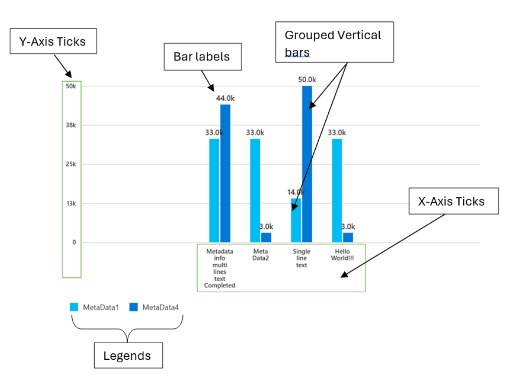
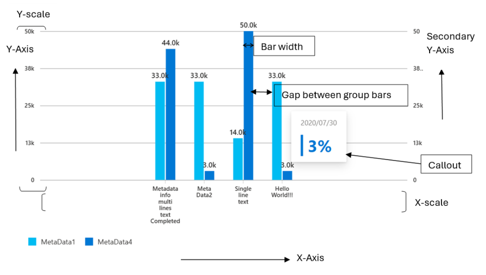
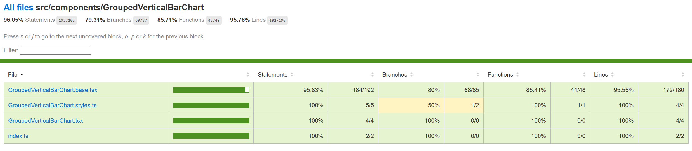

# Contributor guide: Grouped Vertical Bar Chart



A grouped vertical bar chart is a type of chart that displays multiple series of data as groups of bars, with each bar representing a category. The bars are grouped together side by side, with each group representing a different series.

In a grouped vertical bar chart, the x-axis represents the categories, while the y-axis represents the values of the series. Each bar in a group is colored differently to differentiate between the series.

- **Use cases**
  Some common use cases for a Grouped Vertical Bar Chart are as follows:
  - Comparing the values of multiple series across categories
  - Displaying financial data, such as revenue and expenses, for different products or services
  - Displaying scientific research data for different treatments or conditions
  - Comparing the performance of different teams or departments in a company
  - Showing the distribution of different types of crimes in a city
  - Displaying the results of a survey for different age groups or genders
  - Comparing the sales of different products in a store
  - Showing the number of students enrolled in different courses in a school
  - Displaying the number of employees in different departments of a company
  - Comparing the number of visitors to different tourist attractions in a city
- **Mathematical/Geometrical concepts**



The major D3 functions that are involved in the creation of Vertical bar charts are:

- **d3-scale:**
  The d3-scale module is a part of the d3 library, which is a collection of JavaScript functions that are used for data visualization. The d3-scale module provides several functions for creating and manipulating scales, which are used to map data values to visual properties, such as position, size, and color.

  The d3-scale module includes several scale types, including linear, logarithmic, power, and time scales. These scales are used to map continuous data values to a continuous range of visual properties. The module also includes ordinal and band scales, which are used to map categorical data values to a discrete range of visual properties.

The d3-scale module provides several functions for creating and manipulating scales, including scaleLinear, scaleLog, scalePow, scaleTime, scaleOrdinal, and scaleBand. These functions take one or more arguments that define the domain and range of the scale, as well as any additional properties, such as the number of ticks or the padding between bands.

**Application in Grouped Vertical bar chart:**
Grouped vertical bar chart uses the d3-scale module to create a linear scale for the y-axis of the chart. The linear scale maps a continuous domain of data values to a continuous range of visual properties, such as position or height.

- **d3.scaleLinear()**: The d3.scaleLinear is a function from the d3-scale module that is used to create a linear scale for the y-axis of the chart. The linear scale maps a continuous domain of data values to a continuous range of visual properties, such as position or height. The d3ScaleLinear function takes no arguments and returns a new linear scale. The scale can be customized using several methods, including domain, range, clamp, and nice. The domain method sets the domain of the scale, which is the range of data values that the scale maps to the range of visual properties. The range method sets the range of the scale, which is the range of visual properties that the scale maps to the domain of data values.

  **Application in Grouped Vertical bar chart:**

  - In the Grouped Vertical Bar chart component, the d3.scaleLinear function from the d3-scale module is used to create a new linear scale for the y-axis of the chart.
  - The d3.scaleLinear function takes no arguments and returns a new linear scale. The scale maps a continuous input domain to a continuous output range. In this case, the input domain is the range of values for the y-axis data, while the output range is the range of pixel values for the y-axis on the chart.
  - The d3.scaleLinear function is used in the GroupedVerticalBarChart component to generate the y-axis scale for the chart. The yAxisScale property of the component is set to a new instance of the d3.scaleLinear function. The domain property of the yAxisScale object is set to an array of the minimum and maximum values of the y-axis data. The range property of the yAxisScale object is set to an array of the minimum and maximum pixel values for the y-axis on the chart.
  - The d3.scaleLinear function is used to generate a linear scale that maps the y-axis data to the pixel values on the chart. This allows the y-axis data to be displayed in a way that is visually meaningful and easy to interpret.
- **d3.scaleBand():** The d3.scaleBand is a function from the d3-scale module that is used to create a band scale for the x-axis of the chart. The band scale maps a discrete domain of data values to a discrete range of visual properties, such as position or width. The d3ScaleBand function takes no arguments and returns a new band scale. The scale can be customized using several methods, including domain, range, padding, and align. The domain method sets the domain of the scale, which is the range of data values that the scale maps to the range of visual properties. The range method sets the range of the scale, which is the range of visual properties that the scale maps to the domain of data values. The padding method sets the padding between the bands of the scale, which determines the width of the bands. The align method sets the alignment of the bands within the range of the scale.

  **Application in Grouped Vertical bar chart:**
```
- x0_inner_padding = space_between_groups /(space_between_groups + group_width)

- space_between_groups = 2 * bar_width

- group_width = this._keys.length * bar_width + (this._keys.length - 1) * space_between_bars
```
- In the Grouped Vertical Bar chart component, the d3.scaleBand function from the d3-scale module is used to create a new band scale for the x-axis of the chart.
- The d3.scaleBand function takes no arguments and returns a new band scale. The scale maps a discrete input domain to a continuous output range. In this case, the input domain is an array of categories for the x-axis, while the output range is the range of pixel values for the x-axis on the chart.
- The d3.scaleBand function is used in the GroupedVerticalBarChart component to generate the x-axis scale for the chart. The xAxisScale property of the component is set to a new instance of the d3.scaleBand function. The domain property of the xAxisScale object is set to an array of the categories for the x-axis. The range property of the xAxisScale object is set to an array of the minimum and maximum pixel values for the x-axis on the chart.
- The d3.scaleBand function is used to generate a band scale that maps the categories for the x-axis to the pixel values on the chart. This allows the categories to be displayed in a way that is visually meaningful and easy to interpret. The paddingInner and paddingOuter properties of the xAxisScale object can be used to adjust the spacing between the bars and groups of bars on the chart.

Overall, the d3.scaleBand function is used to generate a band scale that maps the categories for the x-axis to the pixel values on the chart, allowing the categories to be displayed in a way that is visually meaningful and easy to interpret.

- **d3-selection:** The d3-selection is a module from the d3 library that is used to select and manipulate DOM elements in the chart component. The d3-selection module provides several functions for selecting and manipulating DOM elements, including select, selectAll, append, attr, and style. The select function is used to select a single DOM element that matches a given selector. The selectAll function is used to select multiple DOM elements that match a given selector. The append function is used to append a new DOM element to a selected element. The attr function is used to set or get an attribute of a selected element. The style function is used to set or get a style property of a selected element.

  **Application in Grouped Vertical bar chart:**

  - In the Grouped Vertical Bar chart component, the d3Select function from the d3-selection module is used to select an element from the DOM.
  - The d3Select function takes one argument, which is a SVG node element for the element to be selected. The function returns a new selection object that represents the selected element.

Overall, the d3Select function from the d3-selection module is used to select an element from the DOM, which allows the GroupedVerticalBarChart component to interact with and modify the chart elements.

- **d3-array:** The d3-array is a module from the d3 library that is used to manipulate arrays of data in the chart component. The d3-array module provides several functions for manipulating arrays of data, including max, min, extent, sum, and mean. The max function is used to find the maximum value in an array of data. The min function is used to find the minimum value in an array of data. The extent function is used to find the minimum and maximum values in an array of data. The sum function is used to find the sum of the values in an array of data. The mean function is used to find the mean (average) of the values in an array of data.

  **Application in Grouped Vertical bar chart:**

  - In the Grouped Vertical Bar chart component, the d3Max function from the d3-array module is used to find the maximum value in an array of numbers.
  - The d3Max function takes two arguments: the first argument is the array of numbers to be searched, and the second argument is an optional function that specifies how to extract the numeric value from each element in the array. If the second argument is not provided, the d3Max function assumes that the array contains only numeric values.

Overall, the d3Max function from the d3-array module is used to find the maximum value in an array of numbers, which allows the GroupedVerticalBarChart component to set the y-axis scale domain based on the maximum value of the y-axis data.

- **d3-format:** The d3-format is a module from the d3 library that is used to format numbers and strings in the chart component. The d3-format module provides several functions for formatting numbers and strings, including format, formatPrefix, precisionFixed, and precisionRound.

  The format function is used to format a number or string using a specified format string. The format string can include placeholders for the value, such as % for a percentage or , for a comma-separated number. The formatPrefix function is used to format a number using a prefix notation that rounds the value to a specified precision and appends a prefix, such as K for thousands or M for millions. The precisionFixed function is used to format a number using a fixed number of decimal places. The precisionRound function is used to format a number using a variable number of decimal places that is determined by the magnitude of the value.

**Application in Grouped Vertical bar chart:**

- In the Grouped Vertical Bar chart component, the d3FormatPrefix function from the d3-format module is used to format numbers with SI-prefixes.
- The d3FormatPrefix function takes one argument, which is a numeric value. The function returns a string that represents the value with an SI-prefix, such as "K" for thousands or "M" for millions.
- The d3FormatPrefix function is used in the GroupedVerticalBarChart component to format the bar labels for groups.

Overall, the d3FormatPrefix function from the d3-format module is used to format numbers, which allows the component to display the bar labels in a way that is visually meaningful and easy to interpret.

- **d3-axis:** The d3-axis module is a part of the d3 library, which is a collection of JavaScript functions that are used for data visualization. The d3-axis module provides several functions for creating and manipulating axes, which are used to display the scales of a chart component.

  In data visualization, axes are used to display the scales of a chart component, such as the x-axis and y-axis of a bar chart. Axes provide visual cues to help readers interpret the data values of a chart component, such as the range and domain of the data values.

The d3-axis module provides several types of axes, including bottom, top, left, and right axes. Each type of axis has its own set of methods for customizing the axis and displaying the tick values.

Overall, the d3-axis module is an essential part of data visualization, as it provides a powerful and flexible way to display the scales of a chart component and help readers interpret the data values of the chart.

**Application in Grouped Vertical bar chart:**
In the Vertical stacked bar chart, d3-axis is used to create and render the x and y axes of the chart.

- The d3-axis library provides various methods for creating and rendering axes, such as axisBottom(), axisLeft(), and tickFormat(). In this case, the d3-axis library is used to create and render the x and y axes of the chart.
- To create the x and y axes, the d3-axis library's axisBottom() and axisLeft() methods are used, respectively. These methods take a scale function as an argument and return a new axis function that can be used to render the axis.
- The resulting x and y axis functions are then used to render the x and y axes of the chart. The call() method of the selection object is used to call the axis function and render the axis.
- The tickFormat() method of the y-axis scale is also used to set the tick format function for the y-axis. This method takes the format function created using the d3-format library as an argument and sets it as the tick format function for the y-axis.

Overall, the d3-axis library is used to create and render the x and y axes of the chart by using the axisBottom() and axisLeft() methods to create the axis functions and the call() method to render the axes. The tickFormat() method is also used to set the tick format function for the y-axis.

- **Dev Deisgn Details:**
  Following are the major components that contribute towards creating a complete grouped vertical bar chart:
  - **Axes:**
    - **\_createX0Scale():** This method is responsible for generating the x and y scales that are used to map the data points to the chart dimensions. The scales are generated using the d3-scale library, which provides several scale types for different types of data.

      **Function arguments:**

      - containerWidth: It is a number representing the width of the container element for the chart. This argument is used to calculate the range of the x-axis scale.

**Working algorithm:**

- The \_createX0Scale method first creates a new d3ScaleBand object called x0Axis. The domain property of the x0Axis object is set to the \_xAxisLabels array, which contains the labels for the main x-axis of the chart. The range property of the x0Axis object is set to an array that defines the range of the main x-axis scale. The range is calculated based on the containerWidth, the margins of the chart, and the \_domainMargin property, which is the margin between the edge of the chart and the first and last bars.
- The paddingInner property of the x0Axis object is set to a value that defines the inner padding between groups of bars in the chart. The value is calculated based on the number of keys in the chart, which is the number of series in each data point, and the BAR\_GAP\_RATE property, which is the ratio of the space between bars to the width of a bar.
- Finally, the \_createX0Scale method returns the x0Axis object.
- **\_createX1Scale():** This method generates the grouped x-axis scale for the chart. The method creates a new d3ScaleBand object and sets its domain, range, and paddingInner properties based on the \_keys array, the bandwidth of the main x-axis scale, the \_isRtl property, and the X1\_INNER\_PADDING and BAR\_GAP\_RATE properties. The method returns the d3ScaleBand object.

  **Function arguments:**

  - xScale0: This argument is a scale function that is used to calculate the width of each bar in the chart. The function returns a new scale function that is used to calculate the position of each bar within a group.

**Working algorithm:**

- The \_createX1Scale method first creates a new d3ScaleBand object say x1Axis. The domain property of the x1Axis object is set to the \_keys array, which contains the keys for each series in the chart. The range property of the x1Axis object is set to an array that defines the range of the grouped x-axis scale. The range is calculated based on the bandwidth of the main x-axis scale, the \_isRtl property, which is a boolean that indicates whether the chart is in right-to-left mode.
- The paddingInner property of the x1Axis object is set to a value that defines the inner padding between groups of bars in the chart. The value is calculated based on the X1\_INNER\_PADDING property whose value is 0.1.
- Finally, the \_createX1Scale method returns the x1Axis object.
- **\_getDomainMargins():** This method calculates the margins of the chart based on the available width of the chart container and the required width to render the bars in the chart. The method calculates the barWidth and groupWidth variables based on the barwidth prop, the number of keys in the chart, and the BAR\_GAP\_RATE property. If the available width is greater than or equal to the required width, the method centers the chart by setting equal left and right margins for the domain. If the available width is less than the required width, the method calculates the maximum possible group width to maintain a 2:1 spacing between bars and groups of bars and recalculates the barWidth variable. The method returns an object that represents the margins of the chart.

  **Function arguments:**

  - containerWidth: It is a number representing the width of the container in which the chart is being rendered.

**Formulae:**
```
x1_inner_padding = space_between_bars / (space_between_bars + bar_width)

=> space_between_bars = (x1_inner_padding / (1 - x1_inner_padding)) \* bar_width

BAR_GAP_RATE = Rate at which the space between the bars in a group changes wrt the bar width

BAR_GAP_RATE = X1_INNER_PADDING / (1 - X1_INNER_PADDING)

X1_INNER_PADDING = 0.1

Maximum possible group width to maintain 2:1 spacing:

InitialBarWidth = Math.min(props.barwidth || 16, 24);

(i) InitialGroupWidth = _keys.length * InitialBarWidth+ (_keys.length - 1) * BAR_GAP_RATE * InitialBarWidth

Total width required to render the bars. Directly proportional to bar width:

(ii) ReqWidth = _xAxisLabels.length * InitialGroupWidth  + (_xAxisLabels.length - 1) * 2 * InitialBarWidth

From (i) and (ii)

Maximum possible group width to maintain 2:1 spacing

MaxBandwidth = totalWidth / (_xAxisLabels.length +

(_xAxisLabels.length - 1) \* (2 / (_keys.length + (_keys.length - 1) * BAR_GAP_RATE)))

FinalGroupWidth = MaxBandwidth;

From (i)

FinalBarWidth = FinalGroupWidth / (_keys.length + (_keys.length - 1) * BAR_GAP_RATE)
```

**Working algorithm:**

- The \_getDomainMargins method first calculates the total width available to render the bars in the chart. The total width is calculated based on the containerWidth, the margins of the chart, and the MIN\_DOMAIN\_MARGIN property, which is the minimum margin between the edge of the chart and the first and last bars. The method then sets the barWidth variable to the minimum of the barwidth prop or 16, and the groupWidth variable to the product of the number of keys in the chart, the barWidth, and the BAR\_GAP\_RATE property, which is the ratio of the space between bars to the width of a bar, plus the space between groups of bars.
- The method then calculates the total width required to render the bars in the chart. The total width is calculated based on the length of the \_xAxisLabels array, the groupWidth, the barWidth, and the space between groups of bars. If the total width available to render the bars is greater than or equal to the total width required to render the bars, the method sets the \_domainMargin property to half of the difference between the total width available and the total width required. This centers the chart by setting equal left and right margins for the domain.
- If the total width available to render the bars is less than the total width required to render the bars, the method calculates the maximum possible group width to maintain a 2:1 spacing between bars and groups of bars. The method then sets the groupWidth variable to the maximum possible group width and recalculates the barWidth variable based on the groupWidth and the BAR\_GAP\_RATE property. The \_domainMargin property is set to the MIN\_DOMAIN\_MARGIN.
- Finally, the \_getDomainMargins method returns an object that represents the margins of the chart. The left and right margins of the chart are updated to include the \_domainMargin.
- **createNumericXAxis():** The code above is a function called createNumericXAxis in the utilities.ts file. This function is responsible for creating a numeric x-axis for a chart component. The function takes two arguments: xAxisParams and chartType. xAxisParams is an object that contains several properties, including domainNRangeValues, showRoundOffXTickValues, xAxistickSize, tickPadding, xAxisCount, and xAxisElement. chartType is an enumeration that specifies the type of chart component.

  **Function arguments:**

  - xAxisParams of type IXAxisParams which is an object containing the following properties:
    - domainNRangeValues of type IDomainNRange which is an object containing the domain and range values for the x-axis.
    - showRoundOffXTickValues of type boolean which is an optional property that determines whether to round off the x-axis tick values.
    - xAxistickSize of type number which is an optional property that determines the size of the x-axis ticks.
    - tickPadding of type number which is an optional property that determines the padding between the x-axis ticks and the x-axis labels.
    - xAxisCount of type number which is an optional property that determines the number of x-axis ticks.
    - xAxisElement of type SVGElement | null which is an optional property that represents the x-axis element.
  - chartType of type ChartTypes which is an enum that represents the type of chart.
  - culture of type string which is an optional paramter represents the locale into which the numeric x-axis labels will be localized.

**Working algorithm:**

- The function first extracts the properties of the xAxisParams object using destructuring. The domainNRangeValues property is an object that contains the start and end values of the domain and range of the x-axis. The showRoundOffXTickValues property is a boolean that specifies whether to round off the tick values of the x-axis. The xAxistickSize property is a number that specifies the size of the ticks of the x-axis. The tickPadding property is a number that specifies the padding between the ticks and the labels of the x-axis. The xAxisCount property is a number that specifies the number of ticks of the x-axis. The xAxisElement property is a reference to the DOM node that contains the x-axis of the chart.
- The function then creates a linear scale for the x-axis using the d3ScaleLinear function from the d3-scale module. The scale is customized using the domain and range methods, which set the domain and range of the scale, respectively. If the showRoundOffXTickValues property is true, the nice method is called on the scale to round off the tick values of the x-axis.
- The function then creates a bottom axis for the x-axis using the d3AxisBottom function from the d3-axis module. The axis is customized using the tickSize, tickPadding, ticks, and tickFormat methods. The tickSize method sets the size of the ticks of the x-axis. The tickPadding method sets the padding between the ticks and the labels of the x-axis. The ticks method sets the number of ticks of the x-axis. The tickFormat method formats the tick values of the x-axis using the convertToLocaleString function and the culture parameter.
- If the xAxisElement property is not null, the axis is rendered on the DOM node using the call method of the d3-selection module. The selectAll method is called on the axis to select all the text elements of the x-axis, and the attr method is called to set the aria-hidden attribute of the text elements to true.
- Finally, the function computes the tick values of the x-axis using the ticks and tickFormat methods of the scale, and returns an object that contains the x-axis scale and the tick values.

Overall, the createNumericXAxis function is responsible for creating a numeric x-axis for a chart component. The function creates a linear scale for the x-axis and a bottom axis for the x-axis using the d3-scale and d3-axis modules, respectively. The function customizes the scale and axis using several methods, including domain, range, tickSize, tickPadding, ticks, and tickFormat. The function also renders the axis on the DOM node and computes the tick values of the x-axis.

- **createStringXAxis():** This function is responsible for creating a string x-axis for a chart component. The function takes four arguments: xAxisParams, tickParams, dataset, and culture. xAxisParams is an object that contains several properties, including domainNRangeValues, xAxisCount, xAxistickSize, tickPadding, xAxisPadding, xAxisInnerPadding, and xAxisOuterPadding. tickParams is an object that contains several properties, including tickValues and tickFormat. dataset is an array of strings that contains the values of the x-axis. culture is a string that specifies the locale into which the x-axis labels can be localized.

**Function Arguments:**

- xAxisParams: An object containing the parameters for the x-axis, including the domain and range values, tick size, tick padding, number of ticks, padding for the inner and outer edges of the axis, and the element to render the axis.
- tickParams: An object containing the parameters for the ticks on the x-axis, including the tick values and tick format.
- dataset: An array of strings representing the data points for the x-axis.
- culture: An optional string representing the culture to use for formatting the tick labels on the x-axis. However, the localization works only if the string can be converted to a numeric value. Otherwise, the x-axis labels remain unlocalized.

**Working algorithm:**

- The function first extracts the properties of the xAxisParams object using destructuring. The domainNRangeValues property is an object that contains the start and end values of the domain and range of the x-axis. The xAxisCount property is a number that specifies the number of ticks of the x-axis. The xAxistickSize property is a number that specifies the size of the ticks of the x-axis. The tickPadding property is a number that specifies the padding between the ticks and the labels of the x-axis. The xAxisPadding property is a number that specifies the padding between the bars of the chart. The xAxisInnerPadding property is a number that specifies the inner padding between the bars of the chart. The xAxisOuterPadding property is a number that specifies the outer padding between the bars of the chart.
- The function then creates a band scale for the x-axis using the d3ScaleBand function from the d3-scale module. The scale is customized using the domain and range methods, which set the domain and range of the scale, respectively. The paddingInner and paddingOuter methods are used to set the inner and outer padding between the bars of the chart, respectively.
- The function then creates a bottom axis for the x-axis using the d3AxisBottom function from the d3-axis module. The axis is customized using the tickSize, tickPadding, ticks, and tickFormat methods. The tickSize method sets the size of the ticks of the x-axis. The tickPadding method sets the padding between the ticks and the labels of the x-axis. The ticks method sets the number of ticks of the x-axis. The tickFormat method formats the tick values of the x-axis using the convertToLocaleString function and the culture parameter.
- If the xAxisParams.xAxisElement property is not null, the axis is rendered on the DOM node using the call method of the d3-selection module. The selectAll method is called on the axis to select all the text elements of the x-axis, and the attr method is called to set the aria-hidden attribute of the text elements to true.
- Finally, the function computes the tick values of the x-axis using the tickFormat method of the axis, and returns an object that contains the x-axis scale and the tick values.

Overall, the createStringXAxis function is responsible for creating a string x-axis for a chart component. The function creates a band scale for the x-axis and a bottom axis for the x-axis using the d3-scale and d3-axis modules, respectively. The function customizes the scale and axis using several methods, including domain, range, paddingInner, paddingOuter, tickSize, tickPadding, ticks, and tickFormat. The function also renders the axis on the DOM node and computes the tick values of the x-axis.

- **createYAxis():** In the Vertical bar chart component, the d3-axis module is used to create and customize the y-axis of a vertical bar chart. The createYAxis function is responsible for creating the y-axis using the createYAxisForOtherCharts function. The function takes in several parameters, including yAxisParams, isRtl, axisData, and useSecondaryYScale. These parameters are used to customize the y-axis, such as setting the tick values, tick format, and tick padding.

  **Function arguments:**

  - yAxisParams: An object that contains various parameters related to the y-axis of the chart. It has the following properties:
    - yMinMaxValues: An object that contains the start and end values of the y-axis.
    - yAxisElement: The DOM element that represents the y-axis.
    - yMaxValue: The maximum value of the y-axis.
    - yMinValue: The minimum value of the y-axis.
    - containerHeight: The height of the container that holds the chart.
    - containerWidth: The width of the container that holds the chart.
    - margins: An object that contains the margins of the chart.
    - tickPadding: The padding between the ticks and the axis line.
    - maxOfYVal: The maximum value of the y-axis for area chart and Grouped vertical bar chart.
    - yAxisTickFormat: The format of the y-axis tick labels.
    - yAxisTickCount: The number of ticks on the y-axis.
    - eventAnnotationProps: An object that contains the properties of the event annotation.
    - eventLabelHeight: The height of the event label.
  - isRtl: A boolean value that indicates whether the chart is in right-to-left mode.
  - axisData: An object that contains the data related to the axis of the chart.
  - useSecondaryYScale: A boolean value that indicates whether to use a secondary y-axis scale.

**Working algorithm:**

- The function first extracts the necessary parameters from the yAxisParams object, such as the yMinMaxValues, yAxisElement, containerHeight, and containerWidth. It then calculates the final maximum and minimum values for the y-axis, based on the maxOfYVal, yMaxValue, and yMinValue parameters.
- The function then prepares the datapoints for the y-axis using the prepareDatapoints function, which calculates the tick values based on the maximum and minimum values of the y-axis. It then creates a linear scale for the y-axis using the d3ScaleLinear function from the d3-scale library.
- The function then creates the y-axis using the d3AxisLeft or d3AxisRight function from the d3-axis library, depending on the isRtl and useSecondaryYScale parameters. It sets the tick padding, tick values, and tick size for the y-axis, and formats the tick labels using the yAxisTickFormat parameter.
- Finally, the function uses the d3Select function to select the yAxisElement and apply the y-axis to it using the call method. It also sets the aria-hidden attribute of the y-axis text elements to true to improve accessibility.
- **createStringYAxis():** In the Vertical bar chart component, the d3-axis module is used to create and customize the y-axis of a vertical bar chart. The createStringYAxis function is responsible for creating the y-axis that use string values for the y-axis using the createStringYAxisForOtherCharts function. The function takes in several parameters, including yAxisParams, dataPoints, and isRtl. These parameters are used to customize the y-axis, such as setting the tick values, tick format, and tick padding.

  **Function arguments:**

  - yAxisParams: An object that contains the parameters for the y-axis, including containerHeight, tickPadding, margins, yAxisTickFormat, yAxisElement, and yAxisPadding.
  - dataPoints: An array of strings that represent the data points for the y-axis.
  - isRtl: A boolean value that indicates whether the chart is in right-to-left mode.

**Working algorithm:**

- The function first extracts the necessary parameters from the yAxisParams object, such as the containerHeight, margins, yAxisTickFormat, yAxisElement, and yAxisPadding. It then creates a band scale for the y-axis using the d3ScaleBand function from the d3-scale library.
- The band scale is defined using the dataPoints array as the domain, and the containerHeight and margins parameters as the range. The padding method is used to set the padding between the bands in the y-axis.
- The function then creates the y-axis using the d3AxisLeft or d3AxisRight function from the d3-axis library, depending on the isRtl parameter. It sets the tick padding, tick values, and tick size for the y-axis, and formats the tick labels using the yAxisTickFormat parameter.
- Finally, the function uses the d3Select function to select the yAxisElement and apply the y-axis to it using the call method. It also selects all the text elements of the y-axis and returns the y-axis scale.
- **Bars:**
  - **\_getGraphData():** This method generates the set of bars for each data point in the chart. The method creates two new x-axis scales, iterates over the \_datasetForBars array, and calls the \_buildGraph method to generate a set of bars for each data point. The sets of bars are added to an array, which is then assigned to the \_groupedVerticalBarGraph variable.

    **Function arguments:**

    - xScale: A StringAxis or NumericAxis object that represents the x-axis scale of the chart.
    - yScale: A NumericAxis object that represents the y-axis scale of the chart.
    - containerHeight: A number that represents the height of the chart container.
    - containerWidth: A number that represents the width of the chart container.
    - xElement: An optional SVGElement or null that represents the x-axis element of the chart.

**Working algorithm:**

- The \_getGraphData method first creates two new x-axis scales using the \_createX0Scale and \_createX1Scale methods. The \_createX0Scale method creates a new x-axis scale for the main x-axis of the chart, while the \_createX1Scale method creates a new x-axis scale for the grouped bars in the chart.
- The method then creates an empty array called allGroupsBars. The \_datasetForBars array is then iterated over, and for each data point in the array, the \_buildGraph method is called to generate a set of bars for the data point. The \_buildGraph method takes the current data point, the two x-axis scales, the container height, and the optional x-axis element as arguments and returns a set of bars as a JSX element.
- The set of bars for each data point is added to the allGroupsBars array. Finally, the \_groupedVerticalBarGraph variable is set to the allGroupsBars array.
- **\_buildGraph():** The method generates a set of bars for a single data point in the chart. The method iterates over each series in the data point and creates a rect element for each series. If the data property of the series is not null, the method also creates a text element to display the value of the data point above the bar. If the wrapXAxisLables prop is false and the showXAxisLablesTooltip prop is true, the method also displays a tooltip at the x-axis label. The method returns a g element that contains the set of bars and labels.

  **Function arguments:**

  - singleSet: This is an object that contains the data for a single set of bars.
  - xScale0: This is a scale function that maps the domain values to the range values for the x-axis.
  - xScale1: This is a scale function that maps the domain values to the range values for the x-axis.
  - containerHeight: This is the height of the container that holds the chart. It is of type number.
  - xElement: This is the SVG element that represents the x-axis. It is of type SVGElement.

**Working algorithm:**

- The \_buildGraph method first creates two empty arrays called singleGroup and barLabelsForGroup. The yBarScale variable is then set to a new d3ScaleLinear object that represents the y-axis scale of the chart.
- The method then iterates over each series in the current data point. For each series, the method calculates the x and y coordinates of the bar using the xScale1 and yBarScale scales, respectively. If the data property of the series is not null, the method creates a new rect element and adds it to the singleGroup array. The rect element has properties that define its position, size, color, and event handlers. If the data property of the series is not null and the hideLabels prop is false and the \_barWidth property is greater than or equal to 16, the method creates a new text element and adds it to the barLabelsForGroup array. The text element displays the value of the data point above the bar.
- If the wrapXAxisLables prop is false and the showXAxisLablesTooltip prop is true, the method creates a new tooltipProps object and calls the tooltipOfXAxislabels function to display a tooltip at the x-axis label.
- Finally, the method returns a g element that contains the singleGroup and barLabelsForGroup arrays. The g element is translated to the x-coordinate of the current data point on the main x-axis using the xScale0 scale.
- **Legends:**
  - **\_getLegendData():** The method generates the legend for the chart. The method iterates over each data point and series in the chart and creates a legend object for each unique series. The method returns a Legends component that renders the legend using the legend objects.

    **Function arguments:**

    - points: An array of IGroupedVerticalBarChartData objects, which contain the data points for the chart.
    - palette: An object of type IPalette, which contains the color palette for the chart.
      The function returns a JSX element that renders the legend for the chart.

**Working algorithm:**

- The \_getLegendData method starts by defining some variables. The data variable is set to the points argument. The defaultPalette variable is set to an array of colors to use for the legend. The actions variable is set to an empty array.
- The method then iterates over each data point in the data array. For each data point, the method iterates over each series in the data point. For each series, the method checks if a similar legend has already been added to the actions array. If a similar legend exists, the method skips to the next series. If a similar legend does not exist, the method creates a new legend object and adds it to the actions array. The legend object contains a title property, which is set to the legend property of the current series, a color property, which is set to a random color from the defaultPalette array if the color property of the current series is not defined, and action, hoverAction, and onMouseOutAction properties, which are functions that handle click, hover, and mouse out events for the legend.
- Finally, the method returns a Legends component that renders the legend for the chart. The legends prop is set to the actions array. The overflowProps, enabledWrapLines, focusZonePropsInHoverCard, and legendProps props are set to values from the props object.
- **Callouts:**
  - **\_getCustomizedCallout():** The method returns a customized callout for a data point in the chart. The callout is rendered using the onRenderCalloutPerDataPoint prop, which is a function that takes a dataPointCalloutProps object as an argument and returns a React element.

**Working algorithm:**

- The \_getCustomizedCallout method first checks if the onRenderCalloutPerDataPoint prop is defined. If it is, the method calls the onRenderCalloutPerDataPoint function and passes in the dataPointCalloutProps object as an argument. The dataPointCalloutProps object contains information about the current data point, including its x and y values, as well as its color and data properties.
- If the onRenderCalloutPerDataPoint prop is not defined, the \_getCustomizedCallout method returns null.
- **Rendering details**
  The Grouped vertical bar chart uses d3 SVG based rendering, which follows the following render cycles:
  ```
  - Invocation cycle: Grouped Vertical bar Chart -> Cartesian base chart -> X-axis -> X-axis labels -> Y-axis -> Y-axis labels -> bars, legends, callouts
  - Rendering cycle: Grouped vertical bar chart <- Bars (rect), Legends, Callouts <- Axes (d3.axis, d3.scale)
  ```

**Following are the detailed steps:**

- The rendering of the grouped vertical bar chart is done using SVG elements. The chart is rendered inside a svg element that is created using the React.createElement() method.
- The chart is divided into two main sections: the x-axis and the bars. The x-axis is created using the d3.axis() function and is rendered as a g element inside the svg element. The bars are created using the rect element and are rendered as a g element inside the svg element.
- The rect elements are created using the datasetForBars array that is created using the \_createDataset() method. The datasetForBars array contains an array of objects, where each object represents a group of bars. Each group of bars is rendered as a g element inside the svg element.
- Inside each group of bars, the rect elements are created using the map() method on the data array. The map() method creates a new array of rect elements, where each rect element represents a bar in the group. The rect elements are positioned using the x and y attributes, which are calculated based on the data and the scales that were created earlier in the file.
- The rect elements are also styled using various attributes such as fill, stroke, and strokeWidth. The fill attribute is set to a color that is based on the index of the rect element in the group. The stroke and strokeWidth attributes are used to create a border around each rect element.
- The \_onBarHover() method is used to handle the hover event on the bars. This method is called when the user hovers over a bar in the chart. The method updates the state of the component to show the callout for the hovered bar.

Overall, the grouped vertical bar chart is rendered using SVG elements that are created using the React.createElement() method. The chart is divided into two main sections: the x-axis and the bars. The bars are created using the rect element and are positioned and styled based on the data and the scales that were created earlier in the file. The \_onBarHover() method is used to handle the hover event on the bars and show the callout for the hovered bar.

- **Error scenarios**
  The Grouped Vertical bar chart handles the following error scenario:
  - Empty data: If the data passed to the chart component is empty, the chart will not render and a message will be narrated to the user. \_isChartEmpty functions handles that scenario.
- **Localization aspects**
  Currently, although the component has a support for culture prop, but it does not support localization yet.
- **Testing**
  The testing for Grouped Vertical bar chart have not been started. The document will be updated as and when the tests are completed.
  
  - Component Tests:
    - Work item [7411](https://uifabric.visualstudio.com/iss/_workitems/edit/7411)
  - Unit Tests:
    - Work item [7412](https://uifabric.visualstudio.com/iss/_workitems/edit/7412)
  - Manual Tests:
    - Work item [8605](https://uifabric.visualstudio.com/iss/_workitems/edit/8605)
  - Accessibility Tests:
    - Work item [7410](https://uifabric.visualstudio.com/iss/_workitems/edit/7410)
- **Accessibility**
  FAST pass checks resulted in no error for Grouped Vertical bar chart. Link to the [FAST pass tool](https://accessibilityinsights.io/docs/web/getstarted/fastpass/)
  Our charts have elaborate accessibility support. The charts are WCAG 2.1 MAS C compliant for accessibility.
  Consumers can define their own aria labels for each point by setting the callOutAccessibilityData property.
- **Theming**
  The palette for vertical bar chart is set from the "theme" prop as passed to the component during rendering. Both light and dark themes are supported and users can create there own theme too. [Ref6](https://github.com/microsoft/fluentui/wiki/Theming)  and [Ref7](https://github.com/microsoft/fluentui/wiki/How-to-apply-theme-to-Fluent-UI-React-components)  explains theming in detail.
- **Debugging**
  The detailed steps on debugging has been given in [Debugging](https://github.com/microsoft/fluentui-charting-contrib/blob/main/docs/Debugging.md).
- **Variants**
  Following are the variants of vertical bar chart: [Ref8](https://developer.microsoft.com/en-us/fluentui#/controls/web/verticalbarchart/grouped) 
  - *Basic Grouped Vertical bar Chart*: Only basic props are provided.
  - *Custom Accessibility*: Providing custom aria labels.
  - *Styled*: Can show bars with increased bar width.
  - *Tooltip*: Can show tooltip over x-axis ticks when the ticks are truncated.
- **Interaction**
  Following are the interactions that are allowed for donut chart:
  - *Mouse Events*:
    a. Hover mouse over a bar, should call the corresponding handler and show the callout over that bar.
    b. On mouse move on Bar 1 (step 1) -> mouse leave (step 2) -> mouse move on Bar 2 (step 3), should render the callout of the Bar 2.
    c. On mouse over, callout should be defined, on mouse leave, callout should disappear.
    d. On mouse over on legends, should highlight the corresponding bar.
    f. On click on Bar, should highlight the corresponding bar.
    g. On mouse out after mouse over on first legend, should have opacity 0.1 for second bar initially (during mouseOver on first legend) and opacity set to 1 for both the bars on mouse out.
  - *Keyboard Events*:
    a. On focus on a bar, should render the corresponding callout.
- **Some notable PRs and their brief description**
  - [Adding the Grouped Vertical bar chart main component](https://github.com/microsoft/fluentui/pull/12687)
  - [Refactoring Grouped Vertical Bar Chart via implementation of Cartesian charts](https://github.com/microsoft/fluentui/pull/15838)
  - [Custom Accessibility Change for Grouped Vertical Bar Chart](https://github.com/microsoft/fluentui/pull/18880)
  - [Number localization in charts](https://github.com/microsoft/fluentui/pull/20347)
  - [Narrator issues fixed in bar charts](https://github.com/microsoft/fluentui/pull/16914)
  - [Callout accessibility issue fixed for bar charts](https://github.com/microsoft/fluentui/pull/17571)
- **Learnings**
  - While implementing the tests using react testing library, it was found that certain browser functions like getComputedTextLength() cannot be unit tested and needs to be tested End-to-End only.
  - Order of imports are important.
    For example: for Vertical bar charts tests, improper sequencing of the imports (data first and then render) results in incorrect and incopmlete rendering of charts:
```
  - import { chartPoints } from '../VerticalBarChart/VerticalBarChart.test';
  - import { render, screen, queryAllByAttribute, fireEvent, act } from '@testing-library/react';
```

However, the following results in correct rendering:
```
import { render, screen, queryAllByAttribute } from '@testing-library/react';

import { chartPoints } from './VerticalBarChart.test';
```
- Certain props need async await structure (waitFor in react testing library) for different props or nested SVGs to render.
- **Known issues**
  - Setting the margins externally via the props may cut the x and y ticks if the margins provided are very less. Setting a minimum margin would prevent any such distortions.
- **Future improvements**

  Following are the list of future improvements for the vertical bar chart:

  - Improved accessibility: While the component already provides accessibility data for screen readers, there is always room for improvement in this area. Adding support for keyboard navigation and improving the accessibility of the callout would make the component more accessible to users with disabilities.
  - Support for animations: Adding support for animations, such as transitions between data updates or hover effects, would make the component more visually appealing and engaging for users.
  - Following error handling scenarios can be improved:
    - Invalid or missing chart dimensions: If the dimensions of the chart are invalid or missing, the chart will not render and a message will be displayed to the user.
    - Invalid or missing axis parameters: If the parameters for the x-axis or y-axis are invalid or missing, the chart will not render and a message will be displayed to the user.
    - Invalid or missing legends: If the legends for the chart are invalid or missing, the chart will not render and a message will be displayed to the user.
    - Invalid bar width: If the bar width for the chart is invalid, the chart will not render and a message will be displayed to the user.
    - Invalid or missing data for callout: If the data for the callout is invalid or missing, the callout will not render and a message will be displayed to the user.
    - Invalid or missing accessibility data: If the accessibility data for the chart is invalid or missing, the chart will not render and a message will be displayed to the user.
  - Localization support can be improved for all strings and numbers.
- **Design figma**
  Vertical bar Chart Figma: [Link](https://www.figma.com/file/WOoCs0CmNYZhYl9xXeCGpi/Data-viz-\(Archive\)?type=design&node-id=21153-80245&mode=design&t=eFKlPGUixdgy9xRs-0) 
- **Performance**

  The performance aspect of a donut chart refers to how efficiently and effectively it conveys information to the viewer. Here are some key considerations regarding the performance of a line chart:

  - Data Visualization Efficiency
  - Clarity and Simplicity
  - Responsiveness
  - Handling Large Datasets
  - Interactive Features

We use Lighthouse tool for measuring the performance of our charts. Following are few of the scenarios for which we measure the performance score for vertical bar chart:

- **References**
1. [D3-scale](https://github.com/d3/d3-scale/blob/main/README.md)
2. [D3-selection](https://github.com/d3/d3-selection/blob/main/README.md)
3. [D3-array](https://github.com/d3/d3-array/blob/main/README.md)
4. [D3-axis](https://github.com/d3/d3-axis/blob/main/README.md)
5. [How to apply theme](https://github.com/microsoft/fluentui/wiki/How-to-apply-theme-to-Fluent-UI-React-components)
6. [Theming](https://github.com/microsoft/fluentui/wiki/Theming)
7. [Grouped Vertical Bar Chart](https://developer.microsoft.com/en-us/fluentui#/controls/web/verticalbarchart/grouped)

- **Appendix**
The mathematical formulae used in the Grouped vertical bar chart component are as follows:

1. Formula for calculating the x0 scale using d3ScaleBand:
```
x0 = d3ScaleBand()

.domain(data.map(d => d.category))

.range([0, width])

.paddingInner(x0_inner_padding)

- x0_inner_padding = space_between_groups/(space_between_groups + group_width)

- space_between_groups = 2 * bar_width

- group_width = this._keys.length * bar_width + (this._keys.length - 1) * space_between_bars
```

2. Formula for calculating the maximum value of the y-axis data using d3Max:
```
const maxYValue = d3Max(data, d => d3Max(\_keys, key => d[key]))
```
3. Formula for calculating the y scale using d3ScaleLinear:
```
y = d3ScaleLinear()

.domain([0, maxYValue])

.range([0, height])

height = containerHeight - marginsBottom - marginsTop
```
4. Formula for calculating the bar gap rate:
```
x1_inner_padding = space_between_bars / (space_between_bars + bar_width)

=> space_between_bars = (x1_inner_padding / (1 - x1_inner_padding)) * bar_width

Rate at which the space between the bars in a group changes wrt the bar width

BAR_GAP_RATE = X1_INNER_PADDING / (1 - X1_INNER_PADDING)

X1_INNER_PADDING = 0.1
```
5. Formula for calculating the group width and bar width:

Maximum possible group width to maintain 2:1 spacing:

InitialBarWidth = Math.min(props.barwidth || 16, 24);
```
(i) InitialGroupWidth = _keys.length * InitialBarWidth+ (_keys.length - 1) * BAR_GAP_RATE * InitialBarWidth
```

Total width required to render the bars. Directly proportional to bar width:
```
(ii) ReqWidth = _xAxisLabels.length * InitialGroupWidth  + (_xAxisLabels.length - 1) * 2 * InitialBarWidth

From (i) and (ii)

Maximum possible group width to maintain 2:1 spacing

MaxBandwidth = totalWidth / (_xAxisLabels.length +

(_xAxisLabels.length - 1) * (2 / (_keys.length + (_keys.length - 1) * BAR_GAP_RATE)))

FinalGroupWidth = MaxBandwidth;

From (i)

FinalBarWidth = FinalGroupWidth / (_keys.length + (_keys.length - 1) * BAR_GAP_RATE)
```
6. Formula for calculating the width of each bar:
```
barWidth = (x0.bandwidth() - spaceBetweenBars) / this._keys.length
```