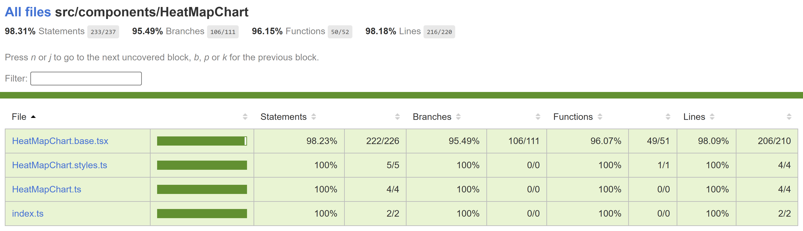

# Contributor guide: Heatmap Chart

A heatmap chart is a type of data visualization that represents data values as colors in a grid of rectangles. Each cell's color intensity corresponds to the value it represents, making it easy to spot patterns and variations in the data.

## Use cases

Here are some common use cases for heatmap charts:

- Data Analysis: Heatmaps help analyze large datasets by visually identifying trends, outliers, and correlations.
- User Behavior Tracking: In web analytics, heatmaps can show where users click, move, or spend time on a webpage, helping optimize user experience.
- Risk Assessment: Heatmaps are used in financial and project management to assess and manage risks by highlighting areas with the highest potential impact.
- Sports Analysis: In sports, heatmaps show player movement and performance on the field or court, aiding in strategic decision-making.
- Weather and Climate Analysis: Meteorologists use heatmaps to visualize temperature, precipitation, and other climate-related data.

## Dev Design details

The heatmap chart comprises the following components and subcomponents:

**HeatMapChart**: This is the main component responsible for rendering and managing subcomponents, such as rectangles and other components. It handles user interactions and provides the overall functionality of the chart.

**CartesianChart**: This component is responsible for rendering the x and y axes. Additionally, it wraps the entire chart with a FocusZone component, which allows users to navigate focus between rectangles using arrow keys. It also renders a Callout component with a ChartHoverCard component, which functions as an anchored tip, offering additional information about the rectangle that is currently hovered over or focused without blocking the user.

**Legends**: Legends are a unique list of strings that identify each group of rectangles in the chart. The Legends component renders a button for each legend, enabling users to highlight the associated rectangles by hovering over or selecting the legend.

## Mathematical/Geometrical concepts

- Numeric x and y values are converted to strings using the [format](https://d3js.org/d3-format#format) utility from the [d3-format](https://d3js.org/d3-format) library, based on the provided format specifier string. Similarly, date x and y values are converted to human readable strings using the [timeFormat](https://d3js.org/d3-time-format#timeFormat) utility from the [d3-time-format](https://d3js.org/d3-time-format) library, according to the provided format specifier string. The resulting string values are then passed as domains to CartesianChart for creating string x and y axes.
- A linear scale is created using the [scaleLinear](https://d3js.org/d3-scale/linear#scaleLinear) utility from the [d3-scale](https://d3js.org/d3-scale) library, which maps rectangle values (continuous input domain) to colors (continuous output range) using the default interpolation. Specifying more than 2 domain and range values produces a piecewise scale.

## Performance

## Accessibility

The following subcomponents are accessible using a screen reader:

1. **Rectangle \<g>**: The following attributes provide an accessible description for the rectangle.
   - `role` = "img"
   - `aria-label` = "\{xCoordinate}, \{yCoordinate}. \{legend}, \{rectangleValue}. \{description}."

   Users can customize this description using the callOutAccessibilityData prop.

## Testing

[HeatMapChart test plan](../Test%20Plans/HeatMapChart/ComponentTests.md)

## Variants

Here are the props available for customizing the heatmap chart:

- **data** (required): Use this prop to populate the chart by providing a series of groups, each containing data for a series of rectangles.

- **domainValuesForColorScale** and **rangeValuesForColorScale** (required): These props are used to generate a scale that transforms rectangle values into colors. The domainValuesForColorScale prop accepts an array of numbers, and the rangeValuesForColorScale prop accepts an array of CSS color strings. For optimal results, ensure the length of these arrays is the same.

- **xAxisDateFormatString**: Use this prop to specify a custom string format for formatting date-based x-axis labels. For more information, refer to [d3-time-format | D3 by Observable (d3js.org)](https://d3js.org/d3-time-format#locale_format)

- **yAxisDateFormatString**: Use this prop to specify a custom string format for formatting date-based y-axis labels. For more information, refer to [d3-time-format | D3 by Observable (d3js.org)](https://d3js.org/d3-time-format#locale_format)

- **xAxisNumberFormatString**: Use this prop to specify a custom string format for formatting numeric x-axis labels. For more information, refer to [d3-format | D3 by Observable (d3js.org)](https://d3js.org/d3-format#locale_format)

- **yAxisNumberFormatString**: Use this prop to specify a custom string format for formatting numeric y-axis labels. For more information, refer to [d3-format | D3 by Observable (d3js.org)](https://d3js.org/d3-format#locale_format)

- **xAxisStringFormatter**: Use this prop to provide a custom function for formatting string-based x-axis labels.

- **yAxisStringFormatter**: Use this prop to provide a custom function for formatting string-based y-axis labels.

For more details, see [Fluent UI React Charting Examples - Heat Map Chart (windows.net)](https://fluentuipr.z22.web.core.windows.net/heads/master/react-charting/demo/index.html#/examples/HeatMapChart)

## Theming

- The styles file contains a function called getHeatMapChartStyles, which returns styles for different areas or subcomponents of the chart based on the props passed to it. The base component is wrapped with the styled HOC, which passes the theme (set by the user) and the concatenated styles (obtained from the styling function and any additional styles provided by the user) as props to the base component. Within the base component, the styles are applied to corresponding elements after converting them into class names. This conversion is done by passing theme and other style props as arguments to the function returned by the classNamesFunction utility. To learn more about component styling, refer [this](https://github.com/microsoft/fluentui/wiki/Component-Styling).

## Debugging

## Error scenarios

## Localization aspects

Currently, the chart supports localization only for numeric texts inside rectangles.

## Some notable PRs and their brief description

- [Fixing re-render issue for all charts when empty by srmukher · Pull Request #28321 · microsoft/fluentui (github.com)](https://github.com/microsoft/fluentui/pull/28321)
- [Fix wrong narration in browse mode by krkshitij · Pull Request #25616 · microsoft/fluentui (github.com)](https://github.com/microsoft/fluentui/pull/25616)
- [Fix legends selection bugs by krkshitij · Pull Request #24563 · microsoft/fluentui (github.com)](https://github.com/microsoft/fluentui/pull/24563)
- [Fix wrong narration when legend selected by krkshitij · Pull Request #24903 · microsoft/fluentui (github.com)](https://github.com/microsoft/fluentui/pull/24903)
- [Fix charting callout not hoverable using mouse and callout flickering by AtishayMsft · Pull Request #21750 · microsoft/fluentui (github.com)](https://github.com/microsoft/fluentui/pull/21750)

## Future improvements

## Rendering details

- When no data is provided by the user, an empty div is rendered in place of the chart.
- Currently, a string axis is created regardless of the type of x and y values, which uses the d3 [scaleBand](https://d3js.org/d3-scale/band) utility. This utility has a [bandwidth](https://d3js.org/d3-scale/band#band_bandwidth) property that is used to determine the width and height of rectangles. The d3 [scaleLinear](https://d3js.org/d3-scale/linear) and [scaleTime](https://d3js.org/d3-scale/time) utilities, used for number and date axes respectively, don't have such a property.

## Interactions

The chart is wrapped with a FocusZone component to allow focus on its interactive subcomponents. The following subcomponents are accessible using the keyboard:

1. **Rectangle \<g>**
   - `data-is-focusable`: True.
   - `onFocus`: Shows a callout near the element containing the rectangle details.
   - `onBlur`: Does nothing.

1. **Legend \<button>** (Legends)
   - `data-is-focusable`: Depends on the allowFocusOnLegends prop, which is true by default.
   - `onFocus`: Highlights the associated rectangles.
   - `onBlur`: Unhighlights the associated rectangles.

Users can interact with the following subcomponents using the mouse:

1. **Rectangle**
   - **\<g>**
     - `onMouseOver`: Shows a callout near the element containing the rectangle details.
     - `onMouseOut`: Does nothing.
   - **\<rect>**
     - `onClick`: Calls the onClick prop associated with the rectangle if provided.

1. **Root \
** (CartesianChart)
   - `onMouseLeave`: Hides the callout if it is visible.

1. **Legend \<button>** (Legends)
   - `onMouseOver`: Highlights the associated rectangles.
   - `onMouseOut`: Unhighlights the associated rectangles.
   - `onClick`: Highlights the associated rectangles if the legend is not already selected, otherwise unhighlights them.

## Known issues

- [[Bug]: Date axis labels formatted to show only the year are being localized as if they were numbers · Issue #30128 · microsoft/fluentui](https://github.com/microsoft/fluentui/issues/30128)
- Y-axis labels are accessible through assistive technologies, such as screen readers.

## Design figma

- [Heat map - Figma](https://www.figma.com/file/7ywOrSjGW5DEkNETagzXf2/Heat-map?type=design&t=FUFuc5mzEF4G6hag-6)

## Learnings

- Long y axis labels get clipped which can be fixed by passing custom left or right margin to the chart. In contrast, horizontal bar chart with axis calculates longest label width and updates the margin with that value to prevent the labels from clipping.

## Extensions

