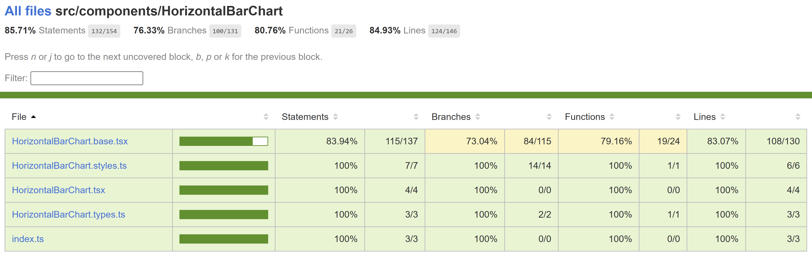

# Horizontal Bar Chart

A horizontal bar chart is a chart that presents categorical data with rectangular bars with lengths proportional to the values they represent. This type of chart is particularly useful when the intention is to show comparisons among different categories and the labels for those categories are long.

## Use cases

Here are some common use cases for horizontal bar charts:

- Comparative Analysis: Display and compare quantities, such as sales figures, across different products, regions, or time periods.
- Ranking: Show the ranking of items, like top-selling products or highest-performing employees, in a visually impactful manner.
- Survey Results: Present survey responses for multiple options to help visualize the popularity or preference of each choice.
- Part-to-Whole Relationships: Display composition within a category, like expense types in a budget or age groups in a population.
- Benchmark Comparison: Compare data to benchmarks or goals, like industry standards or set targets.
- Progress Tracking: Track the progress of various goals, objectives, or metrics over time or across different units.

## Dev Design details

The horizontal bar chart comprises the following components and subcomponents:

**HorizontalBarChart**: This is the main component responsible for rendering and managing subcomponents such as bar titles, bars themselves, bar values, benchmark triangles, and other components. It handles user interactions and provides the overall functionality of the chart.

**FocusZone**: This component facilitates focus navigation within the chart. It allows users to navigate between bars using the tab key.

**FocusableTooltipText**: This component is used to render a bar title with an optional tooltip. The tooltip is triggered when the content overflows and is truncated due to the CSS text-overflow property. Users can access the tooltip by hovering over or focusing on the respective element.

**Callout**: This component functions as an anchored tip, offering additional information about the bar that is currently hovered over or focused without blocking the user.

**ChartHoverCard**: This component acts as the body of the callout, presenting relevant details in a well-organized manner.

**Benchmark Triangle**: It is displayed above a bar to indicate benchmark data. It acts as a visual reference point, making it easier for users to compare bar values to the benchmark value.

## Mathematical/Geometrical concepts

All calculations are performed in percentages to ensure the responsiveness of the chart.

- First, the spacing between bar segments is determined as a percentage of the chart's width when the component mounts.
- The total width required for all the gaps between segments is calculated by multiplying the number of gaps (which is one less than the number of segments) by the width of a single gap, as calculated previously.
- The sum of widths for each segment is computed, ensuring that even segments with very small values remain visible and accessible to users. This sum is always equal to or greater than 100.
- The total width required for rendering all the segments without any gaps is derived by subtracting the total width of all the gaps from 100. A scale factor is then obtained by dividing the real length (the total width of all segments without gaps) by the scale length (the sum of segment widths). This scale factor is used to calculate the precise width of each segment.

## Performance

## Accessibility

The following subcomponents are accessible using a screen reader:

1. **Chart title \
**: This is already accessible to screen readers.

1. **Chart data text \
**: This is already accessible to screen readers.

1. **Chart \<svg>**: The following attributes provide an accessible label for the bar.
   - `aria-label` = the bar title, which is referred to as chartTitle in the component

1. **Bar \<rect>**: The following attributes provide an accessible description for the bar.
   - `role` = "img"
   - `aria-label` = "\{barTitle}, \{barValue}."

   Users can customize this description using the xAxisCalloutData, yAxisCalloutData and callOutAccessibilityData props.

## Testing

[HorizontalBarChart test plan](../Test%20Plans/HorizontalBarChart/ComponentTests.md)

## Variants

Here are the props available for customizing the horizontal bar chart:

- **data**: Use this prop to provide a series of bar data, including colors and values, to populate the chart.

- **width**: Use this prop to set the width of the chart. If not provided, the chart will occupy the total available width.

- **barHeight**: Use this prop to set the height of the bars in the chart. If not provided, a default bar height of 12px is used.

- **chartDataMode**: Choose from the following options to format how bar values are displayed in the chart:
  - *default*: Renders the bar value as a numeric string.
  - *fraction*: Renders the bar value as a fraction of the total.
  - *percentage*: Renders the bar value as a percentage of the total.

- **barChartCustomData**: Use this prop to render a custom string as the bar value.

- **variant**: Select the presentation style of the horizontal bar chart from the following options:
  - *HorizontalBarChartVariant.PartToWhole* (default): In this variant, each bar represents a part or segment of a whole. It is excellent for showing how each category or segment contributes to the total or whole.
  - *HorizontalBarChartVariant.AbsoluteScale*: In this variant, each bar's length is directly proportional to its absolute value or quantity. It is useful for comparing magnitudes across different categories.

- **hideLabels**: Use this prop to hide bar labels when using the AbsoluteScale variant.

For more details, see [Fluent UI - Controls - React - HorizontalBarChart](https://developer.microsoft.com/en-us/fluentui#/controls/web/horizontalbarchart)

## Theming

- The styles file contains a function called getHorizontalBarChartStyles, which returns styles for different areas or subcomponents of the chart based on the props passed to it. The base component is wrapped with the styled HOC, which passes the theme (set by the user) and the concatenated styles (obtained from the styling function and any additional styles provided by the user) as props to the base component. Within the base component, the styles are applied to corresponding elements after converting them into class names. This conversion is done by passing theme and other style props as arguments to the function returned by the classNamesFunction utility. To learn more about component styling, refer [this](https://github.com/microsoft/fluentui/wiki/Component-Styling).

## Debugging

## Error scenarios

## Localization aspects

Currently, the chart supports localization only for the chart data texts and the callout content.

## Some notable PRs and their brief description

- [Focus indicator bug in bar charts by yush-singla · Pull Request #28414 · microsoft/fluentui (github.com)](https://github.com/microsoft/fluentui/pull/28414)
- [Add new variant to horizontal bar chart by krkshitij · Pull Request #26082 · microsoft/fluentui (github.com)](https://github.com/microsoft/fluentui/pull/26082)
- [Adjust horizontal bar chart styles as per design by krkshitij · Pull Request #25268 · microsoft/fluentui (github.com)](https://github.com/microsoft/fluentui/pull/25268)
- [Disable focus on non-interactive elements by krkshitij · Pull Request #27580 · microsoft/fluentui (github.com)](https://github.com/microsoft/fluentui/pull/27580)
- [Fix min width of bars as 1% for horizontal bar charts by AtishayMsft · Pull Request #24631 · microsoft/fluentui (github.com)](https://github.com/microsoft/fluentui/pull/24631)

## Future improvements

## Rendering details

- When no data is provided by the user, an empty div is rendered in place of the chart.
- The horizontal bar chart data comprises two values: a total (y) and a portion of that total (x). The primary bar, colored as per user preference, represents this portion (x). The remaining portion (y-x) is represented by a placeholder bar in the default part-to-whole variant.
- The FocusableTooltipText component renders text with a tooltip. It monitors the size of the container to detect if the text content overflows. If it does, it truncates the text with ellipsis and enables users to view the tooltip with complete content by focusing or hovering over the element.
- In the part-to-whole variant, the bar value is displayed above the bar as a number, fraction, or percentage based on the chartDataMode prop. In the absolute-scale variant, the bar value is displayed as a number beside the primary bar, replacing the placeholder bar.
- Changes in layout direction do not affect the stacking order of the bars but rather the text anchor. Therefore, the stacking order of the bars is reversed by adjusting the x attribute according to the layout direction, making it easier for the respective users to read the chart.

## Interactions

The chart is wrapped with a FocusZone component to allow focus on its interactive subcomponents. The following subcomponents are accessible using the keyboard:

1. **Bar \<rect>**
   - `data-is-focusable`: True
   - `onFocus`: Shows a callout near the element containing the bar details.
   - `onBlur`: Does nothing.

1. **Chart title \**
   - `data-is-focusable`: True if the text content overflows and is truncated due to the CSS text-overflow property.
   - `onFocus`: Shows a tooltip with complete content.
   - `onBlur`: Hides the tooltip if it is visible.

Users can interact with the following subcomponents using the mouse:

1. **Bar \<rect>**
   - `onMouseOver`: Shows a callout near the element containing the bar details.
   - `onMouseLeave`: Does nothing.

1. **Chart title \
**
   - `onMouseEnter`: Shows a tooltip with complete content if the text content overflows and is truncated due to the CSS text-overflow property.
   - `onMouseLeave`: Hides the tooltip if it is visible.

1. **Root \
**
   - `onMouseLeave`: Hides the callout if it is visible.

## Known issues

## Design figma

- [Horizontal bar chart – Figma](https://www.figma.com/file/WOoCs0CmNYZhYl9xXeCGpi/Data-viz-(Archive)?type=design&node-id=21153-107659&mode=design&t=z2rzYs6YG3VbbVoG-4)
- [Horizontal bar chart: Part to whole – Figma](https://www.figma.com/file/WOoCs0CmNYZhYl9xXeCGpi/Data-viz-(Archive)?type=design&node-id=18708-74877&mode=design&t=z2rzYs6YG3VbbVoG-4)

## Learnings

## Extensions

