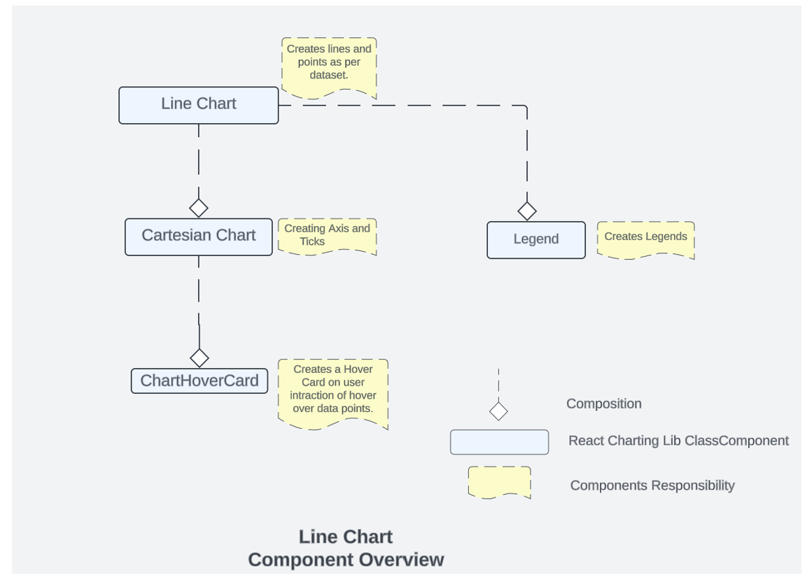

# Contributor guide: Line Chart 

Line charts are a versatile type of graph used to visualize data trends over time. They are commonly used in various fields and industries for different purposes.  

## Use cases:
Line charts are used for various use cases which involve Trend Analysis, Performance Monitoring , Comparisions , Forecasting , Monitoring Changes , Communicating Data etc. 
### Fluent Line chart also provide support for the scenarios where we need  
### Gaps
A line chart can have gaps/breaks in between. This is to represent missing data. The gaps can also be replaced with dashed or dotted lines for specific scenarios, say to represent low confidence predictions for a time series forecast graph. 

### Event annotations
Event annotations are used to highlight events and annotate them using messages. 
### Lines with large dataset
We use a path based rendering technique to show datasets with large number of points (greater than 1k). 

## Dev Design details 




Fig A: Representing Charting Lib Components Relationships and Functionality. 

Line chart comprises of other charting components as shown above, these are: 

### 1. Line Chart
This is the main component which is responsible for invoking/using other components. This is the component which is responsible for creating lines , event annotations, gaps and managing user interactions with itself , Legends and Cartesian Chart.  

### 2. Cartesian chart
This is component which is responsible for creating the X and Y Axis and the ticks for Axis. All the calculation for domain/range is done in cartesian chart. This component can be accessed through line chart. This is also manages the ChartHoverCard component . 

### 3. ChartHover Card
ChartHoverCard is a utility in the Fluent UI web library that provides a tooltip-like experience for charts. It is a React component that can be used to display additional information about data points on a chart when the user hovers over them. 

### 4 .Legends
In the Fluent UI React charting library, a legend contains a list of the variables appearing in the chart and an example of their appearance. This information allows the data from each variable to be identified in the chart. This component is populated in Line chart component. 

### 5.Line border
Each line in the chart can contain a 2 px border for better highlighting of the line when there are multiple items in the chart. The border will have color of the background theme. Lines will be highlighted in order of their appearance in legends. Line border is a highly suggested style that you should apply to make multiple lines more distinguishable from each other. Use lineBorderWidth prop present insidelineOptions to enable it. 

## Mathematical/Geometrical concepts 

Line Chart are created using [d3-shape](https://github.com/d3/d3-shape#readme) . The main API used from this library to create line between 2 points is [d3-line](https://github.com/d3/d3-shape#lines). 

[d3-line](https://github.com/d3/d3-shape#lines) is used only when the property optimizeLargeData is enabled , we use the spline and interpolation to generate a continuous line, when the dataset is huge(>10k points). 

In case of a smaller dataset, line chart builds the lines using the [SVG line](https://www.w3schools.com/graphics/svg_line.asp)  element. In such cases, the chart renders a line segment connecting each adjacent pair of coordinates. 

### D3-Line 

Line Generator are generated using a [spline](https://en.wikipedia.org/wiki/Spline_(mathematics)) or [polyline](https://en.wikipedia.org/wiki/Polygonal_chain), as in a line chart. Lines also appear in many other visualization types, such as the links in [hierarchical edge bundling](https://observablehq.com/@d3/hierarchical-edge-bundling).  

While [lines](https://github.com/d3/d3-shape#lines) are defined as a sequence of two-dimensional [x, y] points, and [areas](https://github.com/d3/d3-shape#areas) are similarly defined by a topline and a baseline, there remains the task of transforming this discrete representation into a continuous shape: i.e., how to interpolate between the points. A variety of curves are provided for this purpose. The curve used to draw these lines are [curveLinear](https://github.com/d3/d3-shape#curveLinear). 

## Performance 

The performance aspect of a line chart refers to how efficiently and effectively it conveys information to the viewer. Here are some key considerations regarding the performance of a line chart:  

- Data Visualization Efficiency  
- Clarity and Simplicity  
- Responsiveness 
- Handling Large Datasets 
- Interactive Features 

We use Lighthouse tool for measuring the performance of our charts. We have multiple scenarios against which we measure the performance score for line chart: 

- 1 chart with 30k Points  
- 6 charts,1 series with 100 data points each  
- 18 charts,1 series 5 data points each  
- 1 chart  ,1 series  with 1000 data points each 
- 50 charts, 1 Series with 10 data points each 
- 1 chart, 2 series with 500 data points each 
- 10 charts ,1 series with 1000 data points each 

Most of above scenarios have 90+ Lighthouse score. If we talk about the 30k data point has Lighthouse score close to 85. We are efficient in terms of the performance of the line chart. 

We have 2 rendering methods for the line chart. one of the method is optimized for large datasets and is controlled by the optimizeLargeData property. Enable this rendering method by setting the optimizeLargeData prop to true this will help in improving the performance for your large data set. 

 

## Accessibility 

 Following subcomponents are accessible using a screen reader: 

- Chart `<svg>`The role is set as presentation, and the aria-label attribute is set as a string to describe its contents. This is readable by screen reader if user has given chartTitle prop 

- eventAnnotation accessibility is managed by EventAnnotation sub componnets which internally uses `<text>` hence the labels provided in IEvenetAnnotaionProps will be read by screen reader. 

- Points accessibility is managed by `<path>` tags with role=”img” whose accessibility is managed by aria-label property . 

- Line chart provides a bunch of props to enable custom accessibility messages. UsexAxisCalloutAccessibilityData and callOutAccessibilityData to configure x axis and y axis accessibility messages respectively. 

 

## Testing 

 

## Variants 

Different variants of line charts are available starting from the basic line chart to multiple line charts, line chart with event, line chart with custom accessibility, Line chart with large data set, line chart with gaps and custom date axis locale. For more details visit DemoSite [Fluent UI React Charting Examples - Line Chart (windows.net)](https://fluentuipr.z22.web.core.windows.net/heads/master/react-charting/demo/index.html#/examples/linechart) 

 Below are details for using the above variants: 

### Event annotations
Event annotations are used to highlight events and annotate them using messages.. Events can be added by using eventAnnotationProps  prop. Each event contains adate, event message and event details callout callbackonRenderCard 

### Gaps
 A line chart can have gaps/breaks in between. Gaps can be added by using gaps prop. A gap is denoted bystartIndex andendIndex datapoints in the line. A line will be drawn uptil the startIndex and skipped forendIndex - startIndex number of datapoints. A line can have as many gaps as possible. 

### Lines with large dataset 
We use a path based rendering technique to show datasets with large number of points (greater than 1k). Using this technique datasets with over 10k points can be rendered easily. Enable this rendering method by setting the optimizeLargeData prop to true. 

 

## Theming 

The getStyles function defined in the styles file returns styles for different areas (or subcomponents) of the chart based on the props passed to it. The base component is wrapped with the styled HOC, which passes the theme (set by the user) and the concatenated styles (derived from the styling function and any additional styles provided by the user) as props to the base component. Within the base component, the styles are named as the class name. The conversion is done by passing theme and other style props as arguments to the function returned by the classNamesFunction utility. Learn more about component styling here. 

The color prop for a segment is optional. If the color prop is not defined, a color is selected from the qualitative palette using the getNextColor utility. On the other hand, if the color prop is defined, the getColorFromToken utility is used to determine the appropriate CSS color. If the value of the color prop is a theme-specific color token from the DataVizPalette, the utility will return the corresponding CSS color. Otherwise, if the color prop is already a valid CSS color, it will be returned as is. 

 

 

## Debugging 

Our Test Suites are exhaustive to test each and every features provided with Line Charts, for debugging any particular feature these can be used respectively . 

Few of these tests also verify the technical aspect of rendering like there is a test suite “Render calling with respective to props”  available in line chart test which verifies that the render is called 2 times. 

 

## Error scenarios 

### The chart cannot be loaded because of one or more reasons:  

- Empty data passed such that chart does not have visual to show.  
- One of the datapoint passed to the chart is corrupted. The corrupted datapoint can be for a continuous chart like line or area, or a discrete chart like bar chart, donut chart.  
- The type of data passed to the chart is not supported.  
- The user has not provided the required property.  

### The chart is in a loading state because of one or more reasons below.  

- The chart data is too heavy.  
- Chart is waiting for data from a webservice.  

### Extremely high density:  
The number of lines in a line chart is more considering the height and width of the canvas provided. 

### Errors in other components:  

- Empty/invalid data passed to hover callout.  
- There is a large variation in data in one datapoint compared to others causing the graphs to become extremely skewed and non-interactable.  
- Title for legends is not defined or is corrupted.  
- There is more than point on y axis for the same point in x axis.  

 

## Localization aspects 

### Date Axis localization: The axes support 2 ways of localization. 

1. Javascript provided inbuilt localization for numeric and date axis. Specify the culture and dateLocalizeOptions for date axis to define target localization. Refer theJavascript localization guidefor usage. 

1. Custom locale definition: The consumer of the library can specify a custom locale definition as supported by d3 like this: 
 The date axis will use the date range and the multiformat specified in the definition to determine the correct labels to show in the ticks. For example - If the date range is in days then the axis will show hourly ticks. If the date range spans across months then the a xis will show months in tick labels and so on. Specify the custom locale definition in the timeFormatLocale prop. Refer to the Custom Locale Date Axis example in line chart for sample usage. 

 

 

 

##Some notable PRs and their brief description 

[Fix line chart rendering logic for bigger datasets having lines with more than 1000 datapoints by AtishayMsft · Pull Request #24050 · microsoft/fluentui (github.com)](https://github.com/microsoft/fluentui/pull/24050) With this PR, We have enabled a path based rendering when there are larger number of datapoints.For lines with points greater than 1000, we render a single path for all the points leveraging d3 line functionality. 

[Add color palette for data visualization by krkshitij · Pull Request #26869 · microsoft/fluentui (github.com)](https://github.com/microsoft/fluentui/pull/26869)Color is optional for the data series in AreaChart and LineChart. If the color is absent, it will be picked automatically from the default color palette.New DataVizPalette provides users with theme-specific color tokens 

 

 

##Future improvements 

We are working on Performance Improvements for line chart. Link to our performance roadmap for charting library : 

 

##Rendering details 

Line Chart is a react class Component, which uses different states for managing user interaction. The various other components that are used and their relationship are shown here. 

The rendering order is reverse of the diagram that means the order of rendering of the components is.  

###Chart Hover Card -> Cartesian Chart -> Legend -> Line chart. 

Every state change of user interaction causes different components to re-render. Example if a user hover onto the Legends then the components that will be re-rendered are Legends and then Line chart. However, if the user hovers onto a data point then the components that are re-rendered are Chart Hover Card then Cartesian Chart and then the Line Chart. 

##Interactions 

There are various interactions that a user experiences in Line Chart which are  

###1. Hover on Legends 
###2. Hover on Data Points 

Hovering on the legend highlights only that legend and line/data point related to that legend. 

Hovering on Data Points renders a card which highlights the nearest points and displays the value of x and all the y on it. 

These interactions are managed by the below states - 

```js
  // This array contains data of selected legends for points
  selectedLegendPoints: LineChartDataWithIndex[];
  // This array contains data of selected legends for color bars
  selectedColorBarLegend: IColorFillBarsProps[];
  // This is a boolean value which is set to true
  // when at least one legend is selected
  isSelectedLegend: boolean;
  // This value will be used as customized callout props - point callout.
  dataPointCalloutProps?: ICustomizedCalloutData;
  // This value will be used as Customized callout props - For stack callout.
  stackCalloutProps?: ICustomizedCalloutData;
  // active or hovered point
  activePoint?: string;
  // x-axis callout accessibility data
  xAxisCalloutAccessibilityData?: IAccessibilityProps;

  nearestCircleToHighlight: ILineChartDataPoint | null;

  activeLine: number | null;
 ```

 

##Known issues 

 

##Design figma 

[Data viz (Archive) – Figma](https://www.figma.com/file/WOoCs0CmNYZhYl9xXeCGpi/Data-viz-(Archive)?type=design&node-id=1911-32621&mode=design&t=JWqPtVKYrHi6Jgwa-0) 

 

##Learnings 

We have enhanced the performance of the chart using `<path>` instead of using the points to construct the path. Please refer the “Mathematical/Geometrical concepts”  section for more details. 

##Extension 

While working on line chart if you are exploring or adding any new things , so if you are planning to contribute or fix something related to creation of line, interaction with the chart and data related things you should start exploring https://github.com/microsoft/fluentui/tree/master/packages/react-charting/src/components/LineChart 

 If anything is related axis creation, domain range issues then one should start exploring cartesian chart code:
[fluentui/packages/react-charting/src/components/CommonComponents at master · microsoft/fluentui · GitHub ](https://github.com/microsoft/fluentui/tree/master/packages/react-charting/src/components/CommonComponents)