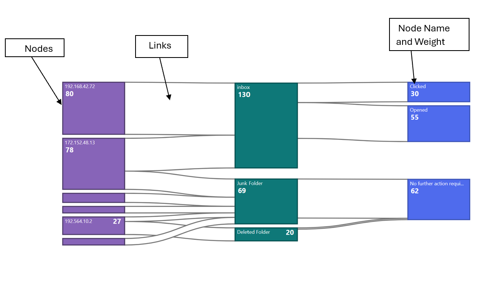
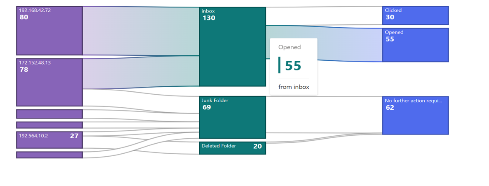
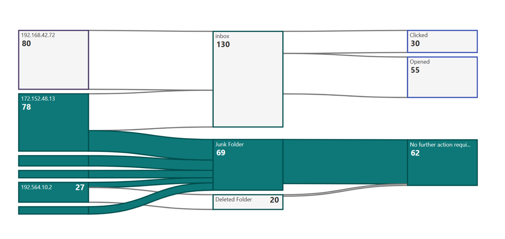
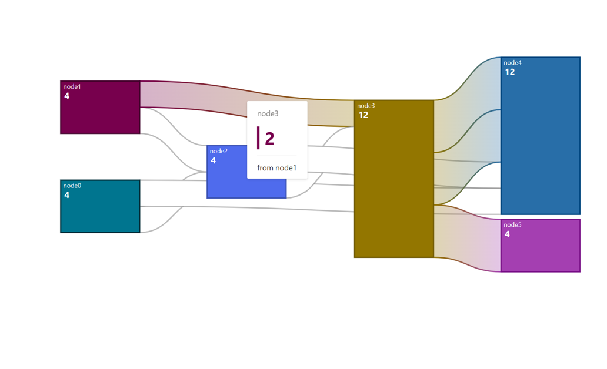

# Sankey Chart

Sankey charts are a type of data visualization that are particularly useful for showing the flow of resources, energy, or information through a system. They are characterized by their flowing, interconnected arrows that represent the quantity or value of something as it moves from one stage or category to another.

## Use cases:
 Sankey charts are used for various use cases which involve Energy Flows, Material Flow Analysis, Website User Flow, Customer Journey Mapping, Water Usage and Conservation, Financial Flows, Environmental Impact, Project Management etc.

###Fluent Sankey charts offer various functionalities, including node descriptions, diverse hover actions triggered when interacting with nodes and links.

## Dev Design details
Following are the major components that contribute towards creating a complete Sankey Chart
### 1. Nodes
 In a Sankey chart, "nodes" represent the distinct categories or stages within a system where resources, energy, or information flow. These nodes are usually depicted as rectangles or blocks, and they are interconnected by arrows or lines that indicate the flow between them. Each node represents a specific entity or group, and the width of the arrows or lines is proportional to the quantity or value of what is flowing from one node to another.
_createNodes() is used for creating Sankey nodes .This function creates an array of React nodes based on the SankeyChartData property of the data object passed in as a prop. For each node in the SankeyChartData.nodes array, the method calculates the height of the node based on the difference between the y1 and y0 properties of the node. If the height is less than a certain minimum height, an extra padding of 6 pixels is added between the node description and the node weight. The method then truncates the node name to fit within the available space, and creates a tooltip with the full node name.The method then creates a React node for the current node, which consists of a rectangle and two text elements. The rectangle is positioned based on the x0, y0, x1, and y1 properties of the node, and is filled with a color based on the fillNodeColors method. The rectangle also has event handlers for mouseover, mouseout, and focus events.The two text elements are positioned based on the height of the node and the length of the node weight text. The first text element contains the  node name, and the second text element contains the node weight. Both text elements have event handlers for mouseover and mouseout events that show and hide the tooltip, respectively.
### 2.Links
 In a Sankey chart, "links" represent the connections or flows of resources, energy, or information between nodes. Links are typically depicted as lines or arrows that connect one node to another, indicating the quantity or value of what is flowing from the source node to the target node. Here are some key characteristics of links in Sankey charts:

- #### Flow Direction
 Links have a direction, moving from a source node to a target node. The direction of the link illustrates how resources or information is flowing within the system.
- #### Width
 The width of the link is proportional to the quantity or value of the flow it represents. Wider links indicate larger flows, while narrower links represent smaller flows.
- #### Color
 Links can be colored to provide additional information or to differentiate between different types of flows or categories. For example, different colors might represent different materials, energy sources, or information types.
- #### Interactivity
In some Sankey charts, links can be interactive. For instance, hovering over a link may display additional information, such as the exact value of the flow or other related data.

Links are created using createLInks() function. The method takes no arguments. For each link, the method creates a linear gradient that goes from the color of the source node to the color of the target node. The method then calculates the data points for the link area using the `data` function, which takes a single link object and returns an array of two points that define the shape of the link. the `d3CurveBasis` curve type to create a smooth curve for the link area. The method then creates a React node for the link, which consists of a `path` element that uses the link area to define its shape. The `path` element is filled with the linear gradient created earlier, and has a stroke color and width that are determined by the`_fillStreamBorder` and `_getOpacityStreamBorder` methods, respectively.

## Mathematical/Geometrical concepts
[d3-sankey](https://github.com/d3/d3-sankey) is a JavaScript library that extends the capabilities of the popular data visualization library D3.js to create Sankey charts easily. The primary role of [d3-sankey](https://github.com/d3/d3-sankey) in creating Sankey charts is to simplify the process of generating these complex diagrams by providing a set of functions and methods tailored specifically for Sankey diagrams. 
The _preRenderLayout method initializes a d3Sankey object that is used to calculate the layout of the Sankey diagram. The d3Sankey object is configured with various properties, such as the width of the nodes, the extent of the diagram, and the alignment of the nodes.The d3Sankey object is then used to calculate the layout of the Sankey diagram in the _createNodes and _createLinks methods. The d3Sankey object takes in the nodes and links arrays and calculates the positions of the nodes and the paths of the links based on the properties of the nodes and links.
•	Nodes will contain an array of node objects, each with properties like name, x0, x1, y0, and y1.
•	Links will contain an array of link objects, each with properties like source, target, and value.
### Dynamic node padding in Fluent Sankey chart
We have also introduced dynamic padding concept for Sankey charts .This is used for cases where the number of nodes in a column is huge.so that we maintain a node to space ratio for such columns as if we fail to do so the chart is devoid of nodes and only shows links. See the code for dynamic at [githublink](https://github.com/microsoft/fluentui/blob/f9ef593dd07abb0341e7be09f60cb841d577135d/packages/react-charting/src/components/SankeyChart/SankeyChart.base.tsx#L295). This is necessary because D3 Sankey reduces the node height when there are more nodes within a constrained chart height while maintaining the same node padding as specified.
### Minimum height of the node for Fluent Sankey charts will be 1% of the total column height.

## Performance
The performance aspect of a  chart refers to how efficiently and effectively it conveys information to the viewer. Here are some key considerations regarding the performance of a area chart: 

- Data Visualization Efficiency 
- Clarity and Simplicity 
- Responsiveness
- Handling Large Datasets
- Interactive Features

We use Lighthouse tool for measuring the performance of our charts. Currently we are working on improving the  performance . We are currently working on improving 3 of the performance lighthouse metrics FCP, TBT, TTI.
The current implementation of the Sankey chart  is already performing well. However, as part of our future plans, we aim to assess the Lighthouse performance score, particularly when dealing with extensive datasets for the chart. We are committed to enhancing the performance further by identifying and capitalizing on any opportunities for improvement that may arise.

## Accessibility
Chart `<svg>`The role is set as presentation, and the aria-label attribute is set as a string to describe its contents. This is readable by screen reader if user has given chartTitle prop
Horizontal bar chart  provides a bunch of props to enable custom accessibility messages. UsexAxisCalloutAccessibilityData and callOutAccessibilityData to configure x axis and y axis accessibility messages respectively.

## Variants
Different variants of Sankey chart are available at below location:
[Fluent UI React Charting Examples - Sankey Charts](https://developer.microsoft.com/en-us/fluentui#/controls/web/sankeychart)
The Variants in the above consisting of different functionalities:

- Nodes can have customized colors, or else the default colors will be assigned. The node border also follows the same approach.
- The color of links depends on the action taken on the chart. In the default state, the link color is grey. However, when hovering over the link, it transitions into a gradient between the source and target nodes, creating a visually appealing effect.

- The details inside nodes, such as node name and weight, depend on the size of the node. If the node's height is less than 24px, no details will appear inside the node. This is because with such limited width, reading any details within the node becomes challenging. We will cover an alternative method for accessing this information in the interaction section of the contributor guide.

- There are two ways to display the node name and weight. To have the node name and weight displayed on two separate lines, a minimum height of 36px is required.

## Error scenarios
### Chart is not rendered properly if for a link source and target node will be same.
### Chart is not rendered properly if consistent names  are not used properly while configuring links.
### The chart cannot be loaded because of one or more reasons:
- Empty data passed such that chart does not have visual to show.
- One of the datapoint passed to the chart is corrupted. The corrupted datapoint can be for a continuous chart like line or area, or a discrete chart like bar chart, donut chart.
- The type of data passed to the chart is not supported.
- The user has not provided the required property.
### The chart is in a loading state because of one or more reasons below.
- The chart data is too heavy.
- Chart is waiting for data from a webservice.
### Extremely high density:
The number of nodes  in the chart are more considering the height and width of the canvas provided.

## Some notable PRs and their brief description
[PR](https://github.com/microsoft/fluentui/pull/25455)

## Design figma
Sankey Chart Figma : [Data viz (Archive) – Figma](https://www.figma.com/file/WOoCs0CmNYZhYl9xXeCGpi/Data-viz-(Archive)?type=design&node-id=21212-72120&mode=design&t=uSjYIeUd9e3vBPuc-0)

## Rendering details
The Sankey chart in SankeyChart.base.tsx is rendered using D3.js, a popular JavaScript library for data visualization. The chart is created by rendering a series of SVG elements, including rectangles for the nodes and paths for the links between the nodes.
The chart is created in the _createSankey function, which initializes the D3 Sankey layout and sets the chart's dimensions and margins. The function then creates the nodes and links for the chart using the d3.sankey layout and the chart's data.
The nodes are rendered as rectangles using the rect SVG element, with the position and size of each rectangle determined by the x, y, width, and height properties of the node. The links between the nodes are rendered as paths using the path SVG element, with the position and shape of each path determined by the x0, y0, x1, y1, and width properties of the link.
The chart also includes event handlers for mouseover and mouseout events on the nodes and links, which highlight the corresponding elements and display tooltips with additional information.

## Interactions
There are various interactions that a user experiences in Line Chart which are
#### Hover Over Nodes
When the user hovers over nodes, the entire flow associated with that node will be highlighted, encompassing both the links and nodes within the entire flow. Furthermore, the entire flow will be colored to match the node upon which the user has hovered. To enhance visibility, all other nodes will be rendered in white with reduced opacity.Below is an example. Here user has hovered over node with value 62 . 

Hovering on the node with height less than 24px will display a callout with details of node name and weight. 
#### Hover Over links
When the user hovers over a link, the entire flow will be highlighted. All nodes will retain their original colors, while the links themselves will adopt a gradient color derived from the source and target nodes. Additionally, a callout will appear, displaying details about the link, such as the source node's name, weight, and the target node's name. To enhance the visual appeal, the link border will also transition into a gradient when the link is hovered over. Below is an example of a link being hovered over, in this case, between node 4 and node 12.

