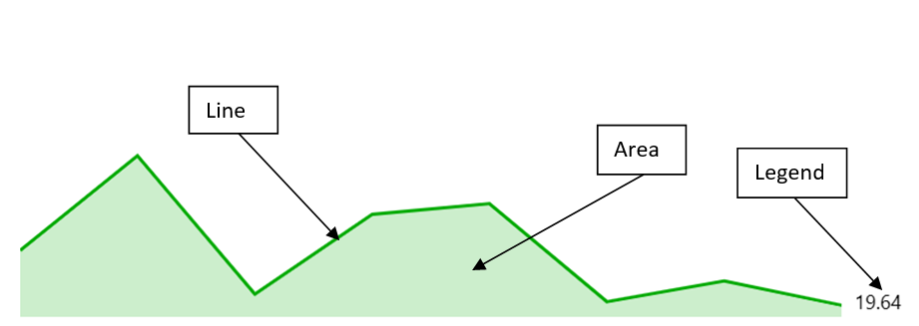
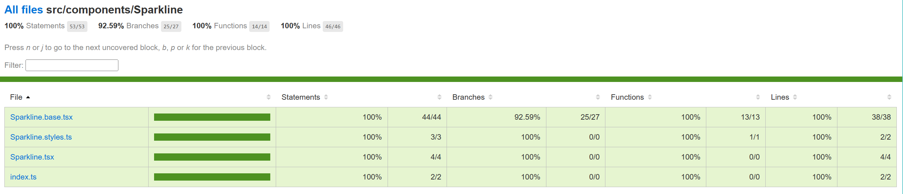

# Sparkline Chart



A Sparkline chart is a small, simple chart that is used to display trends over time or changes in data. It is typically used in dashboards or reports where space is limited. The chart consists of a line that shows the trend over time, and an area that shows the range of the data. The chart is designed to be small and compact, so it can be used in dashboards or reports where space is limited.

- **Use cases**
  Following are some use cases for Sparkline Chart:
  - **Displaying trends over time:** Sparkline charts are great for showing trends over time, such as stock prices, website traffic, or weather patterns. By compressing the data into a small space, sparklines can quickly show whether the trend is up, down, or flat.
  - **Showing changes in data:** Sparkline charts can also be used to show changes in data, such as the number of sales per day or the number of website visitors per hour. By comparing the data points to each other, sparklines can show whether the changes are significant or not.
  - **Comparing multiple data sets:** Sparkline charts can be used to compare multiple data sets, such as the sales of different products or the performance of different teams. By placing the sparklines side by side, it's easy to see which data set is performing better.
  - **Visualizing data in a small space:** Sparkline charts are great for visualizing data in a small space, such as a dashboard or a report. By compressing the data into a small chart, sparklines can provide a quick overview of the data without taking up too much space.
  - **Providing a quick overview of data:** Sparkline charts can be used to provide a quick overview of data, such as the performance of a website or the progress of a project. By placing the sparkline chart in a prominent location, it's easy to see whether the data is trending in the right direction.
  - **Displaying data in a dashboard or report:** Sparkline charts are often used in dashboards or reports to provide a quick overview of data. By combining sparkline charts with other types of charts and graphs, it's possible to create a comprehensive view of the data.
- **Mathematical/Geometrical concepts**
  The major D3 functions that are involved in the creation of Vertical bar charts are:
  - **d3-scale:**
    The d3-scale module is a part of the d3 library, which is a collection of JavaScript functions that are used for data visualization. The d3-scale module provides several functions for creating and manipulating scales, which are used to map data values to visual properties, such as position, size, and color.

    The d3-scale module includes several scale types, including linear, logarithmic, power, and time scales. These scales are used to map continuous data values to a continuous range of visual properties. The module also includes ordinal and band scales, which are used to map categorical data values to a discrete range of visual properties.

The d3-scale module provides several functions for creating and manipulating scales, including scaleLinear, scaleLog, scalePow, scaleTime, scaleOrdinal, and scaleBand. These functions take one or more arguments that define the domain and range of the scale, as well as any additional properties, such as the number of ticks or the padding between bands.

**Application in Sparkline chart:**
In Sparkline chart, d3Scale is used to create a linear scale for the x and y axes of the sparkline chart.

- **d3.scaleLinear()**: The d3.scaleLinear is a function from the d3-scale module that is used to create a linear scale for the y-axis of the chart. The linear scale maps a continuous domain of data values to a continuous range of visual properties, such as position or height. The d3ScaleLinear function takes no arguments and returns a new linear scale. The scale can be customized using several methods, including domain, range, clamp, and nice. The domain method sets the domain of the scale, which is the range of data values that the scale maps to the range of visual properties. The range method sets the range of the scale, which is the range of visual properties that the scale maps to the domain of data values.

  **Application in Sparkline chart:**

  - In Sparkline chart, d3.scaleLinear() is used to create a linear scale for the x and y axes of the sparkline chart.
  - The x scale is created using the d3.scaleLinear() function and is defined by the minimum and maximum values of the x-axis data points.
  - The y scale is also created using the d3.scaleLinear() function and is defined by the minimum and maximum values of the y-axis data points.
  - These scales are then used to map the data points to the corresponding positions on the chart.
- **d3-shape:** The d3-shape library provides various functions for creating and manipulating shapes such as arcs, lines, and areas. Following are the main mathematical/geometrical concepts that are used while drawing a Sparkline chart.
  **Application in Sparkline chart:**
  - **d3.area():** In Sparkline chart, d3.area() is used to create an area chart for the Sparkline component. It is initialized in the componentDidMount method and takes in an array of data points as input. The x and y values of each data point are used to create the shape of the area chart. The x value is mapped to the x-axis and the y value is mapped to the y-axis. The area chart is then rendered using the drawSparkline method, which returns a path element with the class name "area". The fill color of the area chart is set to the color of the line chart data point and the opacity is set to 0.2. The aria-label attribute is also set to the legend of the line chart data point.
  - **d3.line():** In Sparkline chart, d3Line is used to create a line generator function that is used to generate a line path for the Sparkline chart. The line generator function takes an array of data points and generates a path string that represents the line connecting those points. The x and y values of each data point are mapped to the x and y coordinates of the line path using the x and y scales created using d3.scaleLinear(). The curveLinear function is used to specify the type of curve used to interpolate between the data points. The resulting line path is then rendered in the SVG element of the Sparkline chart.
  - **d3.curveLinear():** In the Sparkline chart, d3.curveLinear() is used to define the curve type for the line and area charts in the Sparkline component. It is used in the componentDidMount method to create an area and line function that will be used to draw the chart. The curve method is called on both the area and line functions, passing in d3.curveLinear() as the argument. This sets the curve type to be a straight line between each data point. This means that the line and area charts will be drawn with straight lines connecting each data point, rather than a curved line.
- **d3-array:** The d3-array is a module from the d3 library that is used to manipulate arrays of data in the chart component. The d3-array module provides several functions for manipulating arrays of data, including max, min, extent, sum, and mean. The max function is used to find the maximum value in an array of data. The min function is used to find the minimum value in an array of data. The extent function is used to find the minimum and maximum values in an array of data. The sum function is used to find the sum of the values in an array of data. The mean function is used to find the mean (average) of the values in an array of data.

  **Application in Sparkline chart:**

  - **d3.max():** In Sparkline chart, d3.max() is used to find the maximum value of the y-axis domain for the Sparkline chart. It takes an array of data points and a function that returns the value to be compared. In this case, it compares the y value of each data point. The maximum y value is then used to set the upper limit of the y-axis scale.
  - **d3.extent():** In Sparkline chart, d3.extent() is used to calculate the minimum and maximum values of the x-axis of the sparkline chart. It takes an array of data points as its first argument and a function that returns the value to be used for the extent calculation as its second argument. In this case, the function returns the x-value of each data point. The resulting array of minimum and maximum values is then used to set the domain of the x-axis scale.
- **Dev Design details**
  This section contains the technical design of various sub-components of a Sparkline chart and how they interact with each other. This section can also contain any key interface or class structure of the donut chart.
  The Sparkline chart consists of the following sub-components:

  **1. Line:**

  - **Line creation:** In the Sparkline chart, the line is created using the d3Line() function from the d3-shape library. The d3Line() function generates a line generator function that can be used to generate a line path string for the given data points.

    In the Sparkline component, the line variable is assigned to the line generator function created using d3Line(). The x and y values for each data point are specified using the x() and y() methods of the line generator function, respectively. The curve() method is used to specify the type of curve to use for the line.

Finally, the line path string is generated by calling the line() method of the line generator function with the array of data points as its argument. This path string is then used to draw the line in the chart.

**2. Area:**

- **Area creation:** The area in the Sparkline chart is created using the d3.area() function from the d3-shape library. The d3.area() function generates an area shape for the given data points. In this code, the d3.area() function is called with the following parameters:
  - .x((d: any) => this.x(d.x)): This sets the x-coordinate of each point in the area to the corresponding x-coordinate of the data point.
  - .y0(this.state.\_height): This sets the y-coordinate of the bottom of the area to the height of the Sparkline chart.
  - .y1((d: any) => this.y(d.y)): This sets the y-coordinate of each point in the area to the corresponding y-coordinate of the data point.
  - .curve(d3curveLinear): This sets the curve of the area to a linear curve.

The resulting area shape is then rendered in the drawSparkline method of the Sparkline component.

**3. Legend:**

- If showLegend prop is set to true, the chart displays the value of the legend which is mentioned in the provided data. Otherwise, no value is displayed.
- **Rendering details**
1. A Sparkline chart is drawn using a line and an area that represent the trend of the data over time. The line shows the trend of the data, while the area shows the range of the data. The chart is typically small and compact, making it ideal for displaying trends and changes in data in a small space.
1. The chart is drawn using the D3 (Data-Driven Documents) library. The drawSparkline method of the Sparkline component returns a JSX element that contains two SVG paths, one for the line and one for the area.
1. The line and area variables are created using the d3.line() and d3.area() functions respectively. These functions take an array of data points and generate a path string that can be used to draw the line or area.
1. The x and y scales are created using the d3.scaleLinear() function, which maps the data points to the x and y coordinates of the chart. The domain method sets the range of the data, while the range method sets the range of the chart.
1. Once the scales are created, the line and area functions are called with the data points to generate the path strings. These path strings are then used to draw the line and area on the chart.
1. The drawSparkline method also sets the stroke and fill colors of the line and area based on the color property of the lineChartData object. The opacity and fillOpacity properties are also set to control the transparency of the chart.
1. Finally, the aria-label property is set to provide an accessible label for the chart. This label includes the legend text of the lineChartData object.

   Overall, the Sparkline chart is drawn using D3 to generate the path strings for the line and area of the chart and sets the properties of the chart based on the lineChartData object.

- **Error scenarios**
  - The Sparkline chart handles the scenario where there is no data to display. In this case, it displays a message stating that the graph has no data to display. This is done by rendering a div with an id of \_SparklineChart\_empty and setting its opacity to 0. The div has an aria-label attribute with the value "Graph has no data to display".
- **Localization aspects**
  Currently, Sparkline chart does not provide any localization support.
- **Testing**
  Following is the test report for Sparkline Chart:
  
- **Accessibility**
  FAST pass checks resulted in no error for Sparkline chart. Link to the [FAST pass tool](https://accessibilityinsights.io/docs/web/getstarted/fastpass/) 
  Our charts have elaborate accessibility support. The charts are WCAG 2.1 MAS C compliant for accessibility.
- **Theming**
  The palette for donut chart is set from the "theme" prop as passed to the component during rendering. Both light and dark themes are supported and users can create there own theme too. [Ref3](https://github.com/microsoft/fluentui/wiki/Theming)  and [Ref4](https://github.com/microsoft/fluentui/wiki/How-to-apply-theme-to-Fluent-UI-React-components)  explains theming in detail.
- **Debugging**
  The detailed steps on debugging has been given in [Debugging](https://github.com/microsoft/fluentui-charting-contrib/blob/main/docs/Debugging.md).
- **Variants**
  Following are the variants of donut chart: [Ref2](https://developer.microsoft.com/en-us/fluentui#/controls/web/sparklinechart) 
  - Basic Sparkline Chart: Only basic props are provided.
- **Interaction**
  Following are the interactions that are allowed for Sparkline chart:
  - The Sparkline charts are focusable using mouse and keyboard.
- **Some notable PRs and their brief description**
  - [Adding the Sparkline Chart main component and tests](https://github.com/microsoft/fluentui/commit/e4efe4f056ed6af7d6e55e87580906efacc9a1fc)
  - [Fixing charting visualization bugs](https://github.com/microsoft/fluentui/commit/9af1af0649760df3eb0fae4a9c542466388318ac)
- **Learnings**
  - While implementing the tests using react testing library, it was found that certain browser functions like _getComputedTextLength()_ cannot be unit tested and needs to be tested End-to-End only.
  - Order of imports are important.
    For example: for Vertical bar charts tests, improper sequencing of the imports (data first and then render) results in incorrect and incomplete rendering of charts:
```
  - import { chartPoints } from '../VerticalBarChart/VerticalBarChart.test';
  - import { render, screen, queryAllByAttribute, fireEvent, act } from '@testing-library/react';
```
However, the following results in correct rendering:
```
import { render, screen, queryAllByAttribute } from '@testing-library/react';

import { chartPoints } from './VerticalBarChart.test';
```
- Certain props need async await structure (waitFor in react testing library) for different props or nested SVGs to render.
- **Future improvements**

  Following are the list of potential future improvements for the Sparkline chart:

  - Add sub-components: Callouts can be added on hover over a point on Sparkline chart.
  - Add support for multiple data series: Currently, the component only supports a single data series. It could be improved to allow for multiple series to be displayed on the same chart.
  - Improve accessibility: The component could be improved to better support accessibility, such as by adding support for keyboard navigation and improving the use of ARIA attributes.
  - Add support for custom styling: Currently, the component has a limited set of styles that can be customized. It could be improved to allow for more customization, such as by allowing users to specify custom CSS classes or inline styles.
  - Improve performance: Depending on the size of the data set, the component could potentially have performance issues. It could be improved to better handle large data sets or to use more performant rendering techniques, such as canvas rendering.
- **Design figma**
  Sparkline Chart Figma: [Link](https://www.figma.com/file/WOoCs0CmNYZhYl9xXeCGpi/Data-viz-\(Archive\)?type=design&node-id=3583-83411&mode=design&t=q0qfn10YyA5UiKNb-0) 
- **Performance**

  The performance aspect of a donut chart refers to how efficiently and effectively it conveys information to the viewer. Here are some key considerations regarding the performance of a line chart:

  - Data Visualization Efficiency
  - Clarity and Simplicity
  - Responsiveness
  - Handling Large Datasets
    -Interactive Features
- **References**
1. [D3-shape](https://github.com/d3/d3-shape/blob/main/README.md)
2. [Sparkline Chart](https://developer.microsoft.com/en-us/fluentui#/controls/web/sparklinechart)
3. [Theming](https://github.com/microsoft/fluentui/wiki/Theming) 
4. [How to apply theme](https://github.com/microsoft/fluentui/wiki/How-to-apply-theme-to-Fluent-UI-React-components)
