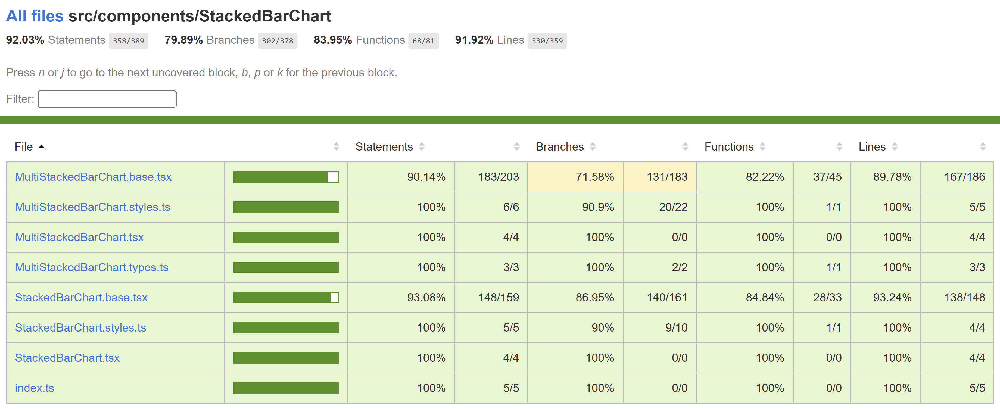

# Contributor guide: Stacked Bar Chart

A stacked bar chart is a type of data visualization that represents data using rectangular bars with lengths proportional to the values they represent. In a stacked bar chart, each bar is divided into segments, and the segments represent different categories or components. The segments are stacked next to each other to show the total value of each bar.

## Use cases

Here are some common use cases for stacked bar charts:

- Tracking Trends Over Time: Show changes in category proportions over time, allowing you to analyze how the distribution of data points evolves.
- Highlighting Part-to-Whole Relationships: Emphasize the contribution of individual categories to the whole, helping viewers understand the significance of each component.
- Visualizing Survey Data: Present the distribution of responses in a survey across various answer choices for different questions, providing insights into the survey's results.
- Resource Allocation: Show how resources, such as budget or time, are allocated among various tasks, projects, or departments within an organization.
- Market Share Analysis: Illustrate the market share of different companies or products within a specific industry, helping in competitive analysis.

## Dev Design details

The stacked bar chart comprises the following components and subcomponents:

**StackedBarChart**: This is the main component responsible for rendering and managing subcomponents, such as bar titles, bars, bar labels, benchmark and triangle indicators, and other components. It handles user interactions and provides the overall functionality of the chart.

**FocusZone**: This component facilitates focus navigation within the chart. It allows users to navigate between focusable subcomponents, such as bars and bar segments, using the tab and arrow keys.

**FocusableTooltipText**: This component is used to render a bar title with a tooltip. It monitors the size of the container to detect if the text content overflows. If it does, it truncates the text with ellipsis and enables users to view the tooltip with complete content by focusing or hovering over the element.

**Legends**: Legends are a unique list of strings that identify each bar segment in the chart. The Legends component renders a button for each legend, enabling users to highlight the corresponding segment by hovering over or selecting the legend.

**Callout**: This component functions as an anchored tip, offering additional information about the bar segment that is currently hovered over or focused without blocking the user.

**ChartHoverCard**: This component acts as the body of the callout, presenting relevant details in a well-organized manner.

**Benchmark & Target indicators**: Currently, these indicators are only supported by the stacked bar chart and not the multi-stacked bar chart. They act as visual reference points, making it easier for users to compare bar values to the benchmark/target value.

## Mathematical/Geometrical concepts

All calculations are performed in percentages to ensure the responsiveness of the chart.

- First, the spacing between bar segments is determined as a percentage of the chart's width when the component mounts.
- The total width required for all the gaps between segments is calculated by multiplying the number of gaps (which is one less than the number of segments) by the width of a single gap, as calculated previously.
- The sum of widths for each segment is computed, ensuring that even segments with very small values remain visible and accessible to users. This sum is always equal to or greater than 100. In the absolute-scale variant of the multi-stacked bar chart, the width percentage of each segment is calculated against the total value of the longest bar.
- The total width required for rendering all the segments without any gaps is derived by subtracting the total width of all the gaps from 100. A scale factor is then obtained by dividing the real length (the total width of all segments without gaps) by the scale length (the sum of segment widths). This scale factor is used to calculate the precise width of each segment.

## Performance

## Accessibility

The following subcomponents are accessible using a screen reader:

1. **Chart title \
**: It is already accessible to screen readers.

1. **Chart data \
**: It is already accessible to screen readers. Users can provide a custom accessible name or description for it using the chartDataAccessibilityData prop.

1. **Chart \<svg>**: The following attributes provide an accessible label for the bar.
   - `aria-label` = the bar title, which is referred to as chartTitle in the component

1. **Bar segment \<g>**: The following attributes provide an accessible description for the bar segment.
   - `role` = "img"
   - `aria-label` = "\{legend}, \{segmentValue}."

   Users can customize this description using the xAxisCalloutData, yAxisCalloutData and callOutAccessibilityData props.

1. **Bar label \<text>**: The bar labels are limited to the absolute-scale variant of the multi-stacked bar chart. It is already accessible to screen readers, but the content doesn’t convey complete information. The following attributes specify a different accessible name for the bar label.
   - `role` = "img"
   - `aria-label` = "Total: \{barTotalValue}"

## Testing

[StackedBarChart test plan](../Test%20Plans/StackedBarChart/ComponentTests.md)

## Variants

Here are the props available for customizing the stacked bar chart:

- **data**: Use this prop to provide a series of bar data, including colors and values, to populate the chart.

- **width**: Use this prop to set the width of the chart. If not provided, the chart will occupy the total available width.

- **barHeight**: Use this prop to set the height of the bars in the chart. If not provided, a default bar height of 12px is used.

- **hideDenominator**: Use this prop to hide the denominator of the chart data when it is displayed as a fraction/ratio. In the case of the multi-stacked bar chart, it takes an array of booleans with length equal to the number of bars in the chart, where each element determines whether to hide the denominator for the corresponding bar.

- **benchmarkData** (Stacked): Use this prop to show a benchmark indicator/triangle above the bar.

- **targetData** (Stacked): Use this prop to show a target indicator/triangle above the bar.

- **hideNumberDisplay** (Stacked): Use this prop to hide the chart data from above the bar.

- **ignoreFixStyle** (Stacked): By default, the chart data with a length of 1 is displayed as a number, and a length of 2 is displayed as a fraction/ratio. Use this prop to ignore the default display pattern and hide the chart data, irrespective of its length.

- **hideRatio** (Multi-Stacked): This prop takes an array of booleans with length equal to the number of bars in the chart, where each element determines whether to hide the chart data for the corresponding bar.

- **variant** (Multi-Stacked): Select the presentation style of the multi-stacked bar chart from the following options:
  - *MultiStackedBarChartVariant.PartToWhole* (default): In this variant, each bar represents a part or segment of a whole. It is excellent for showing how each category or segment contributes to the total or whole.
  - *MultiStackedBarChartVariant.AbsoluteScale*: In this variant, each bar's length is directly proportional to its absolute value or quantity. It is useful for comparing magnitudes across different categories.

- **hideLabels** (Multi-Stacked): Use this prop to hide bar labels when using the AbsoluteScale variant.

For more details, see [Fluent UI React Charting Examples - Stacked Bar Chart (windows.net)](https://fluentuipr.z22.web.core.windows.net/heads/master/react-charting/demo/index.html#/examples/stackedbarchart) and [Fluent UI React Charting Examples - Multi Stacked Bar Chart (windows.net)](https://fluentuipr.z22.web.core.windows.net/heads/master/react-charting/demo/index.html#/examples/MultiStackedBarChart)

## Theming

- The styles file contains a function called getStyles, which returns styles for different areas or subcomponents of the chart based on the props passed to it. The base component is wrapped with the styled HOC, which passes the theme (set by the user) and the concatenated styles (obtained from the styling function and any additional styles provided by the user) as props to the base component. Within the base component, the styles are applied to corresponding elements after converting them into class names. This conversion is done by passing theme and other style props as arguments to the function returned by the classNamesFunction utility. To learn more about component styling, refer [this](https://github.com/microsoft/fluentui/wiki/Component-Styling).

## Debugging

## Error scenarios

## Localization aspects

Currently, the chart supports localization only for the chart data texts and the callout content.

## Some notable PRs and their brief description

- [Focus indicator bug in bar charts by yush-singla · Pull Request #28414 · microsoft/fluentui (github.com)](https://github.com/microsoft/fluentui/pull/28414)
- [Disable focus on non-interactive elements by krkshitij · Pull Request #27580 · microsoft/fluentui (github.com)](https://github.com/microsoft/fluentui/pull/27580)
- [Add new variant to horizontal bar chart by krkshitij · Pull Request #26082 · microsoft/fluentui (github.com)](https://github.com/microsoft/fluentui/pull/26082)
- [Fix legends selection bugs by krkshitij · Pull Request #24563 · microsoft/fluentui (github.com)](https://github.com/microsoft/fluentui/pull/24563)
- [Set minimum width of 1% for multi stacked horizontal bar chart by AtishayMsft · Pull Request #24835 · microsoft/fluentui (github.com)](https://github.com/microsoft/fluentui/pull/24835)
- [Fix min width of bars as 1% for horizontal bar charts by AtishayMsft · Pull Request #24631 · microsoft/fluentui (github.com)](https://github.com/microsoft/fluentui/pull/24631)
- [Fix charting callout not hoverable using mouse and callout flickering by AtishayMsft · Pull Request #21750 · microsoft/fluentui (github.com)](https://github.com/microsoft/fluentui/pull/21750)

## Future improvements

## Rendering details

- When no data is provided by the user, an empty div is rendered in place of the chart.
- By default, chart data with a length of 1 is displayed as a number, and data with a length of 2 is displayed as a fraction/ratio above the bar. However, in the absolute-scale variant of the multi-stacked bar chart, the sum of the values of all highlighted bar segments is displayed as a number beside the bar.
- Changes in layout direction do not affect the stacking order of the bars but rather the text anchor. Therefore, the stacking order of the bars is reversed by adjusting the x attribute according to the layout direction, making it easier for the respective users to read the chart.

## Interactions

The chart is wrapped with a FocusZone component to allow focus on its interactive subcomponents. The following subcomponents are accessible using the keyboard:

1. **Bar segment \<g>**
   - `data-is-focusable`: True if the hideTooltip prop is falsy.
   - `onFocus`: Shows a callout near the element containing the segment details.
   - `onBlur`: Does nothing.

1. **Chart title \**
   - `data-is-focusable`: True if the text content overflows and is truncated.
   - `onFocus`: Shows a tooltip with complete content.
   - `onBlur`: Hides the tooltip if it is visible.

1. **Legend \<button>**
   - `data-is-focusable`: Depends on the allowFocusOnLegends prop, which is true by default.
   - `onFocus`: Highlights the corresponding bar segment.
   - `onBlur`: Unhighlights the corresponding bar segment.

Users can interact with the following subcomponents using the mouse:

1. **Bar segment \<g>**
   - `onMouseOver`: Shows a callout near the element containing the segment details.
   - `onMouseMove`: Shows the callout if it is not already visible.
   - `onMouseLeave`: Does nothing.

1. **Chart title \
**
   - `onMouseEnter`: Shows a tooltip with complete content if the text content overflows and is truncated.
   - `onMouseLeave`: Hides the tooltip if it is visible.

1. **Root \
**
   - `onMouseLeave`: Hides the callout if it is visible.

1. **Legend \<button>**
   - `onMouseOver`: Highlights the corresponding bar segment.
   - `onMouseOut`: Unhighlights the corresponding bar segment.
   - `onClick`: Highlights the corresponding bar segment if the legend is not already selected, otherwise unhighlights it.

## Known issues

## Design figma

- [Horizontal stacked bar chart – Figma](https://www.figma.com/file/WOoCs0CmNYZhYl9xXeCGpi/Data-viz-(Archive)?type=design&node-id=21153-107763&mode=design&t=Ubd0AoDYFIsZ770q-4)

## Learnings

## Extensions

