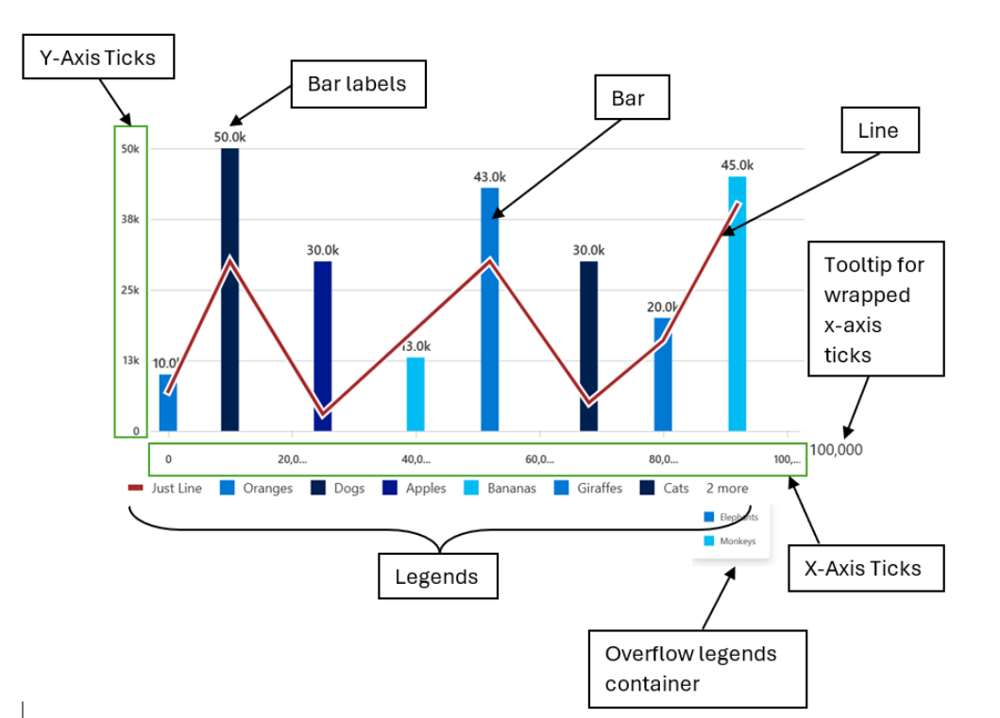
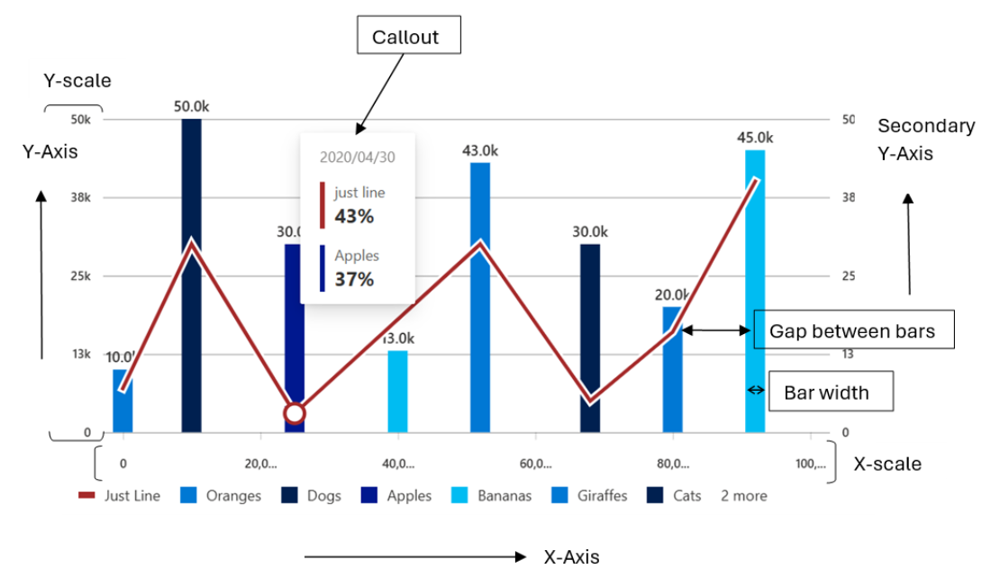
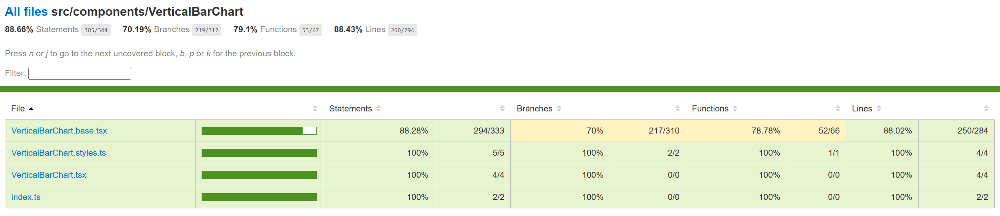
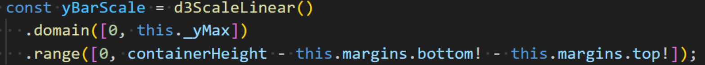
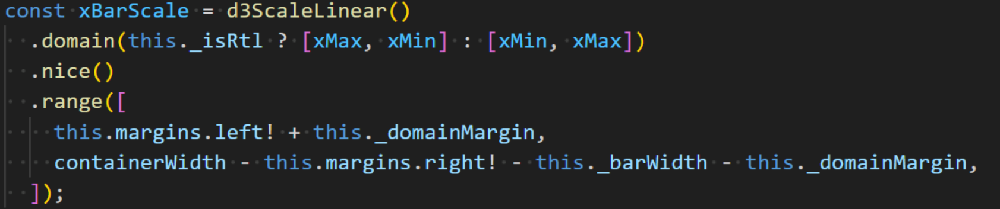
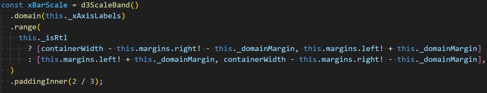
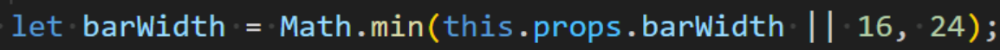
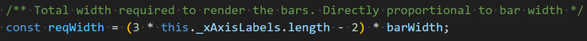
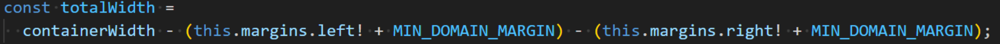
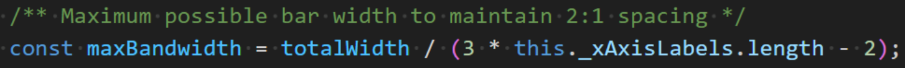

# Contributor guide: Vertical Bar Chart



A vertical bar chart is a type of chart that displays data as a series of vertical bars, with each bar representing a category and the height of the bar representing the value of that category. It is commonly used to compare the values of different categories. In addition, it can also include a line chart that displays a trend line or a target line. This type of chart is commonly used to show the relationship between the actual values and the target values or to show the trend of the data over time.

- **Use cases**
  Some common use cases of vertical bar charts are as follows:
  - Comparing values of different categories
  - Showing changes in data over time
  - Displaying data that can be easily divided into categories
  - Highlighting the highest or lowest values in a dataset
  - Showing the distribution of data across categories
  - Displaying survey results or feedback data
  - Comparing performance metrics of different products or services
  - Analyzing sales data by region or product category
  - Displaying financial data such as revenue or profit by quarter or year
- **Mathematical/Geometrical concepts**



The major D3 functions that are involved in the creation of Vertical bar charts are:

- **d3-scale:**
  The d3-scale module is a part of the d3 library, which is a collection of JavaScript functions that are used for data visualization. The d3-scale module provides several functions for creating and manipulating scales, which are used to map data values to visual properties, such as position, size, and color.

  The d3-scale module includes several scale types, including linear, logarithmic, power, and time scales. These scales are used to map continuous data values to a continuous range of visual properties. The module also includes ordinal and band scales, which are used to map categorical data values to a discrete range of visual properties.

The d3-scale module provides several functions for creating and manipulating scales, including scaleLinear, scaleLog, scalePow, scaleTime, scaleOrdinal, and scaleBand. These functions take one or more arguments that define the domain and range of the scale, as well as any additional properties, such as the number of ticks or the padding between bands.

**Application in Vertical bar chart:**
Vertical bar chart uses the d3-scale module to create a linear scale for the y-axis of the chart. The linear scale maps a continuous domain of data values to a continuous range of visual properties, such as position or height.

In Vertical bar chart, the d3ScaleLinear function is used to create the xBarScale, yBarScale and colorScale properties of the component.

- **xBarScale:** It is a function that can be used to map input values to positions on the x-axis of the chart. When an input value is passed to the xBarScale function, it will return a position value that corresponds to the input value based on the specified domain and range. d3.scaleLinear() is used to create xBarScale for Numeric scales. Otherwise, d3.scaleBand() is used.
- **yBarScale:** It is a function that can be used to map input values to positions on the y-axis of the chart. When an input value is passed to the yBarScale function, it will return a position value that corresponds to the input value based on the specified domain and range.
- **colorScale:** It is a function that can be used to map input values to colors. When an input value is passed to the colorScale function, it will return a color value that corresponds to the input value based on the specified domain and range.
- **d3-shape:** The d3-shape library provides various functions for creating and manipulating shapes such as arcs, lines, and areas. Following are the main mathematical/geometrical concepts that are used while drawing a vertical bar chart.

  **Application in Vertical bar chart:**
  In Vertical bar chart, d3.line() is a function from the d3-shape module that is used to create a line generator for the line chart in the chart component. The line generator is used to generate a path element that represents the line chart based on the data points and the x and y scales.

  - **d3.line():** The d3Line function takes no arguments and returns a new line generator. The line generator can be customized using several methods, including x, y, defined, and curve. The x and y methods set the x and y accessors for the line generator, which define how the x and y values of the data points are mapped to the x and y positions of the line. The defined method sets a function that determines whether a data point is defined or not, which can be used to handle missing or invalid data. The curve method sets the curve interpolation for the line, which determines how the line is smoothed between the data points.

    **Application in Vertical bar chart:**
    In Vertical bar chart, the d3Line function is used to create the linePath of the component, which is the line generator for the line chart on top of the vertical bar chart. The linePath variable is created using the d3Line function and is customized using the x and y methods.

The x method uses a ternary operator to check if the x-axis is a numeric axis or not. If the x-axis is not a numeric axis, the function uses the xBarScale function to calculate the x-coordinate of the line chart. The xBarScale function is a scale function that maps the x-axis values to the x-coordinates of the vertical bars in the chart. If the x-axis is a numeric axis, the function uses the xScale function to calculate the x-coordinate of the line chart. The xScale function is a scale function that maps the x-axis values to the x-coordinates of the chart.

The y method uses a ternary operator to check if the data point should use the secondary y-axis or not. If the data point should use the secondary y-axis, the function uses the yScaleSecondary function to calculate the y-coordinate of the line chart. The yScaleSecondary function is a scale function that maps the y-axis values to the y-coordinates of the secondary y-axis. If the data point should not use the secondary y-axis, the function uses the yScale function to calculate the y-coordinate of the line chart. The yScale function is a scale function that maps the y-axis values to the y-coordinates of the chart.

- **d3-selection:** The d3-selection is a module from the d3 library that is used to select and manipulate DOM elements in the chart component. The d3-selection module provides several functions for selecting and manipulating DOM elements, including select, selectAll, append, attr, and style. The select function is used to select a single DOM element that matches a given selector. The selectAll function is used to select multiple DOM elements that match a given selector. The append function is used to append a new DOM element to a selected element. The attr function is used to set or get an attribute of a selected element. The style function is used to set or get a style property of a selected element.

  **Application in Vertical bar chart:**
  In Vertical bar chart, the d3-selection module is used to select and manipulate several DOM elements in the chart component. For example, the d3Selection.select function is used to select the xElement element, which is a reference to the SVG element that contains the x-axis.

- **d3-array:** The d3-array is a module from the d3 library that is used to manipulate arrays of data in the chart component. The d3-array module provides several functions for manipulating arrays of data, including max, min, extent, sum, and mean. The max function is used to find the maximum value in an array of data. The min function is used to find the minimum value in an array of data. The extent function is used to find the minimum and maximum values in an array of data. The sum function is used to find the sum of the values in an array of data. The mean function is used to find the mean (average) of the values in an array of data.

  **Application in Vertical bar chart:**
  In Vertical bar chart, the d3-array module is used to manipulate the data array that represents the data points in the chart component. For example, the d3Array.max function is used to find the maximum value of the y-values in the data array, which is used to set the domain of the y-axis scale. The d3Array.min function is used to find the minimum value of the y-values in the data array, which is also used to set the domain of the y-axis scale.

- **d3-format:** The d3-format is a module from the d3 library that is used to format numbers and strings in the chart component. The d3-format module provides several functions for formatting numbers and strings, including format, formatPrefix, precisionFixed, and precisionRound.

  The format function is used to format a number or string using a specified format string. The format string can include placeholders for the value, such as % for a percentage or , for a comma-separated number. The formatPrefix function is used to format a number using a prefix notation that rounds the value to a specified precision and appends a prefix, such as k for thousands or M for millions. The precisionFixed function is used to format a number using a fixed number of decimal places. The precisionRound function is used to format a number using a variable number of decimal places that is determined by the magnitude of the value.

**Application in Vertical bar chart:**
In Vertical bar chart, the d3-format module is used to format the labels for the bars in the chart component. For example, the \_renderBarLabel method uses the d3FormatPrefix function to format the value of the bar using a prefix notation that rounds the value to two decimal places if the value is less than 1000, or to one decimal place if the value is greater than or equal to 1000. The formatted value is then appended to the text element as its content.

- **d3-axis:** The d3-axis module is a part of the d3 library, which is a collection of JavaScript functions that are used for data visualization. The d3-axis module provides several functions for creating and manipulating axes, which are used to display the scales of a chart component.

  In data visualization, axes are used to display the scales of a chart component, such as the x-axis and y-axis of a bar chart. Axes provide visual cues to help readers interpret the data values of a chart component, such as the range and domain of the data values.

The d3-axis module provides several types of axes, including bottom, top, left, and right axes. Each type of axis has its own set of methods for customizing the axis and displaying the tick values.

**Application in Vertical bar chart:**
In the Vertical stacked bar chart, d3-axis is used to create and render the x and y axes of the chart.

- The d3-axis library provides various methods for creating and rendering axes, such as axisBottom(), axisLeft(), and tickFormat(). In this case, the d3-axis library is used to create and render the x and y axes of the chart.
- To create the x and y axes, the d3-axis library's axisBottom() and axisLeft() methods are used, respectively. These methods take a scale function as an argument and return a new axis function that can be used to render the axis.
- The resulting x and y axis functions are then used to render the x and y axes of the chart. The call() method of the selection object is used to call the axis function and render the axis.
- The tickFormat() method of the y-axis scale is also used to set the tick format function for the y-axis. This method takes the format function created using the d3-format library as an argument and sets it as the tick format function for the y-axis.

- **Dev Deisgn Details:**
  Following are the major components that contribute towards creating a complete vertical bar chart:
  - **Axes:**
    - **\_getScales():** This method is responsible for generating the x and y scales that are used to map the data points to the chart dimensions. The scales are generated using the d3-scale library, which provides several scale types for different types of data.

      **Function arguments:**

      - containerHeight: a number representing the height of the container element that the chart is rendered in.
      - containerWidth: a number representing the width of the container element that the chart is rendered in.
      - isNumericScale: a boolean value indicating whether the x-axis scale is numeric or not.

**Working algorithm:**

- The \_getScales method takes several arguments, including containerHeight, containerWidth, and isNumericScale. These arguments are used to define the dimensions of the chart and to determine whether the x-axis is a numeric or categorical axis.
- If the x-axis is a numeric axis, the method uses the d3ScaleLinear function to create a linear scale for the x-axis. It first calculates the maximum and minimum x-values in the data using the d3Max and d3Min functions, respectively. It then creates a linear scale that maps the x-values to the chart dimensions using the domain and range methods. The nice method is also called on the x-axis scale to ensure that the tick values are rounded to the nearest integer.
- If the x-axis is a categorical axis, the method uses the d3ScaleBand function to create a band scale for the x-axis. It first extracts the x-axis labels from the data and uses them to define the domain of the scale. It then creates a band scale that maps the x-axis labels to the chart dimensions using the domain and range methods. The paddingInner method is also called on the x-axis scale to ensure that there is some space between the bars.
- For the y-axis, the method always uses the d3ScaleLinear function to create a linear scale that maps the y-values to the chart dimensions. It first defines the domain of the scale as [0, this.\_yMax], where \_yMax is the maximum y-value in the data. It then defines the range of the scale as [0, containerHeight - this.margins.bottom! - this.margins.top!], where containerHeight is the height of the chart container and this.margins.bottom! and this.margins.top! are the bottom and top margins of the chart, respectively.
- Finally, the method returns an object that contains the x and y scales for the chart. The x and y scales are returned as separate properties of the object.
- **\_getDomainMargins():** This method is responsible for calculating the margins for the chart based on the available container width and the number of x-axis labels. The margins are used to center the chart and to ensure that the bars are evenly spaced.

  **Function arguments:**

  - containerWidth which is a number representing the width of the container in which the chart is being rendered.

**Working algorithm:**

- The \_getDomainMargins method takes one argument, containerWidth, which is the width of the container that the chart is rendered in. It first checks whether the x-axis is a numeric axis or a categorical axis. If the x-axis is a categorical axis, the method returns the margins defined in the margins prop.
- If the x-axis is a numeric axis, the method calculates the total width available to render the bars by subtracting the left and right margins and the minimum domain margin from the container width. It then calculates the required width to render the bars based on the number of x-axis labels and the bar width. If the total width is greater than or equal to the required width, the method centers the chart by setting equal left and right margins for the domain. If the total width is less than the required width, the method calculates the maximum possible bar width to maintain a 2:1 spacing between the bars.
- The method then sets the \_domainMargin and \_barWidth properties of the component based on the calculated margins and bar width. It returns an object that contains the updated margins, with the left and right margins increased by the \_domainMargin value.
- **createNumericXAxis():** This function is responsible for creating a numeric x-axis for a chart component. The function takes two arguments: xAxisParams and chartType. xAxisParams is an object that contains several properties, including domainNRangeValues, showRoundOffXTickValues, xAxistickSize, tickPadding, xAxisCount, and xAxisElement. chartType is an enumeration that specifies the type of chart component.

  **Function arguments:**

  - xAxisParams of type IXAxisParams which is an object containing the following properties:
    - domainNRangeValues of type IDomainNRange which is an object containing the domain and range values for the x-axis.
    - showRoundOffXTickValues of type boolean which is an optional property that determines whether to round off the x-axis tick values.
    - xAxistickSize of type number which is an optional property that determines the size of the x-axis ticks.
    - tickPadding of type number which is an optional property that determines the padding between the x-axis ticks and the x-axis labels.
    - xAxisCount of type number which is an optional property that determines the number of x-axis ticks.
    - xAxisElement of type SVGElement | null which is an optional property that represents the x-axis element.
  - chartType of type ChartTypes which is an enum that represents the type of chart.
  - culture of type string which is an optional paramter represents the locale into which the numeric x-axis labels will be localized.

**Working algorithm:**

- The function first extracts the properties of the xAxisParams object using destructuring. The domainNRangeValues property is an object that contains the start and end values of the domain and range of the x-axis. The showRoundOffXTickValues property is a boolean that specifies whether to round off the tick values of the x-axis. The xAxistickSize property is a number that specifies the size of the ticks of the x-axis. The tickPadding property is a number that specifies the padding between the ticks and the labels of the x-axis. The xAxisCount property is a number that specifies the number of ticks of the x-axis. The xAxisElement property is a reference to the DOM node that contains the x-axis of the chart.
- The function then creates a linear scale for the x-axis using the d3ScaleLinear function from the d3-scale module. The scale is customized using the domain and range methods, which set the domain and range of the scale, respectively. If the showRoundOffXTickValues property is true, the nice method is called on the scale to round off the tick values of the x-axis.
- The function then creates a bottom axis for the x-axis using the d3AxisBottom function from the d3-axis module. The axis is customized using the tickSize, tickPadding, ticks, and tickFormat methods. The tickSize method sets the size of the ticks of the x-axis. The tickPadding method sets the padding between the ticks and the labels of the x-axis. The ticks method sets the number of ticks of the x-axis. The tickFormat method formats the tick values of the x-axis using the convertToLocaleString function and the culture parameter.
- If the xAxisElement property is not null, the axis is rendered on the DOM node using the call method of the d3-selection module. The selectAll method is called on the axis to select all the text elements of the x-axis, and the attr method is called to set the aria-hidden attribute of the text elements to true.
- Finally, the function computes the tick values of the x-axis using the ticks and tickFormat methods of the scale, and returns an object that contains the x-axis scale and the tick values.
- **createStringXAxis():** This function is responsible for creating a string x-axis for a chart component. The function takes four arguments: xAxisParams, tickParams, dataset, and culture. xAxisParams is an object that contains several properties, including domainNRangeValues, xAxisCount, xAxistickSize, tickPadding, xAxisPadding, xAxisInnerPadding, and xAxisOuterPadding. tickParams is an object that contains several properties, including tickValues and tickFormat. dataset is an array of strings that contains the values of the x-axis. culture is a string that specifies the locale into which the x-axis labels can be localized.

**Function Arguments:**

- xAxisParams: An object containing the parameters for the x-axis, including the domain and range values, tick size, tick padding, number of ticks, padding for the inner and outer edges of the axis, and the element to render the axis.
- tickParams: An object containing the parameters for the ticks on the x-axis, including the tick values and tick format.
- dataset: An array of strings representing the data points for the x-axis.
- culture: An optional string representing the culture to use for formatting the tick labels on the x-axis. However, the localization works only if the string can be converted to a numeric value. Otherwise, the x-axis labels remain unlocalized.

**Working algorithm:**

- The function first extracts the properties of the xAxisParams object using destructuring. The domainNRangeValues property is an object that contains the start and end values of the domain and range of the x-axis. The xAxisCount property is a number that specifies the number of ticks of the x-axis. The xAxistickSize property is a number that specifies the size of the ticks of the x-axis. The tickPadding property is a number that specifies the padding between the ticks and the labels of the x-axis. The xAxisPadding property is a number that specifies the padding between the bars of the chart. The xAxisInnerPadding property is a number that specifies the inner padding between the bars of the chart. The xAxisOuterPadding property is a number that specifies the outer padding between the bars of the chart.
- The function then creates a band scale for the x-axis using the d3ScaleBand function from the d3-scale module. The scale is customized using the domain and range methods, which set the domain and range of the scale, respectively. The paddingInner and paddingOuter methods are used to set the inner and outer padding between the bars of the chart, respectively.
- The function then creates a bottom axis for the x-axis using the d3AxisBottom function from the d3-axis module. The axis is customized using the tickSize, tickPadding, ticks, and tickFormat methods. The tickSize method sets the size of the ticks of the x-axis. The tickPadding method sets the padding between the ticks and the labels of the x-axis. The ticks method sets the number of ticks of the x-axis. The tickFormat method formats the tick values of the x-axis using the convertToLocaleString function and the culture parameter.
- If the xAxisParams.xAxisElement property is not null, the axis is rendered on the DOM node using the call method of the d3-selection module. The selectAll method is called on the axis to select all the text elements of the x-axis, and the attr method is called to set the aria-hidden attribute of the text elements to true.
- Finally, the function computes the tick values of the x-axis using the tickFormat method of the axis, and returns an object that contains the x-axis scale and the tick values.
- **createYAxis():** In the Vertical bar chart component, the d3-axis module is used to create and customize the y-axis of a vertical bar chart. The createYAxis function is responsible for creating the y-axis using the createYAxisForOtherCharts function. The function takes in several parameters, including yAxisParams, isRtl, axisData, and useSecondaryYScale. These parameters are used to customize the y-axis, such as setting the tick values, tick format, and tick padding.

  **Function arguments:**

  - yAxisParams: An object that contains various parameters related to the y-axis of the chart. It has the following properties:
    - yMinMaxValues: An object that contains the start and end values of the y-axis.
    - yAxisElement: The DOM element that represents the y-axis.
    - yMaxValue: The maximum value of the y-axis.
    - yMinValue: The minimum value of the y-axis.
    - containerHeight: The height of the container that holds the chart.
    - containerWidth: The width of the container that holds the chart.
    - margins: An object that contains the margins of the chart.
    - tickPadding: The padding between the ticks and the axis line.
    - maxOfYVal: The maximum value of the y-axis for area chart and Grouped vertical bar chart.
    - yAxisTickFormat: The format of the y-axis tick labels.
    - yAxisTickCount: The number of ticks on the y-axis.
    - eventAnnotationProps: An object that contains the properties of the event annotation.
    - eventLabelHeight: The height of the event label.
  - isRtl: A boolean value that indicates whether the chart is in right-to-left mode.
  - axisData: An object that contains the data related to the axis of the chart.
  - useSecondaryYScale: A boolean value that indicates whether to use a secondary y-axis scale.

**Working algorithm:**

- The function first extracts the necessary parameters from the yAxisParams object, such as the yMinMaxValues, yAxisElement, containerHeight, and containerWidth. It then calculates the final maximum and minimum values for the y-axis, based on the maxOfYVal, yMaxValue, and yMinValue parameters.
- The function then prepares the datapoints for the y-axis using the prepareDatapoints function, which calculates the tick values based on the maximum and minimum values of the y-axis. It then creates a linear scale for the y-axis using the d3ScaleLinear function from the d3-scale library.
- The function then creates the y-axis using the d3AxisLeft or d3AxisRight function from the d3-axis library, depending on the isRtl and useSecondaryYScale parameters. It sets the tick padding, tick values, and tick size for the y-axis, and formats the tick labels using the yAxisTickFormat parameter.
- Finally, the function uses the d3Select function to select the yAxisElement and apply the y-axis to it using the call method. It also sets the aria-hidden attribute of the y-axis text elements to true to improve accessibility.
- **createStringYAxis():** In the Vertical bar chart component, the d3-axis module is used to create and customize the y-axis of a vertical bar chart. The createStringYAxis function is responsible for creating the y-axis that use string values for the y-axis using the createStringYAxisForOtherCharts function. The function takes in several parameters, including yAxisParams, dataPoints, and isRtl. These parameters are used to customize the y-axis, such as setting the tick values, tick format, and tick padding.

  **Function arguments:**

  - yAxisParams: An object that contains the parameters for the y-axis, including containerHeight, tickPadding, margins, yAxisTickFormat, yAxisElement, and yAxisPadding.
  - dataPoints: An array of strings that represent the data points for the y-axis.
  - isRtl: A boolean value that indicates whether the chart is in right-to-left mode.

**Working algorithm:**

- The function first extracts the necessary parameters from the yAxisParams object, such as the containerHeight, margins, yAxisTickFormat, yAxisElement, and yAxisPadding. It then creates a band scale for the y-axis using the d3ScaleBand function from the d3-scale library.
- The band scale is defined using the dataPoints array as the domain, and the containerHeight and margins parameters as the range. The padding method is used to set the padding between the bands in the y-axis.
- The function then creates the y-axis using the d3AxisLeft or d3AxisRight function from the d3-axis library, depending on the isRtl parameter. It sets the tick padding, tick values, and tick size for the y-axis, and formats the tick labels using the yAxisTickFormat parameter.
- Finally, the function uses the d3Select function to select the yAxisElement and apply the y-axis to it using the call method. It also selects all the text elements of the y-axis and returns the y-axis scale.
- **Bars:**
  - **Numeric bars (\_createNumericBars()):** This method is responsible for generating the vertical bars for the chart when the x-axis is a numeric axis. The bars are generated using the d3 library, which provides several functions for creating and manipulating SVG elements.

    **Function arguments:**

    - containerHeight - a number representing the height of the container in which the chart is rendered.
    - containerWidth - a number representing the width of the container in which the chart is rendered.
    - xElement - an SVGElement representing the x-axis element of the chart.

**Working algorithm:**

- The \_createNumericBars method takes several arguments, including containerHeight, containerWidth, and xElement. These arguments are used to define the dimensions of the chart and to create the x-axis scale.
- The method first extracts several props from the props object, including useSingleColor, which determines whether all bars should be the same color, and xBarScale and yBarScale, which are the x and y scales for the chart. It also creates a color scale using the \_createColors method, which generates a range of colors based on the number of data points.
- The method then iterates over each data point in the \_points array and generates a vertical bar for each point. It first checks whether the bar should be highlighted based on the legend or whether any legend is highlighted. It then generates a class name for the bar using the getClassNames function, which applies styles based on the theme and whether the bar should be highlighted.
- The height of the bar is determined by the yBarScale function, which maps the y-value of the data point to the chart dimensions. If the height of the bar is less than 1, the method returns an empty React.Fragment element.
- The method then calculates the x and y positions of the bar using the xBarScale and yBarScale functions, respectively. It generates a rect element for the bar and sets its attributes, including the x, y, width, height, and fill attributes. It also sets several event handlers for the bar, including onClick, onMouseOver, onMouseLeave, onFocus, and onBlur, which are used to display the callout and tooltip for the bar.
- Finally, the method returns an array of g elements that contain the rect elements for each bar. It also removes any unwanted tooltip divs from the DOM and displays the tooltip at the x-axis labels if the showXAxisLablesTooltip prop is set to true.
- **String bars (\_createStringBars()):** This method is responsible for generating the vertical bars for the chart when the x-axis is a categorical axis. The bars are generated using the d3 library, which provides several functions for creating and manipulating SVG elements.

  **Function arguments:**

  - containerHeight (number): The height of the container in which the chart is rendered.
  - containerWidth (number): The width of the container in which the chart is rendered.
  - xElement (SVGElement): The SVG element that represents the x-axis of the chart.

**Working algorithm:**

- The \_createStringBars method takes several arguments, including containerHeight, containerWidth, and xElement. These arguments are used to define the dimensions of the chart and to create the x-axis scale.
- The method first extracts several props from the props object, including xBarScale and yBarScale, which are the x and y scales for the chart, and colorScale, which is a color scale generated using the \_createColors method. It also generates a React.Fragment element for any bars that have a height less than 1.
- The method then iterates over each data point in the \_points array and generates a vertical bar for each point. It first calculates the height of the bar using the yBarScale function, which maps the y-value of the data point to the chart dimensions. If the height of the bar is less than 1, the method returns an empty React.Fragment element.
- The method then calculates the x and y positions of the bar using the xBarScale and yBarScale functions, respectively. It generates a rect element for the bar and sets its attributes, including the x, y, width, height, and fill attributes. It also sets several event handlers for the bar, including onClick, onMouseOver, onMouseLeave, onFocus, and onBlur, which are used to display the callout and tooltip for the bar.
- Finally, the method returns an array of g elements that contain the rect elements for each bar. It also removes any unwanted tooltip divs from the DOM and displays the tooltip at the x-axis labels if the showXAxisLablesTooltip prop is set to true.
- **Lines:**
  - **\_createLine():** This method is responsible for creating a line chart that can be overlaid on top of the vertical bar chart. The line chart is created using the d3.line function, which generates a path element based on an array of data points.

    **Function arguments:**

    - xScale: A scale function that maps values from the x domain to the x range.
    - yScale: A scale function that maps values from the y domain to the y range.
    - containerHeight: The height of the container element that the chart is rendered in.
    - containerWidth: The width of the container element that the chart is rendered in.
    - yScaleSecondary: An optional scale function that maps values from the secondary y domain to the secondary y range. This is used when the chart has a secondary y axis.

**Working algorithm:**

- The \_createLine method takes several arguments, including xScale, yScale, containerHeight, containerWidth, and yScaleSecondary. These arguments are used to define the scales and dimensions of the chart, as well as to extract the data needed to create the line chart.
- The method first checks whether the x-axis is a numeric axis or a categorical axis, and then creates the necessary scales and color scales based on this information. It then extracts the data points from the data prop that have a lineData property, which contains the y-value for each point on the line chart.
- The method then creates a linePath function using the d3.line function, which maps the x and y values of each data point to the chart dimensions using the xScale and yScale functions. If a yScaleSecondary function is provided, it is used instead of yScale for data points that have a useSecondaryYScale property set to true.
- The method then creates a line array that contains two path elements: one for the line itself, and one for the line border. The line element has a stroke color that is set to the lineLegendColor prop, which defaults to yellow. The lineBorder element has a white stroke color and a width that is determined by the lineBorderWidth prop.
- Finally, the method creates a dots array that contains a circle element for each data point on the line chart. These circles have a white fill color and a stroke color that matches the lineLegendColor prop. They also have a visibility property that is set to show if the data point is currently active and hide otherwise.
- **Legends:**
  - **\_getLegendData():** This method is responsible for generating the legend for the chart, which displays the color and label for each data point on the chart. The legend is generated using the Legends component, which is a reusable component that displays a list of legends with customizable styles and behaviors.

    **Function arguments:**

    - data: an array of IVerticalBarChartDataPoint objects, which contain the data points for the chart.
    - palette: an object of type IPalette, which contains the color palette to be used for the chart.

**Working algorithm:**

- The \_getLegendData method takes two arguments, data and palette, which are arrays of data points and a color palette, respectively. It also extracts several props from the props object, including theme, useSingleColor, lineLegendText, and lineLegendColor. These props are used to determine the color and label for each legend item.
- The method then iterates over each data point in the data array and generates a legend item for each point. It first calculates the color of the legend item using the color property of the data point, or by generating a new color using the \_createColors method if no color is defined. It then creates a new object called legend that contains the title, color, and several event handlers for the legend item. These event handlers are used to handle mouse events on the legend item, such as clicking, hovering, and leaving.
- The method then adds the legend object to an array called actions, which is used to store all of the legend items for the chart. If the chart includes a line chart and the lineLegendText and lineLegendColor props are defined, the method adds a new legend item to the beginning of the actions array that represents the line chart. This legend item includes the lineLegendText and lineLegendColor props, as well as an additional property called isLineLegendInBarChart, which is used to style the legend item differently from the other legend items.
- Finally, the method returns a Legends component that displays the legend items in a list. The Legends component takes several props that are used to customize the styles and behaviors of the legend items, including enabledWrapLines, overflowProps, focusZonePropsInHoverCard, and overflowText.
- **Callouts:**
  - **\_getCalloutContentForLineAndBar():** This method is responsible for generating the content that is displayed in the callout when the user hovers over a data point on the chart. The callout content includes the y-values for both the vertical bar and the line chart, as well as any associated callout data.

**Working algorithm:**

- The \_getCalloutContentForLineAndBar method takes a single argument, point, which is an object that contains the x and y values for the data point that the user is hovering over. The method first initializes an empty array called YValueHover, which will be used to store the y-values and callout data for the vertical bar and line chart.
- The method then extracts several props from the props object, including data, lineLegendText, and lineLegendColor. It uses these props to filter the data array and find the data point that matches the x-value of the hovered point. If the chart includes a line chart and the selected data point has a lineData property with a defined y-value, the method adds a new object to the YValueHover array that contains the y-value and callout data for the line chart. This object also includes the legend text and color for the line chart, which are defined by the lineLegendText and lineLegendColor props.
- The method then adds a second object to the YValueHover array that contains the y-value and callout data for the vertical bar. This object includes the legend text, y-value, and color for the vertical bar, as well as any associated callout data. The color of the vertical bar is determined by the color property of the selected data point, or by generating a new color using the \_createColors method if no color is defined.
- Finally, the method returns an object that contains the YValueHover array and the x-value of the hovered point. The x-value is determined by the xAxisCalloutData property of the selected data point, or by using the x-value of the point if no xAxisCalloutData is defined.
- **Bar labels:**
  - **\_renderBarLabel():** This method is responsible for rendering the labels for the bars in the chart component. The method takes three arguments: xPoint, yPoint, and barValue. xPoint and yPoint are the x and y positions of the bar, respectively, and barValue is the value of the bar.

    **Working algorithm:**

    - The method first checks if the hideLabels prop is set to true or if the width of the bar is less than 16 pixels. If either of these conditions is true, the method returns null, which means that no label is rendered for the bar.
    - If the hideLabels prop is false and the width of the bar is greater than or equal to 16 pixels, the method returns a text element that represents the label for the bar. The text element is positioned at the center of the bar using the xPoint and yPoint arguments. The textAnchor attribute is set to middle, which centers the text horizontally. The className attribute is set to a CSS class that is used to style the label. The aria-hidden attribute is set to true, which means that the label is hidden from screen readers.
    - The content of the text element is generated using the d3FormatPrefix function from the d3-format module. The d3FormatPrefix function formats the barValue argument using a prefix notation that rounds the value to two decimal places if the value is less than 1000, or to one decimal place if the value is greater than or equal to 1000. The formatted value is then appended to the text element as its content.
- **Ticks:**
  - **Rotated x-axis ticks (rotateXAxisLabels()):** This function is responsible for rotating the labels of the x-axis of a chart component. The function takes an object called rotateLabelProps as an argument, which contains two properties: node and xAxis. node is a reference to the DOM node that contains the chart component, and xAxis is a reference to the x-axis of the chart.

    **Working algorithm:**

    - The function first checks if either node or xAxis is null.
    - If either of these values is null, the function returns undefined, which means that no rotation is performed.
    - The function then initializes a variable called maxHeight to 0 and an array called xAxisTranslations to store the x-axis translations. It uses d3Select to select the chart node and call the x-axis function. It then selects all the tick elements and loops through them. For each tick element, the function checks whether it has already been rotated. If it hasn't, the function extracts the x-axis translation value and pushes it to the xAxisTranslations array. The function then sets the transform attribute of the tick element to translate it by the x-axis translation value and rotate it by -45 degrees. The function also computes the height of the tick element and stores it in the maxHeight variable if it's greater than the current maxHeight.
    - The function then loops through the tick elements again and sets their transform attribute to translate them by the corresponding x-axis translation value, translate them vertically by half of the maxHeight, and rotate them by -45 degrees.
    - Finally, the function returns the vertical height of the labels by computing maxHeight/tanInverse(45).
- **Rendering details**
  The Vertical bar chart uses d3 SVG based rendering, which follows the following render cycles:
  - Invocation cycle: Vertical bar Chart -> Cartesian base chart -> X-axis -> X-axis labels -> Y-axis -> Y-axis labels -> bars, legends, callouts
  - Rendering cycle: Vertical bar chart <- Bars (rect), lines (d3.line), Legends, Callouts <- Axes (d3.axis, d3.scale)

**Following are the detailed steps:**

1. The VerticalBarChart component renders a vertical bar chart with optional line chart overlay. The chart is rendered using D3.js and SVG elements. The chart can be customized with various props, including data points, axis labels, legend, colors, and more.
1. The chart is rendered within an SVG element with a specified width and height. The chart is composed of several elements, including the x-axis, y-axis, bars, and line chart. The x-axis and y-axis are rendered using D3.js axis functions, and the bars and line chart are rendered using D3.js scales and data binding.
1. The chart data is passed in as an array of IVerticalBarChartDataPoint objects, which contain x and y values, a legend label, and an optional color. The chart can also display a line chart overlay, which is passed in as an array of IVerticalBarChartDataPoint objects with an additional lineData property.
1. The legend is rendered using the Legends component, which is passed an array of ILegend objects. The chart can also display callout labels for each bar, which are rendered using SVG text elements.
1. The chart can be customized with various props, including barWidth, colors, theme, lineLegendText, yAxisTickCount, and more. The chart also supports accessibility features, including aria labels and keyboard navigation.
- **Error scenarios**
  The Vertical bar chart handles the following error scenario:
  - Empty data: If the data passed to the chart component is empty, the chart will not render and a message will be narrated to the user. \_isChartEmpty functions handles that scenario.
- **Localization aspects**
  The component has a culture prop, which is used to set the culture for the chart. This prop is used to format the x-axis labels and the callout values based on the specified culture. Currently, vertical bar chart provides localization only for the x-axis ticks if they are numbers.
- **Testing**
  The manual and component tests for Vertical bar chart has been completed and unit testing are in progress. Following is the current code coverage for Vertical bar chart:

    

1. Component Tests:
   1. Work item: <https://uifabric.visualstudio.com/iss/_workitems/edit/7435>
   1. Test plan: <https://github.com/microsoft/fluentui/blob/master/packages/react-charting/docs/TestPlans/VerticalBarChart/ComponentTests.md> 
1. Unit Tests:
   1. Work item: <https://uifabric.visualstudio.com/iss/_workitems/edit/7436>
1. Manual Tests:
   1. Work item: <https://uifabric.visualstudio.com/iss/_workitems/edit/8604>
1. Accessibility Tests:
   1. Work item: <https://uifabric.visualstudio.com/iss/_workitems/edit/7434>
- **Accessibility**
  Vertical bar chart is tested for fast pass accessibility.
  Link to the FAST pass tool: <https://accessibilityinsights.io/docs/web/getstarted/fastpass/> 
  Our charts have elaborate accessibility support. The charts are WCAG 2.1 MAS C compliant for accessibility.
  Consumers can define their own aria labels for each point by setting the callOutAccessibilityData property.
- **Theming**
  The palette for vertical bar chart is set from the "theme" prop as passed to the component during rendering. Both light and dark themes are supported and users can create there own theme too. [Ref6](https://github.com/microsoft/fluentui/wiki/Theming)  and [Ref7](https://github.com/microsoft/fluentui/wiki/How-to-apply-theme-to-Fluent-UI-React-components)  explains theming in detail.
- **Debugging**
  The detailed steps on debugging has been given in [Debugging](https://uifabric.visualstudio.com/iss/_wiki/wikis/iss.wiki?wikiVersion=GBwikiMaster&pagePath=/Fluent%20React%20Charting/Debugging).
- **Variants**
  Following are the variants of vertical bar chart: [Ref8](https://fluentuipr.z22.web.core.windows.net/heads/master/react-charting/demo/index.html#/examples/VerticalBarchart) 
  - *Basic Vertical bar Chart*: Only basic props are provided.
  - *Dynamic Vertical bar Chart*: The data and bar colors can change.
  - *Custom Callout*: Can show customized callout data.
  - *Custom Accessibility*: Providing custom aria labels.
  - *Styled*: Can show bars with a single color w/o line.
  - *Rotated labels*: Can show labels rotated in -45 degrees.
  - *Tooltip*: Can show tooltip over x-axis ticks when the ticks are truncated.
- **Interaction**
  Following are the interactions that are allowed for vertical bar chart:
  - *Mouse Events*:
    a. Hover mouse over a bar, should call the corresponding handler and show the callout over that bar.
    b. On mouse move on Bar 1 (step 1) -> mouse leave (step 2) -> mouse move on Bar 2 (step 3), should render the callout of the Bar 2.
    c. On mouse over, callout should be defined, on mouse leave, callout should disappear.
    d. On mouse over on legends, should highlight the corresponding bar/line.
    f. On click on Bar, should highlight the corresponding bar.
    g. On mouse out after mouse over on first legend, should have opacity 0.1 for second bar initially (during mouseOver on first legend) and opacity set to 1 for both the bars on mouse out.
  - *Keyboard Events*:
    a. On focus on a bar, should render the corresponding callout.
    b. On focus on a line, should highlight the corresponding line and its legend.
- **Some notable PRs and their brief description**
  - [Adding the Vertical bar chart main component](https://github.com/microsoft/fluentui/pull/4954)
  - [Refactoring Vertical Bar Chart via implementation of Cartesian charts](https://github.com/microsoft/fluentui/commit/562ce21022cb4b5b33309a37712965909c7d15bd)
  - [Adding Tests for Vertical Bar Chart using React Testing Library](https://github.com/microsoft/fluentui/pull/28013)
  - [Accessibility change for Vertical Bar Chart](https://github.com/microsoft/fluentui/pull/19074)
- **Learnings**
  - While implementing the tests using react testing library, it was found that certain browser functions like getComputedTextLength() cannot be unit tested and needs to be tested End-to-End only.
  - Order of imports are important.
    For example: for Vertical bar charts tests, improper sequencing of the imports (data first and then render) results in incorrect and incopmlete rendering of charts:
  - import { chartPoints } from '../VerticalBarChart/VerticalBarChart.test';
  - import { render, screen, queryAllByAttribute, fireEvent, act } from '@testing- 
  - library/react';

    However, the following results in correct rendering:

import { render, screen, queryAllByAttribute } from '@testing-library/react';

import { chartPoints } from './VerticalBarChart.test';

- Certain props need async await structure (waitFor in react testing library) for different props or nested SVGs to render.
- **Known issues**
  - The axis titles are to be added (Already in [PR](https://github.com/microsoft/fluentui/pull/28580) )
  - Setting the margins externally via the props may cut the x and y ticks if the margins provided are very less. Setting a minimum margin would prevent any such distortions.
- **Future improvements**

  Following are the list of future improvements for the vertical bar chart:

  - Adding axis titles - Already in [PR](https://github.com/microsoft/fluentui/pull/28580) 
  - Improved accessibility: While the component already provides accessibility data for screen readers, there is always room for improvement in this area. Adding support for keyboard navigation and improving the accessibility of the callout would make the component more accessible to users with disabilities.
  - Support for animations: Adding support for animations, such as transitions between data updates or hover effects, would make the component more visually appealing and engaging for users.
  - Following error handling scenarios can be improved:
    - Invalid or missing chart dimensions: If the dimensions of the chart are invalid or missing, the chart will not render and a message will be displayed to the user.
    - Invalid or missing axis parameters: If the parameters for the x-axis or y-axis are invalid or missing, the chart will not render and a message will be displayed to the user.
    - Invalid or missing legends: If the legends for the chart are invalid or missing, the chart will not render and a message will be displayed to the user.
    - Invalid bar width: If the bar width for the chart is invalid, the chart will not render and a message will be displayed to the user.
    - Invalid or missing data for callout: If the data for the callout is invalid or missing, the callout will not render and a message will be displayed to the user.
    - Invalid or missing accessibility data: If the accessibility data for the chart is invalid or missing, the chart will not render and a message will be displayed to the user.
  - Localization support can be improved for all strings and numbers.
- **Design figma**
  Vertical bar Chart Figma: [Link](https://www.figma.com/file/WOoCs0CmNYZhYl9xXeCGpi/Data-viz-\(Archive\)?type=design&node-id=21153-80245&mode=design&t=eFKlPGUixdgy9xRs-0) 
- **Performance**

  The performance aspect of a donut chart refers to how efficiently and effectively it conveys information to the viewer. Here are some key considerations regarding the performance of a line chart:

  - Data Visualization Efficiency
  - Clarity and Simplicity
  - Responsiveness
  - Handling Large Datasets
  - Interactive Features

We use Lighthouse tool for measuring the performance of our charts. Following are few of the scenarios for which we measure the performance score for vertical bar chart:

- **References**
1. D3-scale:
   1. <https://github.com/d3/d3-scale/blob/main/README.md> 
   1. <https://d3js.org/d3-scale> 
1. D3-shape: <https://github.com/d3/d3-shape/blob/main/README.md> 
1. D3-selection: <https://github.com/d3/d3-selection/blob/main/README.md> 
1. D3-array: <https://github.com/d3/d3-array/blob/main/README.md> 
1. D3-axis: <https://github.com/d3/d3-axis/blob/main/README.md> 
1. <https://github.com/microsoft/fluentui/wiki/How-to-apply-theme-to-Fluent-UI-React-components> 
1. <https://github.com/microsoft/fluentui/wiki/Theming> 
1. <https://fluentuipr.z22.web.core.windows.net/heads/master/react-charting/demo/index.html#/examples/VerticalBarchart> 

**Appendix:**

The mathematical formulae used in the Vertical bar chart component are as follows:

1. Formula for calculating the y scale using d3ScaleLinear:


2. Formula for calculating the x scale using d3ScaleBand:

    Numeric scale:


    String scale:


3. Formula for calculating the width of each bar:


    In order to maintain 2:1 spacing barWidth is replaced by the maxBandWidth.

4. Formula for calculating the total width required to render the bars:


    ```
    MIN_DOMAIN_MARGIN = 8
    ```
5. Formula for calculating the maximum possible bar width to maintain 2:1 spacing:


6. Formula for calculating the domain margin


    ```
    _domainMarging = MIN_DOMAIN_MARGIN
    MIN_DOMAIN_MARGIN = 8

    To center align the chart by setting equal left and right margins for domain:
    ```