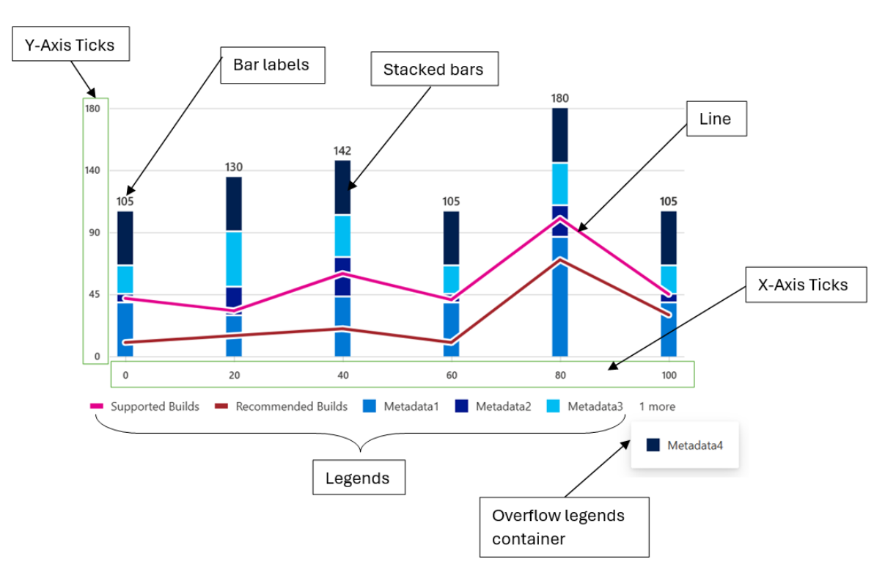
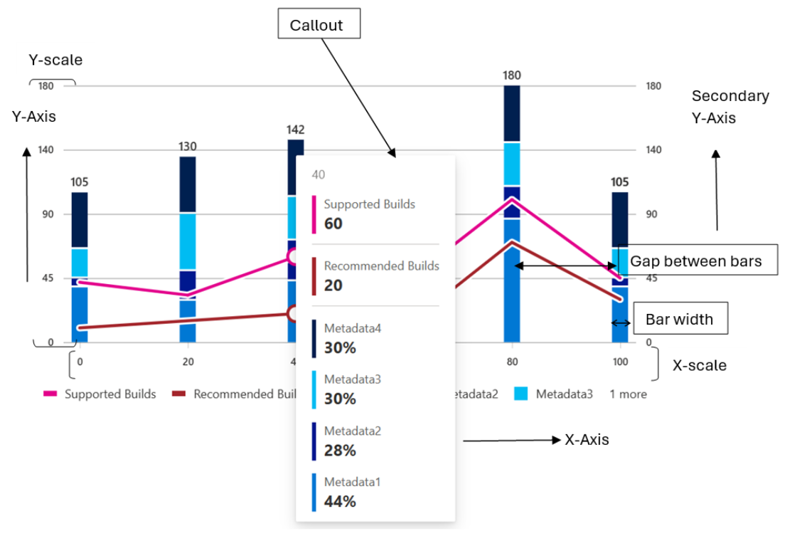
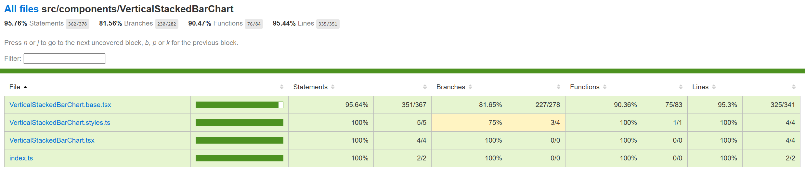

# Contributor guide: Vertical Stacked Bar Chart



A vertical stacked bar chart is a type of chart that displays multiple series of data as stacked bars, with each bar representing a category. The bars are stacked on top of each other, with the height of each bar representing the total value of the series at that category.

In a vertical stacked bar chart, the x-axis represents the categories, while the y-axis represents the values of the series. Each bar is divided into segments, with each segment representing a different series. The segments are colored differently to differentiate between the series.

- **Use cases**
  Here are some common use cases for a vertical stacked bar chart:
  - Comparing the total size of different categories over time
  - Analyzing the composition of a whole category into subcategories
  - Identifying trends in the distribution of data over time
  - Comparing the relative sizes of different categories at a single point in time
  - Highlighting the contribution of each subcategory to the whole category
- **Mathematical/Geometrical concepts**



The major D3 functions that are involved in the creation of Vertical bar charts are:

- **d3-scale:**
  The d3-scale module is a part of the d3 library, which is a collection of JavaScript functions that are used for data visualization. The d3-scale module provides several functions for creating and manipulating scales, which are used to map data values to visual properties, such as position, size, and color.

  The d3-scale module includes several scale types, including linear, logarithmic, power, and time scales. These scales are used to map continuous data values to a continuous range of visual properties. The module also includes ordinal and band scales, which are used to map categorical data values to a discrete range of visual properties.

The d3-scale module provides several functions for creating and manipulating scales, including scaleLinear, scaleLog, scalePow, scaleTime, scaleOrdinal, and scaleBand. These functions take one or more arguments that define the domain and range of the scale, as well as any additional properties, such as the number of ticks or the padding between bands.

**Application in Vertical Stacked bar chart:**
In the Vertical Stacked Bar Chart, d3-scale is used to create scales for the x and y axes of the chart. The d3-scale library provides a set of functions for creating different types of scales, such as linear, logarithmic, and ordinal scales. Here, the d3-scale library is used to create a linear scale for the y-axis of the chart.

- **d3.scaleLinear()**: The d3ScaleLinear is a function from the d3-scale module that is used to create a linear scale for the y-axis of the chart. The linear scale maps a continuous domain of data values to a continuous range of visual properties, such as position or height. The d3ScaleLinear function takes no arguments and returns a new linear scale. The scale can be customized using several methods, including domain, range, clamp, and nice. The domain method sets the domain of the scale, which is the range of data values that the scale maps to the range of visual properties. The range method sets the range of the scale, which is the range of visual properties that the scale maps to the domain of data values.

  **Application in Vertical Stacked bar chart:**
  In Vertical stacked bar chart, d3.scaleLinear() is used to create a linear scale for the y-axis of the chart.

  - A linear scale is a mapping function that maps a continuous input domain to a continuous output range. In this case, the input domain is the range of data values to be plotted on the y-axis, and the output range is the range of pixel values available for the y-axis on the chart.
  - The scaleLinear() method of the d3 library returns a new linear scale function. This function can be used to map data values to pixel values on the y-axis of the chart.
  - To create the scale, the domain() method is used to set the minimum and maximum values of the data array as the input domain. The range() method is used to set the height of the chart minus the top and bottom margins as the output range.
  - The resulting yScale function can then be used to map data values to pixel values on the y-axis of the chart.
- **d3.scaleBand():** The d3ScaleBand is a function from the d3-scale module that is used to create a band scale for the x-axis of the chart. The band scale maps a discrete domain of data values to a discrete range of visual properties, such as position or width. The d3ScaleBand function takes no arguments and returns a new band scale. The scale can be customized using several methods, including domain, range, padding, and align. The domain method sets the domain of the scale, which is the range of data values that the scale maps to the range of visual properties. The range method sets the range of the scale, which is the range of visual properties that the scale maps to the domain of data values. The padding method sets the padding between the bands of the scale, which determines the width of the bands. The align method sets the alignment of the bands within the range of the scale.

  **Application in Vertical Stacked bar chart:**
  In the vertical stacked bar chart, d3.scaleBand() is used to create a band scale for the x-axis of the chart.

  - A band scale is a mapping function that maps a discrete input domain to a continuous output range. In this case, the input domain is an array of discrete values to be plotted on the x-axis, and the output range is the range of pixel values available for the x-axis on the chart.
  - The scaleBand() method of the d3 library returns a new band scale function. This function can be used to map data values to pixel values on the x-axis of the chart.
  - To create the scale, the domain() method is used to set the array of discrete values as the input domain. The range() method is used to set the width of the chart minus the left and right margins as the output range.
  - The padding() method can be used to set the padding between the bands in the scale. The paddingInner() and paddingOuter() methods can be used to set the inner and outer padding, respectively.
  - The resulting xScale function can then be used to map data values to pixel values on the x-axis of the chart.
- **d3-selection:** The d3-selection is a module from the d3 library that is used to select and manipulate DOM elements in the chart component. The d3-selection module provides several functions for selecting and manipulating DOM elements, including select, selectAll, append, attr, and style. The select function is used to select a single DOM element that matches a given selector. The selectAll function is used to select multiple DOM elements that match a given selector. The append function is used to append a new DOM element to a selected element. The attr function is used to set or get an attribute of a selected element. The style function is used to set or get a style property of a selected element.

  **Application in Vertical Stacked bar chart:**
  In the Vertical stacked bar chart, d3-selection is used to select and manipulate DOM elements in the chart.

  - The d3-selection library provides various methods for selecting and manipulating DOM elements, such as select(), selectAll(), append(), and attr(). In this case, the d3-selection library is used to select the svg element that holds the chart and to create and manipulate the rect elements that represent the bars in the chart.
  - To select the svg element, the d3-selection library's select() method is used. This method takes SVG node as an argument and returns a new selection object that represents the selected element. The resulting selection object can then be used to manipulate the selected element.
- **d3-array:** The d3-array is a module from the d3 library that is used to manipulate arrays of data in the chart component. The d3-array module provides several functions for manipulating arrays of data, including max, min, extent, sum, and mean. The max function is used to find the maximum value in an array of data. The min function is used to find the minimum value in an array of data. The extent function is used to find the minimum and maximum values in an array of data. The sum function is used to find the sum of the values in an array of data. The mean function is used to find the mean (average) of the values in an array of data.

  **Application in Vertical Stacked bar chart:**
  In the Vertical stacked bar chart, d3-array is used to calculate the minimum and maximum values of the data array.

  - The d3-array library provides various methods for working with arrays of data, such as min(), max(), and sum(). In this case, the d3-array library is used to calculate the minimum and maximum values of the data array.
  - To calculate the minimum and maximum values of the data array, the d3-array library's min() and max() methods are used. These methods take an array of data as an argument and return the minimum and maximum values of the array, respectively.
  - The resulting minimum and maximum values are then used to set the input domain of the y-axis scale created using the d3-scale library.
  - Overall, the d3-array library is used to calculate the minimum and maximum values of the data array by using the min() and max() methods. These values are then used to set the input domain of the y-axis scale created using the d3-scale library.
- **d3-format:** The d3-format is a module from the d3 library that is used to format numbers and strings in the chart component. The d3-format module provides several functions for formatting numbers and strings, including format, formatPrefix, precisionFixed, and precisionRound.

  The format function is used to format a number or string using a specified format string. The format string can include placeholders for the value, such as % for a percentage or , for a comma-separated number. The formatPrefix function is used to format a number using a prefix notation that rounds the value to a specified precision and appends a prefix, such as k for thousands or M for millions. The precisionFixed function is used to format a number using a fixed number of decimal places. The precisionRound function is used to format a number using a variable number of decimal places that is determined by the magnitude of the value.

**Application in Vertical Stacked bar chart:**
In the Vertical stacked bar chart, d3-format is used to format the tick values on the y-axis of the chart.

- The d3-format library provides various methods for formatting numbers, such as format(), formatPrefix(), and precisionRound(). In this case, the d3-format library is used to format the tick values on the y-axis of the chart.
- To format the tick values, the d3-format library's format() method is used. This method takes a format string as an argument and returns a new function that can be used to format numbers according to the specified format.
- The resulting format function is then used to format the tick values on the y-axis of the chart. The tick values are generated using the ticks() method of the y-axis scale created using the d3-scale library.
- The tickFormat() method of the y-axis scale is then used to set the tick format function. This method takes the format function as an argument and sets it as the tick format function for the y-axis scale.
- Overall, the d3-format library is used to format the tick values on the y-axis of the chart by using the format() method to create a format function and setting this function as the tick format function for the y-axis scale using the tickFormat() method.
- **d3-axis:** The d3-axis module is a part of the d3 library, which is a collection of JavaScript functions that are used for data visualization. The d3-axis module provides several functions for creating and manipulating axes, which are used to display the scales of a chart component.

  In data visualization, axes are used to display the scales of a chart component, such as the x-axis and y-axis of a bar chart. Axes provide visual cues to help readers interpret the data values of a chart component, such as the range and domain of the data values.

The d3-axis module provides several types of axes, including bottom, top, left, and right axes. Each type of axis has its own set of methods for customizing the axis and displaying the tick values.

Overall, the d3-axis module is an essential part of data visualization, as it provides a powerful and flexible way to display the scales of a chart component and help readers interpret the data values of the chart.

**Application in Vertical Stacked bar chart:**
In the Vertical stacked bar chart, d3-axis is used to create and render the x and y axes of the chart.

- The d3-axis library provides various methods for creating and rendering axes, such as axisBottom(), axisLeft(), and tickFormat(). In this case, the d3-axis library is used to create and render the x and y axes of the chart.
- To create the x and y axes, the d3-axis library's axisBottom() and axisLeft() methods are used, respectively. These methods take a scale function as an argument and return a new axis function that can be used to render the axis.
- The resulting x and y axis functions are then used to render the x and y axes of the chart. The call() method of the selection object is used to call the axis function and render the axis.
- The tickFormat() method of the y-axis scale is also used to set the tick format function for the y-axis. This method takes the format function created using the d3-format library as an argument and sets it as the tick format function for the y-axis.

Overall, the d3-axis library is used to create and render the x and y axes of the chart by using the axisBottom() and axisLeft() methods to create the axis functions and the call() method to render the axes. The tickFormat() method is also used to set the tick format function for the y-axis.

- **Dev Design details**
  Following are the major components that contribute towards creating a complete vertical stacked bar chart:
  - **Axes:**
    - **\_getScales():** This method is responsible for creating the x and y scales for the chart.

      **Function arguments:**

      - containerHeight: a number representing the height of the container in which the chart will be rendered.
      - containerWidth: a number representing the width of the container in which the chart will be rendered.
      - isNumeric: a boolean value indicating whether the x-axis data is numeric or not. If true, the x-axis data is numeric, otherwise it is not.

**Working algorithm:**

- The method takes several arguments, including the container height and width, and a boolean value indicating whether the x-axis is numeric or categorical.
- The method first calculates the maximum y-value of the chart data and creates a linear scale for the y-axis using the d3-scale library's scaleLinear() method. The domain of the y-axis scale is set to [0, yMax], where yMax is the maximum y-value of the chart data. The range of the y-axis scale is set to [0, containerHeight - this.margins.bottom! - this.margins.top!], where containerHeight is the height of the chart container and this.margins.bottom! and this.margins.top! are the bottom and top margins of the chart, respectively.
- If the x-axis is numeric, the method calculates the minimum and maximum x-values of the chart data using the d3-array library's d3Min() and d3Max() methods. It then creates a linear scale for the x-axis using the d3-scale library's scaleLinear() method. The domain of the x-axis scale is set to [xMin, xMax] or [xMax, xMin] if the chart is right-to-left, where xMin and xMax are the minimum and maximum x-values of the chart data, respectively. The range of the x-axis scale is set to [this.margins.left! + this.\_domainMargin, containerWidth - this.margins.right! - this.\_barWidth - this.\_domainMargin], where this.margins.left! and this.margins.right! are the left and right margins of the chart, respectively, and this.\_barWidth and this.\_domainMargin are properties of the chart.
- If the x-axis is categorical, the method creates a band scale for the x-axis using the d3-scale library's scaleBand() method. The domain of the x-axis scale is set to the unique x-axis labels of the chart data. The range of the x-axis scale is set to [this.margins.left! + this.\_domainMargin, containerWidth - this.margins.right! - this.\_domainMargin], where this.margins.left! and this.margins.right! are the left and right margins of the chart, respectively, and this.\_domainMargin is a property of the chart. The paddingInner() method is used to set the inner padding of the bars to 2 / 3.
- Finally, the method returns an object with the x and y scales.

Overall, the \_getScales method is responsible for creating the x and y scales for the chart using the d3-scale library's scaleLinear() and scaleBand() methods. The method calculates the domain and range of the scales based on the chart data and properties of the chart.

- **\_getDomainMargins():** This method is responsible for calculating the margins for the x-axis domain based on the width of the chart container and the width of the bars.

  **Function arguments:**

  - containerWidth which is a number representing the width of the container in which the chart is being rendered.

**Working algorithm:**

- The method takes a single argument, containerWidth, which is the width of the chart container.
- The method first checks whether the x-axis is numeric or categorical. If the x-axis is not numeric, the method calculates the total width available to render the bars by subtracting the left and right margins and the minimum domain margin from the container width. It then calculates the required width to render the bars based on the number of x-axis labels and the bar width. If the total width available is greater than or equal to the required width, the method sets the domain margin to half of the difference between the total width available and the required width to center align the chart. If the total width available is less than the required width, the method calculates the maximum possible bar width to maintain a 2:1 spacing between the bars and sets the domain margin to the minimum domain margin.
- The method then sets the bar width and domain margin properties of the chart based on the calculated values.
- Finally, the method returns an object with the margins for the x-axis domain, which includes the left and right margins and the domain margin.

Overall, the \_getDomainMargins method is responsible for calculating the margins for the x-axis domain based on the width of the chart container and the width of the bars. The method calculates the total width available to render the bars, the required width to render the bars, and the maximum possible bar width to maintain a 2:1 spacing between the bars. The method then sets the domain margin and bar width properties of the chart based on the calculated values.

- **createNumericXAxis():** The code above is a function called createNumericXAxis in the utilities.ts file. This function is responsible for creating a numeric x-axis for a chart component. The function takes two arguments: xAxisParams and chartType. xAxisParams is an object that contains several properties, including domainNRangeValues, showRoundOffXTickValues, xAxistickSize, tickPadding, xAxisCount, and xAxisElement. chartType is an enumeration that specifies the type of chart component.

  **Function arguments:**

  - xAxisParams of type IXAxisParams which is an object containing the following properties:
    - domainNRangeValues of type IDomainNRange which is an object containing the domain and range values for the x-axis.
    - showRoundOffXTickValues of type boolean which is an optional property that determines whether to round off the x-axis tick values.
    - xAxistickSize of type number which is an optional property that determines the size of the x-axis ticks.
    - tickPadding of type number which is an optional property that determines the padding between the x-axis ticks and the x-axis labels.
    - xAxisCount of type number which is an optional property that determines the number of x-axis ticks.
    - xAxisElement of type SVGElement | null which is an optional property that represents the x-axis element.
  - chartType of type ChartTypes which is an enum that represents the type of chart.
  - culture of type string which is an optional paramter represents the locale into which the numeric x-axis labels will be localized.

**Working algorithm:**

- The function first extracts the properties of the xAxisParams object using destructuring. The domainNRangeValues property is an object that contains the start and end values of the domain and range of the x-axis. The showRoundOffXTickValues property is a boolean that specifies whether to round off the tick values of the x-axis. The xAxistickSize property is a number that specifies the size of the ticks of the x-axis. The tickPadding property is a number that specifies the padding between the ticks and the labels of the x-axis. The xAxisCount property is a number that specifies the number of ticks of the x-axis. The xAxisElement property is a reference to the DOM node that contains the x-axis of the chart.
- The function then creates a linear scale for the x-axis using the d3ScaleLinear function from the d3-scale module. The scale is customized using the domain and range methods, which set the domain and range of the scale, respectively. If the showRoundOffXTickValues property is true, the nice method is called on the scale to round off the tick values of the x-axis.
- The function then creates a bottom axis for the x-axis using the d3AxisBottom function from the d3-axis module. The axis is customized using the tickSize, tickPadding, ticks, and tickFormat methods. The tickSize method sets the size of the ticks of the x-axis. The tickPadding method sets the padding between the ticks and the labels of the x-axis. The ticks method sets the number of ticks of the x-axis. The tickFormat method formats the tick values of the x-axis using the convertToLocaleString function and the culture parameter.
- If the xAxisElement property is not null, the axis is rendered on the DOM node using the call method of the d3-selection module. The selectAll method is called on the axis to select all the text elements of the x-axis, and the attr method is called to set the aria-hidden attribute of the text elements to true.
- Finally, the function computes the tick values of the x-axis using the ticks and tickFormat methods of the scale, and returns an object that contains the x-axis scale and the tick values.

Overall, the createNumericXAxis function is responsible for creating a numeric x-axis for a chart component. The function creates a linear scale for the x-axis and a bottom axis for the x-axis using the d3-scale and d3-axis modules, respectively. The function customizes the scale and axis using several methods, including domain, range, tickSize, tickPadding, ticks, and tickFormat. The function also renders the axis on the DOM node and computes the tick values of the x-axis.

- **createStringXAxis():** This function is responsible for creating a string x-axis for a chart component. The function takes four arguments: xAxisParams, tickParams, dataset, and culture. xAxisParams is an object that contains several properties, including domainNRangeValues, xAxisCount, xAxistickSize, tickPadding, xAxisPadding, xAxisInnerPadding, and xAxisOuterPadding. tickParams is an object that contains several properties, including tickValues and tickFormat. dataset is an array of strings that contains the values of the x-axis. culture is a string that specifies the locale into which the x-axis labels can be localized.

  **Function Arguments:**

  - xAxisParams: An object containing the parameters for the x-axis, including the domain and range values, tick size, tick padding, number of ticks, padding for the inner and outer edges of the axis, and the element to render the axis.
  - tickParams: An object containing the parameters for the ticks on the x-axis, including the tick values and tick format.
  - dataset: An array of strings representing the data points for the x-axis.
  - culture: An optional string representing the culture to use for formatting the tick labels on the x-axis. However, the localization works only if the string can be converted to a numeric value. Otherwise, the x-axis labels remain unlocalized.

**Working algorithm:**

- The function first extracts the properties of the xAxisParams object using destructuring. The domainNRangeValues property is an object that contains the start and end values of the domain and range of the x-axis. The xAxisCount property is a number that specifies the number of ticks of the x-axis. The xAxistickSize property is a number that specifies the size of the ticks of the x-axis. The tickPadding property is a number that specifies the padding between the ticks and the labels of the x-axis. The xAxisPadding property is a number that specifies the padding between the bars of the chart. The xAxisInnerPadding property is a number that specifies the inner padding between the bars of the chart. The xAxisOuterPadding property is a number that specifies the outer padding between the bars of the chart.
- The function then creates a band scale for the x-axis using the d3ScaleBand function from the d3-scale module. The scale is customized using the domain and range methods, which set the domain and range of the scale, respectively. The paddingInner and paddingOuter methods are used to set the inner and outer padding between the bars of the chart, respectively.
- The function then creates a bottom axis for the x-axis using the d3AxisBottom function from the d3-axis module. The axis is customized using the tickSize, tickPadding, ticks, and tickFormat methods. The tickSize method sets the size of the ticks of the x-axis. The tickPadding method sets the padding between the ticks and the labels of the x-axis. The ticks method sets the number of ticks of the x-axis. The tickFormat method formats the tick values of the x-axis using the convertToLocaleString function and the culture parameter.
- If the xAxisParams.xAxisElement property is not null, the axis is rendered on the DOM node using the call method of the d3-selection module. The selectAll method is called on the axis to select all the text elements of the x-axis, and the attr method is called to set the aria-hidden attribute of the text elements to true.
- Finally, the function computes the tick values of the x-axis using the tickFormat method of the axis, and returns an object that contains the x-axis scale and the tick values.

Overall, the createStringXAxis function is responsible for creating a string x-axis for a chart component. The function creates a band scale for the x-axis and a bottom axis for the x-axis using the d3-scale and d3-axis modules, respectively. The function customizes the scale and axis using several methods, including domain, range, paddingInner, paddingOuter, tickSize, tickPadding, ticks, and tickFormat. The function also renders the axis on the DOM node and computes the tick values of the x-axis.

- **createYAxis():** In the Vertical bar chart component, the d3-axis module is used to create and customize the y-axis of a vertical bar chart. The createYAxis function is responsible for creating the y-axis using the createYAxisForOtherCharts function. The function takes in several parameters, including yAxisParams, isRtl, axisData, and useSecondaryYScale. These parameters are used to customize the y-axis, such as setting the tick values, tick format, and tick padding.

  **Function arguments:**

  - yAxisParams: An object that contains various parameters related to the y-axis of the chart. It has the following properties:
    - yMinMaxValues: An object that contains the start and end values of the y-axis.
    - yAxisElement: The DOM element that represents the y-axis.
    - yMaxValue: The maximum value of the y-axis.
    - yMinValue: The minimum value of the y-axis.
    - containerHeight: The height of the container that holds the chart.
    - containerWidth: The width of the container that holds the chart.
    - margins: An object that contains the margins of the chart.
    - tickPadding: The padding between the ticks and the axis line.
    - maxOfYVal: The maximum value of the y-axis for area chart and Grouped vertical bar chart.
    - yAxisTickFormat: The format of the y-axis tick labels.
    - yAxisTickCount: The number of ticks on the y-axis.
    - eventAnnotationProps: An object that contains the properties of the event annotation.
    - eventLabelHeight: The height of the event label.
  - isRtl: A boolean value that indicates whether the chart is in right-to-left mode.
  - axisData: An object that contains the data related to the axis of the chart.
  - useSecondaryYScale: A boolean value that indicates whether to use a secondary y-axis scale.

**Working algorithm:**

- The function first extracts the necessary parameters from the yAxisParams object, such as the yMinMaxValues, yAxisElement, containerHeight, and containerWidth. It then calculates the final maximum and minimum values for the y-axis, based on the maxOfYVal, yMaxValue, and yMinValue parameters.
- The function then prepares the datapoints for the y-axis using the prepareDatapoints function, which calculates the tick values based on the maximum and minimum values of the y-axis. It then creates a linear scale for the y-axis using the d3ScaleLinear function from the d3-scale library.
- The function then creates the y-axis using the d3AxisLeft or d3AxisRight function from the d3-axis library, depending on the isRtl and useSecondaryYScale parameters. It sets the tick padding, tick values, and tick size for the y-axis, and formats the tick labels using the yAxisTickFormat parameter.
- Finally, the function uses the d3Select function to select the yAxisElement and apply the y-axis to it using the call method. It also sets the aria-hidden attribute of the y-axis text elements to true to improve accessibility.
- **createStringYAxis():** In the Vertical bar chart component, the d3-axis module is used to create and customize the y-axis of a vertical bar chart. The createStringYAxis function is responsible for creating the y-axis that use string values for the y-axis using the createStringYAxisForOtherCharts function. The function takes in several parameters, including yAxisParams, dataPoints, and isRtl. These parameters are used to customize the y-axis, such as setting the tick values, tick format, and tick padding.

  **Function arguments:**

  - yAxisParams: An object that contains the parameters for the y-axis, including containerHeight, tickPadding, margins, yAxisTickFormat, yAxisElement, and yAxisPadding.
  - dataPoints: An array of strings that represent the data points for the y-axis.
  - isRtl: A boolean value that indicates whether the chart is in right-to-left mode.

**Working algorithm:**

- The function first extracts the necessary parameters from the yAxisParams object, such as the containerHeight, margins, yAxisTickFormat, yAxisElement, and yAxisPadding. It then creates a band scale for the y-axis using the d3ScaleBand function from the d3-scale library.
- The band scale is defined using the dataPoints array as the domain, and the containerHeight and margins parameters as the range. The padding method is used to set the padding between the bands in the y-axis.
- The function then creates the y-axis using the d3AxisLeft or d3AxisRight function from the d3-axis library, depending on the isRtl parameter. It sets the tick padding, tick values, and tick size for the y-axis, and formats the tick labels using the yAxisTickFormat parameter.
- Finally, the function uses the d3Select function to select the yAxisElement and apply the y-axis to it using the call method. It also selects all the text elements of the y-axis and returns the y-axis scale.
- **Bars:**
  - **\_createBar():** This method is responsible for creating and rendering the bars of the chart.

    **Function arguments:**
    The \_createBar function takes four arguments:

    - xBarScale: This is a scaling function that maps the x-axis data points to the corresponding x-axis positions on the chart. The type of this argument is any, which means that it can be any type of scaling function.
    - yBarScale: This is a scaling function that maps the y-axis data points to the corresponding y-axis positions on the chart. The type of this argument is NumericScale, which is a custom type defined elsewhere in the code.
    - containerHeight: This is the height of the container element that holds the chart. This is used to calculate the y-axis position of the bars.
    - xElement: This is an SVG element that represents the x-axis of the chart. This is used to calculate the x-axis position of the bars.

**Working algorithm:**

- The method takes several arguments, including the x and y scales, the container height and width, and an SVG element for the x-axis. It first checks whether the chart has any line data and whether to focus on the whole stack or not.
- The method then iterates over each item in the chart data and calculates the x and y coordinates for each bar using the scales and the bar width. It also calculates the height of each bar based on the data and the y scale. If the bar height is less than the minimum bar height, it sets the height to the minimum bar height.
- For each bar, the method creates a rectangle element using the rect SVG element and sets the x, y, width, height, fill, and other properties. It also adds an onMouseOver, onMouseMove, onMouseLeave, onFocus, onBlur, and onClick event listener for the bar if the legend is selected.
- If the bar has a corner radius and is the last bar in the stack, it creates a path element using the path SVG element and sets the d, fill, and other properties. It also adds an onMouseOver, onMouseMove, onMouseLeave, onFocus, onBlur, and onClick event listener for the path if the legend is selected.
- The method then creates a group element using the g SVG element and adds the rectangle and path elements to the group. It also adds an onMouseOver, onMouseMove, onMouseLeave, onFocus, onBlur, and onClick event listener for the group if the legend is selected.
- Finally, the method returns the bars as a React fragment.
- **Numeric bars (\_createNumericBars()):** This method is responsible for creating and rendering the numeric bars of the chart.

  **Function arguments:**

  - containerHeight (number): The height of the container in which the chart is rendered.
  - containerWidth (number): The width of the container in which the chart is rendered.
  - xElement (SVGElement): The SVG element that represents the x-axis of the chart.

**Working algorithm:**

- The method takes several arguments, including the container height and width, and an SVG element for the x-axis. It first gets the x and y bar scales using the \_getScales method with the numeric parameter set to true.
- The method then calls the \_createBar method with the x and y bar scales, container height, and x-axis element as arguments. The \_createBar method is responsible for creating and rendering the bars of the chart.
- The \_createBar method creates a rectangle element for each bar using the rect SVG element and sets the x, y, width, height, fill, and other properties. It also adds event listeners for the bar if the legend is selected.
- The \_createBar method then creates a group element using the g SVG element and adds the rectangle elements to the group. It also adds event listeners for the group if the legend is selected.
- Finally, the \_createBar method returns the bars as a React fragment.

Overall, the \_createNumericBars method is responsible for creating and rendering the numeric bars of the chart by calling the \_createBar method with the appropriate scales and arguments. The \_createBar method is responsible for creating and rendering the bars of the chart using the rect and g SVG elements and adding event listeners for interactivity.

- **String bars (\_createStringBars()):** This method is responsible for creating and rendering the string bars of the chart.

  **Function arguments:**

  - containerHeight (number): The height of the container in which the chart is rendered.
  - containerWidth (number): The width of the container in which the chart is rendered.
  - xElement (SVGElement): The SVG element that represents the x-axis of the chart.

**Working algorithm:**

- The method takes several arguments, including the container height and width, and an SVG element for the x-axis. It first gets the x and y bar scales using the \_getScales method with the numeric parameter set to false.
- The method then calls the \_createBar method with the x and y bar scales, container height, and x-axis element as arguments. The \_createBar method is responsible for creating and rendering the bars of the chart.
- The \_createBar method creates a rectangle element for each bar using the rect SVG element and sets the x, y, width, height, fill, and other properties. It also adds event listeners for the bar if the legend is selected.
- The \_createBar method then creates a group element using the g SVG element and adds the rectangle elements to the group. It also adds event listeners for the group if the legend is selected.
- Finally, the \_createBar method returns the bars as a React fragment.

Overall, the \_createStringBars method is responsible for creating and rendering the string bars of the chart by calling the \_createBar method with the appropriate scales and arguments. The \_createBar method is responsible for creating and rendering the bars of the chart using the rect and g SVG elements and adding event listeners for interactivity.

- **Lines:**
  - **\_createLines():** This method is responsible for creating and rendering the lines and dots of the chart.

    **Function arguments:**

    - xScale: A NumericScale object that represents the scale for the x-axis of the chart.
    - yScale: A NumericScale object that represents the scale for the y-axis of the chart.
    - containerHeight: A number that represents the height of the container that holds the chart.
    - containerWidth: A number that represents the width of the container that holds the chart.
    - secondaryYScale: An optional NumericScale object that represents the scale for the secondary y-axis of the chart. This argument is only used if the chart has a secondary y-axis.

**Working algorithm:**

- The method takes several arguments, including the x and y scales, the container height and width, and an optional secondary y scale. It first checks whether the x-axis is numeric or not and gets the scales using the \_getScales method.
- The method then gets the formatted line data using the \_getFormattedLineData method and iterates over each item in the line object. For each item, it checks whether the legend is highlighted or not and iterates over each point in the line. It calculates the x and y coordinates for each point using the scales and whether to use the secondary y scale or not.
- If the line border width is greater than zero, it creates a line element for the border of the line using the line SVG element. It then creates a line element for the line itself using the same line SVG element and adds an onMouseOver and onMouseLeave event listener if the legend is selected.
- Finally, it creates a circle element for each point in the line using the circle SVG element and adds an onMouseOver and onMouseLeave event listener if the legend is selected. It sets the radius and visibility of the circle based on the legend and x-axis point.
- The method returns the border lines, lines, and dots as a React fragment.
- **Legends:**
  - **\_getLegendData():** This method is responsible for creating and rendering the legend of the chart.

    **Function arguments:**

    - data: an array of IVerticalStackedChartProps objects, which contain the chart data to be displayed.
    - palette: an object of type IPalette that contains a set of colors to be used for the chart.
    - lineLegends: an array of LineLegends objects, which contain the legend data for any lines that are displayed on the chart.

**Working algorithm:**

- The method takes several arguments, including the chart data, the color palette, and an array of line legends. It first checks whether the legend should be hidden or not based on the hideLegend prop.
- The method then iterates over each item in the chart data and creates a legend for each unique legend title and color combination. It generates a random color from the default palette if the point does not have a color. It also checks whether there are any similar legends already created and skips the creation if there are.
- For each legend, the method creates an object with the legend title, color, and event listeners for click, hover, and mouse out actions. It adds the legend object to an array of actions.
- If there are any line legends, the method iterates over each item in the line legends and creates a legend object with the title, color, and event listeners. It adds the legend object to an array of line legends.
- The method then concatenates the arrays of actions and line legends and creates a Legends component with the resulting array of legends. It also passes any additional props for the Legends component.

Overall, the \_getLegendData method is responsible for creating and rendering the legend of the chart by iterating over the chart data and line legends and creating legend objects with event listeners. It then passes the resulting array of legends to a Legends component for rendering.

- **Callouts:**
  - **\_renderCallout():** This method is responsible for rendering the callout for a data point when it is hovered over.

**Working algorithm:**

- The method takes an optional IVSChartDataPoint object as an argument, which contains the data for the hovered data point. If the argument is not provided, the method returns null.
- If the argument is provided, the method creates a ChartHoverCard component with the XValue, Legend, YValue, color, and culture props set to the corresponding values from the IVSChartDataPoint object. The ChartHoverCard component is responsible for rendering the callout with the data for the hovered data point.
- Finally, the method returns the ChartHoverCard component.

Overall, the \_renderCallout method is responsible for rendering the callout for a data point when it is hovered over by creating a ChartHoverCard component with the data for the hovered data point.

- **\_getCustomizedCallout():** This method is responsible for rendering the callout for a data point or stack when it is hovered over.

  **Working algorithm:**

  - The method first checks whether the chart has any line data by iterating over the chart data and checking whether each item has a lineData property with a length greater than zero. If the chart has any line data, it sets a boolean variable \_isHavingLines to true.
  - The method then checks whether the onRenderCalloutPerStack prop is defined. If it is defined, the method calls the onRenderCalloutPerStack function with the stackCalloutProps object as an argument. The stackCalloutProps object contains the data for the hovered stack.
  - If the onRenderCalloutPerStack prop is not defined, the method checks whether the onRenderCalloutPerDataPoint prop is defined and whether the chart has any line data. If the onRenderCalloutPerDataPoint prop is defined and the chart does not have any line data, the method calls the onRenderCalloutPerDataPoint function with the dataPointCalloutProps object and the \_renderCallout method as arguments. The dataPointCalloutProps object contains the data for the hovered data point.
  - If neither the onRenderCalloutPerStack nor the onRenderCalloutPerDataPoint prop is defined, the method returns null.

Overall, the \_getCustomizedCallout method is responsible for rendering the callout for a data point or stack when it is hovered over by calling the appropriate onRenderCallout function with the corresponding data. If neither onRenderCallout function is defined, the method returns null.

- **Rendering details**
  The Vertical stacked bar chart uses d3 SVG based rendering, which follows the following render cycles:
  ```
  - Invocation cycle: Vertical stacked bar Chart -> Cartesian base chart -> X-axis -> X-axis labels -> Y-axis -> Y-axis labels -> bars, legends, callouts
  - Rendering cycle: Vertical stacked bar chart <- Bars (rect), lines (line), Legends, Callouts <- Axes (d3.axis, d3.scale)
  ```

**Following are the rendering details:**

1. The Vertical stacked bar chart component defines a class component that renders a vertical stacked bar chart. The chart can be either numeric or categorical, depending on the type of data passed in. The chart is rendered using SVG elements.
1. The component has several private methods that are used to create the chart. The \_getScales method is used to create the x and y scales for the chart. The \_createNumericBars and \_createStringBars methods are used to create the bars for the chart. The \_getGraphData method is used to get the data for the chart. The \_getAxisData method is used to get the data for the y-axis.
1. The component also has several private variables that are used to calculate the margins and bar width for the chart. The \_domainMargin variable is used to calculate the margin for the x-axis. The \_barWidth variable is used to calculate the width of the bars in the chart.
1. The component also has several private methods that are used to handle user interactions with the chart. The \_legendHighlighted method is used to check if a legend is highlighted. The \_noLegendHighlighted method is used to check if no legend is highlighted. The \_getAriaLabel method is used to get the aria label for the chart.
1. Finally, the component has a render method that renders the chart using SVG elements. The chart is rendered as a series of stacked bars, with each bar representing a category or value. The chart also includes a legend and a callout that displays additional information about the data point when the user hovers over it.
- **Variants**
  Following are the variants of vertical bar chart: [Ref8](https://developer.microsoft.com/en-us/fluentui#/controls/web/verticalbarchart/verticalstackedbarchart) 
  - *Basic Vertical stacked bar Chart*: Only basic props are provided.
  - *Custom Callout*: Can show customized callout data.
  - *Custom Accessibility*: Providing custom aria labels.
  - *Styled*: Can show bars with a single callout or a stacked callout.
  - *Tooltip*: Can show tooltip over x-axis ticks.
- **Testing**
  The manual tests for Vertical stacked bar chart has been completed and the component tests are in PR. Following is the improvement in code coverage:
  

  - Component Tests:
    - Work item [7439](https://uifabric.visualstudio.com/iss/_workitems/edit/7439)
  - Unit Tests:
    - Work item [7440](https://uifabric.visualstudio.com/iss/_workitems/edit/7440)
  - Manual Tests:
    - Work item [8602](https://uifabric.visualstudio.com/iss/_workitems/edit/8602)
  - Accessibility Tests:
    - Work item [7438](https://uifabric.visualstudio.com/iss/_workitems/edit/7438)
- **Accessibility**
  FAST pass checks resulted in no error for Vertical stacked bar chart. Link to the [FAST pass tool](https://accessibilityinsights.io/docs/web/getstarted/fastpass/)
  Our charts have elaborate accessibility support. The charts are WCAG 2.1 MAS C compliant for accessibility.
  Consumers can define their own aria labels for each point by setting the callOutAccessibilityData properties.
- **Theming**
  The palette for donut chart is set from the "theme" prop as passed to the component during rendering. Both light and dark themes are supported and users can create there own theme too. [Ref3](https://github.com/microsoft/fluentui/wiki/Theming)  and [Ref4](https://github.com/microsoft/fluentui/wiki/How-to-apply-theme-to-Fluent-UI-React-components)  explains theming in detail.
- **Debugging**
  The detailed steps on debugging has been given in [Debugging](https://github.com/microsoft/fluentui-charting-contrib/blob/main/docs/Debugging.md).
- **Error scenarios**
  The Vertical stacked bar chart handles the following error scenario:
  - Empty data: If the data passed to the chart component is empty, the chart will not render and a message will be narrated to the user. \_isChartEmpty functions handles that scenario.
- **Localization aspects**
  The component has a culture prop, which is used to set the culture for the chart. This prop is used to format the x-axis labels and the callout values based on the specified culture. Currently, vertical bar chart provides localization only for the x-axis ticks if they are numbers.
- **Some notable PRs and their brief description**
  - [Added the vertical stacked bar chart component](https://github.com/microsoft/fluentui/pull/12308)
  - [Vertical stacked bar chart code refactor. Cartesian chart implemented in base file](https://github.com/microsoft/fluentui/commit/f986d68c3fad2ff4034ebb86fd4618df11d81221)
  - [Accessibility: narrator issues fixed in bar charts](https://github.com/microsoft/fluentui/pull/16914)
  - [Accessibility: Callout dismiss on ESC issue solved in all bar charts](https://github.com/microsoft/fluentui/pull/17571)
  - [Accessibility change for Vertical Stacked Bar chart](https://github.com/microsoft/fluentui/pull/19072)
  - [Adding component tests for Vertical Stacked Bar chart.](https://github.com/microsoft/fluentui/pull/28594)
- **Future improvements**
  Following are the future improvements that can be incorporated in vertical stacked bar charts:
  - Add support for animations: Animations can make the chart more engaging and help to highlight changes in the data over time. Adding support for animations would require using a library such as d3-transition.
  - Add support for multiple data sets: Currently, the chart only supports a single data set. Adding support for multiple data sets would allow the user to compare different sets of data on the same chart. For example: grouped vertical stacked bar chart.
  - Improve accessibility: The chart could be made more accessible by adding support for keyboard navigation. This would require adding additional attributes to the chart elements and updating the event handlers accordingly.
  - Following error handling scenarios can be improved:
    - Invalid or missing chart dimensions: If the dimensions of the chart are invalid or missing, the chart will not render and a message will be displayed to the user.
    - Invalid or missing axis parameters: If the parameters for the x-axis or y-axis are invalid or missing, the chart will not render and a message will be displayed to the user.
    - Invalid or missing legends: If the legends for the chart are invalid or missing, the chart will not render and a message will be displayed to the user.
    - Invalid bar width: If the bar width for the chart is invalid, the chart will not render and a message will be displayed to the user.
    - Invalid or missing data for callout: If the data for the callout is invalid or missing, the callout will not render and a message will be displayed to the user.
    - Invalid or missing accessibility data: If the accessibility data for the chart is invalid or missing, the chart will not render and a message will be displayed to the user.
  - Localization support can be improved for all strings and numbers.
- **Interactions**
  Following are the interactions that are allowed for vertical stacked bar chart:
  - *Mouse Events*:
    a. Hover mouse over a stacked bar, should call the corresponding handler and show the callout containing information about all the bars stacked over that bar.
    b. On mouse move on stacked Bar 1 (step 1) -> mouse leave (step 2) -> mouse move on stacked Bar 2 (step 3), should render the callout of the stacked Bar 2.
    c. On mouse over, callout should be defined, on mouse leave, callout should disappear.
    d. On mouse over on legends, should highlight the corresponding bar/line.
    f. On click on stacked Bar, should highlight the corresponding entire stacked bar.
    g. On mouse over a bar legend, should highlight all the bars of that type on all the stacked bars.
    g. On mouse out after mouse over on first legend, should have opacity 0.1 for second bar initially (during mouseOver on first legend) and opacity set to 1 for both the bars on mouse out.
  - *Keyboard Events*:
    a. On focus on a bar, should render the corresponding callout.
    b. On focus on a line, should highlight the corresponding line and its legend.
- **Learnings**
  - While implementing the tests using react testing library, it was found that certain browser functions like getComputedTextLength() cannot be unit tested and needs to be tested End-to-End only.
  - Order of imports are important.
    For example: for Vertical bar charts tests, improper sequencing of the imports (data first and then render) results in incorrect and incopmlete rendering of charts:
  ```
  import { chartPoints } from '../VerticalBarChart/VerticalBarChart.test';
  import { render, screen, queryAllByAttribute, fireEvent, act } from '@testing-library/react';
  ```
    However, the following results in correct rendering:
    ```
    import { render, screen, queryAllByAttribute } from '@testing-library/react';

    import { chartPoints } from './VerticalBarChart.test';
    ```
- Certain props need async await structure (waitFor in react testing library) for different props or nested SVGs to render.
- **Design figma**
  Vertical Stacked Bar Chart Figma - [Link](https://www.figma.com/file/WOoCs0CmNYZhYl9xXeCGpi/Data-viz-\(Archive\)?type=design&node-id=21153-80197&mode=design&t=kjtgBpG3tOGCcx00-0) 
- **Known issues**
  - Setting the margins externally via the props may cut the x and y ticks if the margins provided are very less. Setting a minimum margin would prevent any such distortions.
- **Performance**
  The performance aspect of a vertical stacked bar chart refers to how efficiently and effectively it conveys information to the viewer. Here are some key considerations regarding the performance of a line chart:
  - Data Visualization Efficiency
  - Clarity and Simplicity
  - Responsiveness
  - Handling Large Datasets
  - Interactive Features
- **References**
1. [D3-scale](https://github.com/d3/d3-scale/blob/main/README.md)
2. [D3-selection](https://github.com/d3/d3-selection/blob/main/README.md)
3. [D3-array](https://github.com/d3/d3-array/blob/main/README.md)
4. [D3-axis](https://github.com/d3/d3-axis/blob/main/README.md)
5. [How to apply theme](https://github.com/microsoft/fluentui/wiki/How-to-apply-theme-to-Fluent-UI-React-components)
6. [Theming](https://github.com/microsoft/fluentui/wiki/Theming)
7. [Vertical Stacked Bar Chart](https://developer.microsoft.com/en-us/fluentui#/controls/web/verticalbarchart/verticalstackedbarchart)

- **Appendix**
The mathematical formulae used in the Vertical Stacked bar chart component are as follows:

1. Formula for calculating the yBarScale using d3ScaleLinear:

```
yBarScale = d3ScaleLinear()

.domain([0, yMax])

.range([0, containerHeight - margins.bottom! - margins.top!])
```
2. Formula for calculating the xBarScale for numeric data using d3ScaleLinear:
```
xMax = d3Max(this.\_dataset, (point: IDataPoint) => point.x as number)!

xMin = d3Min(this.\_dataset, (point: IDataPoint) => point.x as number)!

xBarScale = d3ScaleLinear()

.domain(this.\_isRtl ? [xMax, xMin] : [xMin, xMax])

.nice()

.range([

`    `margins.left! + \_domainMargin,

`    `containerWidth - margins.right! - \_barWidth - \_domainMargin,

`  `])
```
3. Formula for calculating the xBarScale for categorical data using d3ScaleBand:
```
xBarScale = d3ScaleBand()

.domain(\_xAxisLabels)

.range([margins.left! + \_domainMargin, containerWidth - margins.right! - \_domainMargin])

.paddingInner(2 / 3)
```
4. Formula for calculating the height of each bar in the chart:
```
barHeight = heightValueScale \* point.data;

When displaying gaps between the bars, the height of each bar is adjusted so that the total of all bars is not changed by the gaps

totalData = bars.reduce((iter, value) => iter + value.data, 0)

totalHeight = defaultTotalHeight ?? yBarScale(totalData)

gaps = barGapMax && bars.length - 1

gapHeight = gaps && Math.max(barGapMin, Math.min(barGapMax, (totalHeight \* barGapMultiplier) / gaps))

heightValueScale = (totalHeight - gapHeight \* gaps) / totalData

if (barHeight < barMinimumHeight) {

`    `barHeight = barMinimumHeight

}

Default values:

barGapMax = props.barGapMax (default value = 0)

When displaying gaps between bars, the max height of the gap is given in the props. The actual gap is calculated with this multiplier, with a minimum gap of 1 pixel.

barGapMin = 1

barGapMultiplier = 0.2
```
5. Formula for calculating the x position of each bar in the chart:
```
x = xBarScale(bar.category) + (this.\_barWidth / 2)
```
-----


