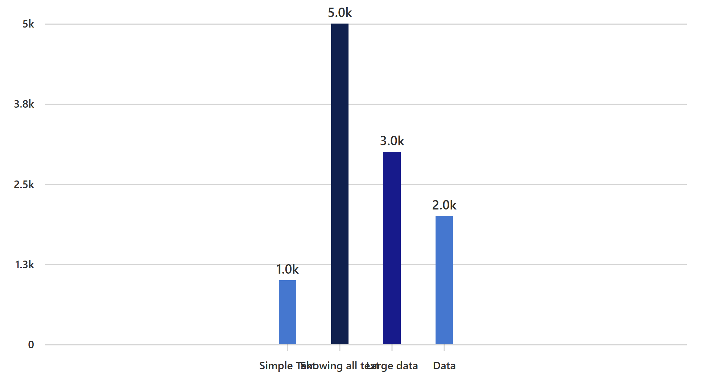

# RFC: Fix 2:1 spacing

## Summary

This document suggests a way to address issues that came up after the implementation of 2:1 spacing in vertical bar charts with string x-axis. The proposed solution introduces new props that will give users more control over both bar width and spacing within the chart.

## Background

The 2:1 spacing feature was added through [Pull Request #25838](https://github.com/microsoft/fluentui/pull/25838), as per [the design](<https://www.figma.com/file/WOoCs0CmNYZhYl9xXeCGpi/Data-viz-(Archive)?type=design&node-id=21153-80245&mode=design&t=yuXjQl2xGWzQrsK8-4>). Following its release in version `5.16.0`, queries from partner teams arose regarding the possibility of disabling or overriding this feature, as they found the previous uniform spacing better suited to their requirements.

## Problem

- The bars don’t occupy the entire space due to the default bar width of 16px and a fixed 2:1 spacing, often leaving considerable amount of blank space before the first bar and after the last bar. This becomes particularly noticeable when the chart width is large.
- Additionally, this setup causes unnecessary overlapping of x-axis labels.

## Proposal

1. Add optional `xAxisInnerPadding`, `xAxisOuterPadding` props to vertical bar charts.
   - `xAxisInnerPadding` controls the space between bars, while `xAxisOuterPadding` controls the space before the first bar and after the last bar.
   - These props accept values between 0 and 1, representing a fraction of the [step](https://d3js.org/d3-scale/band#band_step). These props are particularly relevant when using a string x-axis. For additional information on padding in string axes, see [Band scales | D3 by Observable](https://d3js.org/d3-scale/band#band_paddingInner).
   - By default, the inner padding is set to 2/3, meaning the space between bars is twice the bar width, while the outer padding is set to 1/3, implying that the space before the first bar and after the last bar is equivalent to the bar width. These default values are calculated using the formula:
     $$
     innerPadding = {spaceBetweenBars \over spaceBetweenBars + barWidth}
     $$
     For a more detailed explanation of how these values were derived, see [Implementing 2:1 spacing](../implementing-2-to-1-spacing.md).
   - The default outer padding is non-zero, but users have the option to override it with a value of 0 if they prefer no space before the first bar and after the last bar. Therefore, the minimum domain margin of 8px specified in the design is disregarded for string x-axis.
2. Use the existing `barWidth` prop and add an optional `maxBarWidth` prop to vertical bar charts.
   - The `barWidth` prop takes precedence over the props mentioned above. If not explicitly specified, the bar width will be dynamically adjusted to avoid overlapping while maintaining specified spacing between and around the bars. However, when `barWidth` is provided, it will be respected, potentially compromising padding.
   - In cases where the chart width is large, the bar width might become excessively large. To mitigate this, the `maxBarWidth` prop can be utilized to restrict the width of the bars to a specified maximum.

### Definitions

- **Step** is the interval between the start of a bar and the start of the next bar.

## Pros and Cons

### Pros

- Add new props and functionalities to vertical bar charts without breaking any existing functionalities, making it a backward compatible change.
- Provide more options for adjusting bar width and spacing, making the charts suitable for more generic cases.

### Cons

- Users may notice changes in the appearance of vertical bar charts when updating the package, potentially requiring adjustments to make them look how they were used to.
- Understanding and configuring padding values might be a bit tricky.
- While the padding functionality is available for a string axis, users may find a lack of similar capabilities for continuous (numeric or date) axes.
- The padding within a group in grouped vertical bar chart is fixed and can't be customized by users.

## Discarded Solutions

## Open Issues
