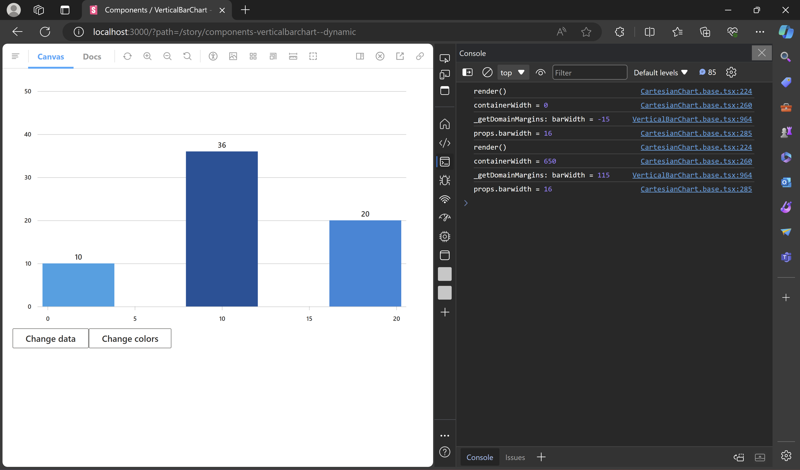

# RFC: Fix overlapping bars on continuous axes

## Rendering x-axis and bars

[D3's linear scales](https://d3js.org/d3-scale/linear) don't account for the bar width. So it is necessary to create the scale(s) in such a way that the bars fit within the available space, and the x-axis ticks align correctly with the bars.

Let $TR$ be the total width of the space available to render the bars. The first bar should begin at the leftmost end of the space, and the last bar should extend to the rightmost end of the space. The x-axis ticks should align with the center of their respective bars, i.e., the first tick should align with the center of the first bar, and the last tick should align with the center of the last bar. Thus, the range of the x-axis scale becomes $[BW/2, TR-BW/2]$, where $BW$ is the bar width. To render the bars, we can just adjust the scale range by translating it to the left by $BW/2$, resulting in $[0, TR-BW]$. This will ensure that the scale returns the starting points of the bars.

Therefore, it is important to determine the bar width beforehand to ensure accurate rendering of both the x-axis and the bars.

Note: There is no need to create separate scales for the x-axis and bars. Instead, we can use the same scale and adjust its range accordingly to render them.

## Calculating appropriate bar width

To prevent bars from overlapping, we will need to adjust the bar width dynamically based on several factors, rather than using a fixed value. Consider this perspective: If we can estimate the bar width to ensure that the closest pair of bars don't overlap, rendering all bars with that width would eliminate overlapping altogether. To determine this bar width, we require the pixel distance between the closest pair of bars. Let's assume a minimum spacing of 1:1 between adjacent bars. Thus,

$$
BW = {PX_2-PX_1 \over 2}
$$

where $PX_1$ and $PX_2$ are the positions of the closest pair of bars on the x-axis.

In linear scales, each range value $y$ can be expressed as a function of the domain value $x$: $y = mx + b$. While we have established the range for the x-axis scale, we also need to define the scale domain to determine the positions of the bars. The scale domain will be equal to the range of the data $[minX, maxX]$. To calculate $PX_1$ and $PX_2$, we must identify the closest pair of x values $(X_1, X_2)$ from the data. Thus,

$$
PX_1 = {TR-BW \over maxX-minX} \cdot (X_1-minX)+0
$$

and

$$
PX_2 = {TR-BW \over maxX-minX} \cdot (X_2-minX)+0
$$

Consequently,

$$
BW = {1 \over 2} \cdot {TR-BW \over maxX-minX} \cdot (X_2-X_1)
$$

Solving it yields

$$
BW = {TR(X_2-X_1) \over 2(maxX-minX)+X_2-X_1}
$$

Note: The above calculation may not yield accurate results for numeric scales when created with the `nice()` function, which extends the domain so that it starts and ends on nice round values. While this approach can help prevent overlapping, it might not guarantee exact 1:1 spacing between the closest bars.

## Implementation

### Attempt

As the rendering of bars is handled within _VerticalBarChart_, the bar width calculation is also integrated there. To determine the total width $(TR)$, we rely on the `containerWidth`, a state within _CartesianChart_. States from a child component (_CartesianChart_) can only be passed to its parent component (_VerticalBarChart_) through a function prop provided by the parent. Currently, the following functions are used to pass `containerWidth` to _VerticalBarChart_:

1. `getDomainMargins()`
2. `getGraphData()`

Since `getDomainMargins()` is invoked before the x-axis and bars are rendered, it serves as the appropriate location to integrate the bar width calculation. Although the bar width in _VerticalBarChart_ is not a state but a class variable, it is passed as a prop to _CartesianChart_ for the purpose of rendering the x-axis.

### Observations

- The bars are rendered with the updated `barWidth`.
- The axis ticks do not align with the bars.

### Solutions

1. Update `barWidth` after the `containerWidth` state is updated but before _CartesianChart_ renders. This can be done by using a React lifecycle method that executes with the updated state just before rendering.
2. Create a state for bar width within _VerticalBarChart_ to ensure that _CartesianChart_ also rerenders when the value of the `barwidth` prop changes.
3. **Decouple the axis utilities invoked within _CartesianChart_ from directly depending on the `barwidth` prop by including the bar width in the margins used for calculating the scale range.** (This solution has been implemented due to its simplicity)
4. Manage and update bar width within _CartesianChart_, and pass it to _VerticalBarChart_ through the `getGraphData()` function.
